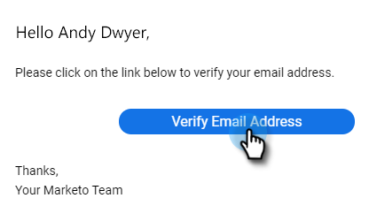

# 驗證您的電子郵件 {#verify-your-email}

如果您的電子郵件標識未經驗證，請執行以下步驟。

1. 按一下右上角的齒輪表徵圖，然後選擇 **設定**。

   

1. 在「My Account（我的帳戶）」下，按一下 **電子郵件設定**。

   

1. 在「地址和簽名」下，查找要驗證的電子郵件，然後按一下 **重新發送驗證電子郵件**。 將發送新的驗證電子郵件。

   

1. 按一下 **重發**。

   

1. 接著，收件人將開啟電子郵件，並按照步驟驗證電子郵件地址。

   

>[!NOTE]
>
>如果您未收到驗證電子郵件，請檢查您的垃圾郵件資料夾。 如果不在，請聯繫 [Marketo支援](https://nation.marketo.com/t5/Support/ct-p/Support)。
