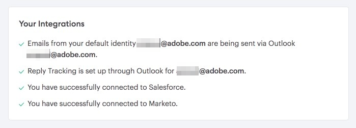
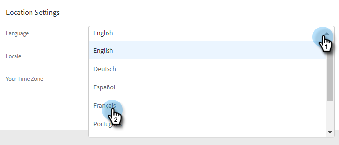

# 管理您的設定檔 {#manage-your-profile}

在「我的配置檔案」頁面中，您可以更新您的名稱、帳戶的語言/地區/時區，並更改密碼。

## 帳戶詳細資訊 {#account-details}

您可以在此處更新您的名稱和/或密碼。

1. 按一下齒輪圖示並選取 **設定**.

   

1. 「我的配置檔案」頁預設會開啟。 若要更新您的名稱，只需輸入變更，然後按一下 **儲存**.

   

>[!NOTE]
>
>您的電子郵件地址設為僅查看。 如果您也需要變更，請聯絡 [Marketo支援](https://nation.marketo.com/t5/Support/ct-p/Support).

您也可以在本節中變更密碼。 本檔案將概述這些步驟。

## 您的整合 {#your-integrations}

在頁面的右側，您的整合區段會提供所有帳戶連線的狀態。

>[!NOTE]
>
>如果您正使用Exchange On Prem搭配Marketo Sales，則不會更新傳送管道（第1行項目）或回覆追蹤（第2行項目）整合狀況檢查。 我們正致力於在未來版本中支援此功能。

## 時區 {#time-zone}

以下說明如何變更帳戶的語言、地區和/或時區。

>[!NOTE]
>
>支援的語言：英文、法文、德文、日文、葡萄牙文、西班牙文。

1. 按一下齒輪圖示並選取 **設定**.

   

1. 若要變更您的語言，請按一下 **語言** 下拉式清單，並做出選擇。

   

1. 此處的地區表示使用該語言的地區。 在您變更語言時，系統會預設選取一個，但若要手動變更，請按一下 **地區** 下拉式清單，並做出選擇。

   

1. 按一下 **您的時區** 下拉式清單，並做出選擇。

   

1. 按一下 **儲存** 時才能使用。

   

好！
