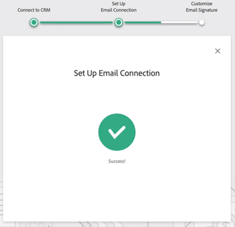

# 《MSI操作使用手冊》 {#msi-actions-user-onboarding-guide}

>[!PREREQUISITES]
>
>* 管理員需要邀請用戶開始使用MSI-Actions。
>* 若要透過Salesforce啟用您的帳戶，您必須在Salesforce設定檔權限中啟用「API已啟用」。

新使用者需遵循下列步驟。

1. 在歡迎電子郵件中，按一下 **開始使用**.

   

1. 按一下 **使用Salesforce啟用帳戶**.

   

1. 如果您已登入Salesforce帳戶，系統會自動將您導向下一個畫面。 如果您未登入，請立即登入。

   

>[!NOTE]
>
>您的salesforce電子郵件id和銷售帳戶電子郵件id必須相同。

1. 按一下 **允許**.

   

1. 按一下 **開始**.

   

1. 按一下 **下一個**.

   

1. 選擇您使用的電子郵件用戶端（Gmail或Outlook），然後按一下 **下一個**.

   

1. 輸入您的電子郵件地址，然後按一下 **下一個**.

   

1. 輸入密碼，然後按一下 **下一個**.

   

1. 按一下 **繼續**.

   

>[!NOTE]
>
>如果選擇Outlook，您將看到Outlook Authentication螢幕，您將在其中輸入您的電子郵件地址。

1. 您會看到「設定電子郵件連線」成功訊息，然後會傳送至下一個畫面。

   

1. 輸入您的自定義簽名，然後按一下 **儲存** (如果您稍後想透過您的設定檔頁面執行此作業，請按一下 **略過**)。

   

1. 按一下 **完成**.

   

1. 您看到查看Marketo銷售活動快速簡介的選項。 按一下 **下一個** 檢視，或 **不是現在** 以儲存以供稍後使用。

   

1. 完成本教程後，或者跳過該教程後，選擇是直接登錄到Web應用程式還是Salesforce帳戶，您可以在此訪問MSI面板中的所有功能(在本示例中，我們選擇 **啟動Salesforce**)。

   

1. 在Salesforce（Classic或Lightning）內，您可以導覽至任何銷售機會、聯絡人、帳戶或商機。 您的所有銷售操作將通過MSI面板中的下拉清單提供。

   
