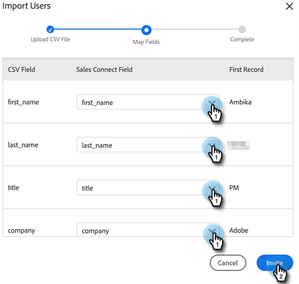

# 《 Sales Insight操作管理指南》 {#sales-insight-actions-admin-guide}

>[!PREREQUISITES]
>
>* 向客戶成功經理確認已為您的Marketo帳戶啟用MSI操作(如果您沒有CSM，請 [聯繫Marketo支援](https://nation.marketo.com/t5/support/ct-p/Support))。
>* 必須設定您的Marketo/Salesforce同步。

<table>
 <tr>
  <th>人物</th>
  <th>步驟</th>
 </tr>
 <tr>
  <td>Marketo</td>
  <td>設定Marketo銷售帳戶</td>
 </tr>
 <tr>
  <td>Marketo管理員或  Salesforce管理員</td>
  <td>將Marketo銷售帳戶連接到Salesforce</td>
 </tr>
 <tr>
  <td>Marketo</td>
  <td>將Marketo銷售帳戶連接到Marketo</td>
 </tr>
 <tr>
  <td>Marketo</td>
  <td>啟動從Marketo到Marketo銷售帳戶的資料同步</td>
 </tr>
 <tr>
  <td>Marketo</td>
  <td>邀請用戶加入MSI-Actions</td>
 </tr>
 <tr>
  <td>Salesforce管理員</td>
  <td>在Salesforce中安裝/升級MSI包</td>
 </tr>
 <tr>
  <td>Salesforce管理員</td>
  <td>在Salesforce中配置MSI操作</td>
 </tr>
</table>

## 設定Marketo銷售帳戶 {#set-up-marketo-sales-account}

1. 在Marketo，按一下 **管理**。

   

1. 按一下 **銷售洞察**，則 **操作配置**。 從要邀請的Marketo管理員清單中選擇並按一下 **發送邀請**。

   

用戶將收到一封電子郵件，其中包含訪問帳戶的步驟。

>[!NOTE]
>
>不會通過Marketo添加其他用戶，而是通過「銷售帳戶用戶管理」頁添加。 [按一下這裡](/help/marketo/product-docs/marketo-sales-connect/admin/invite-users.md) 瞭解有關添加其他用戶的詳細資訊。

## 將Marketo銷售帳戶連接到Salesforce {#connect-marketo-sales-account-to-salesforce}

1. 在您的Marketo銷售帳戶中，按一下齒輪表徵圖並選擇 **設定**。

   

1. 在「Admin Settings（管理設定）」下，按一下 **Salesforce**。

   

1. 在「連接和自定義」頁籤中，按一下 **連接**。

   

1. 按一下 **確定**。

   

如果您已登錄到Salesforce，則將連接您。 如果不是，將要求您登錄。

## 將Marketo連接到您的銷售應用帳戶 {#connect-marketo-to-your-sales-apps-account}

1. 在您的Marketo銷售帳戶中，按一下齒輪表徵圖並選擇 **設定**。

   

1. 在「Admin Settings（管理設定）」下，按一下 **Marketo**。

   

1. 按一下 **連接**。 然後，您的帳戶將被連接。

   

>[!NOTE]
>
>如果它不連接，請從MarketoSales Insight的「操作配置」頁籤複製憑據，然後將它們貼上到「設定」頁籤中。

## 啟動資料同步 {#initiate-data-sync}

Sales Insight Actions的資料統一欄位同步使系統能夠將人員資訊從您的Marketo Engage資料庫拉入您的Sales Insight Actions資料庫，使您的人員資料保持最新，並確保活動記錄在Marketo和Salesforce的正確記錄中。

>[!CAUTION]
>
>啟動資料同步後，應 **不** 刪除Sales Insight Actions實例上的原始用戶。 這是第一個邀請發送給的用戶。

1. 在Marketo，按一下 **管理**。

   

1. 按一下 **銷售洞察**。

   

1. 按一下 **操作配置** 頁籤。 在「操作欄位同步」卡中，按一下 **同步**。

   

1. 您將看到將同步的欄位的預覽。 按一下 **啟動同步**。

   

Marketo和Salesforce中存在的人員記錄將同步到您的Marketo銷售應用帳戶。

>[!NOTE]
>
>要瞭解有關Sales Insight Actions、Marketo和Salesforce之間人員和活動資料如何同步的更多資訊， [按一下這裡](/help/marketo/product-docs/marketo-sales-insight/actions/admin/actions-data-sync-faq.md)。

## 邀請單個用戶執行MSI操作 {#invite-individual-users-to-msi-actions}

1. 在您的Marketo銷售帳戶中，按一下齒輪表徵圖並選擇 **設定**。

   

1. 在「管理設定」下，選擇 **用戶管理**。

   

1. 按一下 **操作** 選擇 **邀請用戶**。

   

1. 輸入電子郵件地址，然後按一下 **邀請**。

   

>[!NOTE]
>
>預設情況下，所有新成員都將添加到「每個人」團隊。

您將收到確認消息。

## 通過CSV邀請用戶執行MSI操作 {#invite-users-via-csv-to-msi-actions}

1. 在您的Marketo銷售帳戶中，按一下齒輪表徵圖並選擇 **設定**。

   

1. 在「管理設定」下，選擇 **用戶管理**。

   

1. 按一下 **操作** 選擇 **通過CSV邀請用戶**。

   

1. 瀏覽電腦上的CSV，選擇它，然後按一下 **下一個**。

   

1. 確認欄位已正確映射，然後按一下 **邀請**。

   

在發送邀請後，您將收到確認消息。

>[!NOTE]
>
>完成此操作後，您可以升級現有MSI包或安裝新包並轉到 [在Salesforce中配置MSI操作](/help/marketo/product-docs/marketo-sales-insight/actions/salesforce-configuration/sales-insight-actions-configuration-in-salesforce.md)。
