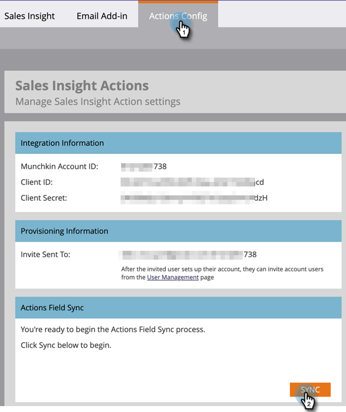

# Sales Insight Actions管理設定指南 {#sales-insight-actions-admin-setup-guide}

>[!PREREQUISITES]
>
>* 請向客戶成功經理確認Marketo帳戶已啟用MSI動作(如果您沒有CSM，請聯絡 [Marketo支援](https://nation.marketo.com/t5/support/ct-p/Support){target=&quot;_blank&quot;})。
>* 必須設定您的Marketo/Salesforce同步。

<table>
 <tr>
  <th>角色</th>
  <th>步驟</th>
 </tr>
 <tr>
  <td>Marketo管理員</td>
  <td>設定Marketo銷售帳戶</td>
 </tr>
 <tr>
  <td>Marketo管理員或  Salesforce管理員</td>
  <td>將Marketo銷售帳戶連接到Salesforce</td>
 </tr>
 <tr>
  <td>Marketo管理員</td>
  <td>將Marketo銷售帳戶連接至Marketo</td>
 </tr>
 <tr>
  <td>Marketo管理員</td>
  <td>從Marketo啟動資料同步至Marketo銷售帳戶</td>
 </tr>
 <tr>
  <td>Marketo管理員</td>
  <td>邀請用戶加入MSI-Actions</td>
 </tr>
 <tr>
  <td>Salesforce管理員</td>
  <td>在Salesforce中安裝/升級MSI包</td>
 </tr>
 <tr>
  <td>Salesforce管理員</td>
  <td>在Salesforce中配置MSI操作</td>
 </tr>
</table>

## 設定Marketo銷售帳戶 {#set-up-marketo-sales-account}

1. 在Marketo中，按一下 **管理**.

   

1. 按一下 **Sales Insight**，然後 **動作設定**. 從要邀請的Marketo管理員清單中選取，然後按一下 **傳送邀請**.

   

使用者會收到電子郵件，內含存取帳戶的步驟。

>[!NOTE]
>
>其他使用者將不會透過Marketo新增，而會透過「銷售帳戶使用者管理」頁面新增。 [按一下這裡](/help/marketo/product-docs/marketo-sales-connect/admin/invite-users.md){target=&quot;_blank&quot;}以進一步了解如何新增其他使用者。

## 將Marketo銷售帳戶連接到Salesforce {#connect-marketo-sales-account-to-salesforce}

1. 在您的Marketo Sales帳戶中，按一下齒輪圖示並選取 **設定**.

   

1. 在「管理設定」下，按一下 **Salesforce**.

   

1. 在「連線與自訂」標籤中，按一下 **Connect**.

   

1. 按一下 **確定**.

   

如果您已登入Salesforce，您將會連線。 如果沒有，系統會要求您登入。

## 將Marketo連接到您的銷售應用帳戶 {#connect-marketo-to-your-sales-apps-account}

1. 在您的Marketo Sales帳戶中，按一下齒輪圖示並選取 **設定**.

   

1. 在「管理設定」下，按一下 **Marketo**.

   

1. 按一下 **connect**. 然後您的帳戶就會連線。

   

>[!NOTE]
>
>如果未連線，請從Marketo Sales Insight的「Actions Config」標籤複製憑證，並貼到「設定」標籤中。

## 啟動資料同步 {#initiate-data-sync}

Sales Insight Actions的資料統一欄位同步使系統能夠從您的Marketo Engage資料庫中提取人員資訊到您的Sales Insight Actions資料庫，使您的人員資料保持最新，並確保在Marketo和Salesforce中將活動記錄到正確的記錄中。

>[!CAUTION]
>
>啟動資料同步後，您應 **not** 刪除Sales Insight Actions實例上的原始用戶。 這是第一個邀請被發送的用戶。

1. 在Marketo中，按一下 **管理**.

   

1. 按一下 **Sales Insight**.

   

1. 按一下 **動作設定** 標籤。 在「動作欄位同步」卡片中，按一下 **同步**.

   

1. 您會看到將同步的欄位預覽。 按一下 **開始同步**.

   

Marketo和Salesforce中的人員記錄會同步至您的Marketo銷售應用程式帳戶。

>[!NOTE]
>
>若要進一步了解Sales Insight Actions、Marketo和Salesforce之間的人員和活動資料同步方式， [按一下這裡](/help/marketo/product-docs/marketo-sales-insight/actions/admin/actions-data-sync-faq.md){target=&quot;_blank&quot;}。

## 邀請單個用戶執行MSI操作 {#invite-individual-users-to-msi-actions}

1. 在您的Marketo Sales帳戶中，按一下齒輪圖示並選取 **設定**.

   

1. 在「管理設定」下，選取 **使用者管理**.

   

1. 按一下 **動作** 選取 **邀請使用者**.

   

1. 輸入電子郵件地址，然後按一下 **邀請**.

   

>[!NOTE]
>
>依預設，所有新成員都會新增至「每個人」團隊。

您會收到確認訊息。

## 通過CSV邀請用戶到MSI操作 {#invite-users-via-csv-to-msi-actions}

1. 在您的Marketo Sales帳戶中，按一下齒輪圖示並選取 **設定**.

   

1. 在「管理設定」下，選取 **使用者管理**.

   

1. 按一下 **動作** 選取 **透過CSV邀請使用者**.

   

1. 瀏覽您電腦上的CSV，選取它，然後按一下 **下一個**.

   

1. 確認欄位已正確對應，然後按一下 **邀請**.

   

在傳送邀請後，您會收到確認訊息。

>[!NOTE]
>
>完成此操作後，您可以升級現有的MSI包，或安裝新包，然後轉到 [在Salesforce中配置MSI操作](/help/marketo/product-docs/marketo-sales-insight/actions/crm/salesforce-configuration/sales-insight-actions-configuration-in-salesforce.md){target=&quot;_blank&quot;}。
