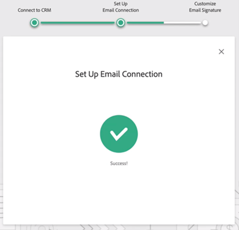
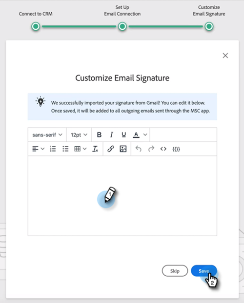

# Sales Insight Actions使用者入門指南 {#sales-insight-actions-user-onboarding-guide}

>[!NOTE]
>
>Marketo Sales Insight Actions是以Web為基礎的應用程式，可透過 [Marketo Sales Insight套件](/help/marketo/product-docs/marketo-sales-insight/msi-for-salesforce/installation/install-marketo-sales-insight-package-in-salesforce-appexchange.md){target="_blank"}. 有時稱為「Marketo銷售」，或簡稱為「動作」。

>[!PREREQUISITES]
>
>* 管理員需要邀請使用者開始使用MSI-Actions。
>* 若要透過Salesforce啟用您的帳戶，您需要在Salesforce設定檔許可權中啟用API。

新使用者需要遵循以下步驟。

1. 在歡迎電子郵件中，按一下 **開始使用**.

   

1. 按一下 **使用Salesforce啟用帳戶**.

   

1. 如果您已登入Salesforce帳戶，系統會自動將您導向下一個畫面。 如果您未登入，請立即登入。

   

>[!NOTE]
>
>您的Salesforce電子郵件ID和銷售帳戶電子郵件ID必須相同。

1. 按一下 **允許**.

   

1. 按一下 **開始**.

   

1. 按一下 **下一個**.

   

1. 選擇您使用的電子郵件使用者端（Gmail或Outlook），然後按一下 **下一個**.

   

1. 輸入您的電子郵件地址，然後按一下 **下一個**.

   

1. 輸入您的密碼，然後按一下 **下一個**.

   

1. 按一下 **繼續**.

   

>[!NOTE]
>
>如果選擇Outlook，您將會看到Outlook驗證畫面，您將在其中輸入您的電子郵件地址。

1. 您會看到「設定電子郵件連線」成功訊息，然後您會進入下一個畫面。

   

1. 輸入您的自訂簽章，然後按一下 **儲存** (如果您稍後想要透過設定檔頁面執行此動作，請按一下 **略過**)。

   

1. 按一下 **完成**.

   

1. 您會看到檢視Marketo銷售動作快速簡介的選項。 按一下 **下一個** 以檢視，或 **現在不要** 以儲存以供稍後使用。

   

1. 完成導覽或略過導覽後，請選擇直接登入Web應用程式或您的Salesforce帳戶，您可在此從MSI面板存取所有功能(在此範例中，我們選擇 **啟動Salesforce**)。

   

1. 在Salesforce （Classic或Lightning）中，您可以導覽至任何銷售機會、聯絡人、客戶或機會。 您的所有銷售動作將可透過MSI面板中的下拉式清單取得。

   
