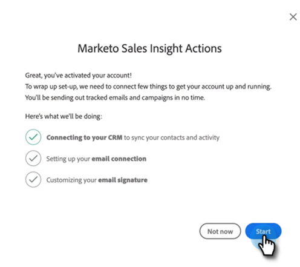

# 《 Sales Insight Actions User Onboarding Guide》 {#sales-insight-actions-user-onboarding-guide}

>[!PREREQUISITES]
>
>* 管理員需要邀請用戶開始使用MSI-Actions。
>* 為了使用Salesforce激活帳戶，您需要在Salesforce配置檔案權限中具有「已啟用API」。

新用戶需要執行以下步驟。

1. 在歡迎電子郵件中，按一下 **開始**。

   

1. 按一下 **使用Salesforce激活帳戶**。

   

1. 如果您已登錄到Salesforce帳戶，則系統會自動將您定向到下一螢幕。 如果您未登錄，請立即登錄。

   

>[!NOTE]
>
>您的Salesforce電子郵件ID和Sales帳戶電子郵件ID必須相同。

1. 按一下 **允許**。

   

1. 按一下 **開始**。

   

1. 按一下 **下一個**。

   

1. 選擇您使用的電子郵件客戶端（Gmail或Outlook），然後按一下 **下一個**。

   

1. 輸入您的電子郵件地址，然後按一下 **下一個**。

   

1. 輸入密碼並按一下 **下一個**。

   

1. 按一下 **繼續**。

   

>[!NOTE]
>
>如果選擇Outlook，您將看到Outlook Authentication螢幕，在該螢幕中輸入您的電子郵件地址。

1. 您將看到「Set Up E-mail Connection success（設定電子郵件連接成功）」消息，然後您將被發送到下一個螢幕。

   

1. 輸入自定義簽名，然後按一下 **保存** (如果以後要通過配置檔案頁面執行此操作，請按一下 **跳過**)。

   

1. 按一下 **完成**。

   

1. 您可以看到查看Marketo銷售活動快速介紹的選項。 按一下 **下一個** 查看 **不是現在** 以備後用。

   

1. 完成教程或跳過教程後，選擇是直接登錄到Web應用程式還是Salesforce帳戶，您可以從MSI面板訪問所有功能(在本示例中，我們選擇 **啟動Salesforce**)。

   

1. 在Salesforce（經典或閃電）內，您可以定位至任何潛在客戶、聯繫人、帳戶或業務機會。 您的所有銷售操作都可通過MSI面板中的下拉清單獲得。

   
