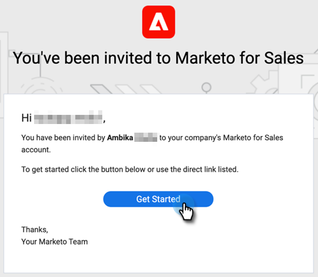

# Sales Insight Actions使用者入門指南 {#sales-insight-actions-user-onboarding-guide}

>[!NOTE]
>
>Marketo Sales Insight Actions是網頁式應用程式，透過[Marketo Sales Insight套件](/help/marketo/product-docs/marketo-sales-insight/msi-for-salesforce/installation/install-marketo-sales-insight-package-in-salesforce-appexchange.md){target="_blank"}專門與Salesforce CRM整合。 有時稱為「Marketo銷售」，或簡稱為「動作」。

>[!PREREQUISITES]
>
>* 管理員需要邀請使用者開始使用MSI-Actions。
>* 若要使用[!DNL Salesforce]啟用您的帳戶，您需要在[!DNL Salesforce]設定檔許可權中啟用API。

新使用者需要遵循以下步驟。

1. 在歡迎電子郵件中，按一下&#x200B;**[!UICONTROL Get Started]**。

   

1. 按一下「**[!UICONTROL Activate Account with Salesforce]**」。

   

1. 如果您已登入您的[!DNL Salesforce]帳戶，系統會自動將您導向下一個畫面。 如果您未登入，請立即登入。

   

>[!NOTE]
>
>您的[!DNL Salesforce]電子郵件ID和銷售帳戶電子郵件ID必須相同。

1. 按一下「**[!UICONTROL Allow]**」。

   

1. 按一下「**[!UICONTROL Start]**」。

   

1. 按一下「**[!UICONTROL Next]**」。

   

1. 選擇您使用的電子郵件使用者端（Gmail或[!DNL Outlook]）並按一下&#x200B;**[!UICONTROL Next]**。

   

1. 輸入您的電子郵件地址，然後按一下&#x200B;**[!UICONTROL Next]**。

   

1. 輸入您的密碼並按一下&#x200B;**[!UICONTROL Next]**。

   

1. 按一下「**[!UICONTROL Continue]**」。

   

>[!NOTE]
>
>如果選擇Outlook，您將會看到Outlook驗證畫面，您將在其中輸入電子郵件地址。

1. 您會看到「設定電子郵件連線」成功訊息，然後系統會將您傳送至下一個畫面。

   

1. 輸入您的自訂簽章，然後按一下&#x200B;**[!UICONTROL Save]** （如果您稍後要透過設定檔頁面執行此動作，請按一下&#x200B;**[!UICONTROL Skip]**）。

   

1. 按一下「**[!UICONTROL Finish]**」。

   

1. 您會看到檢視Marketo銷售動作快速簡介的選項。 按一下&#x200B;**[!UICONTROL Next]**&#x200B;以檢視，或按一下&#x200B;**[!UICONTROL Not Now]**&#x200B;以儲存以供稍後使用。

   

1. 完成導覽或略過導覽時，請選擇直接登入網頁應用程式或您的[!DNL Salesforce]帳戶，您可在此透過MSI面板存取所有功能（在此範例中，我們選擇&#x200B;**[!UICONTROL Launch Salesforce]**）。

   

1. 在[!DNL Salesforce] （Classic或Lightning）中，您可以導覽至任何銷售機會、聯絡人、客戶或商機。 您的所有銷售動作將可透過MSI面板中的下拉式清單取得。

   
