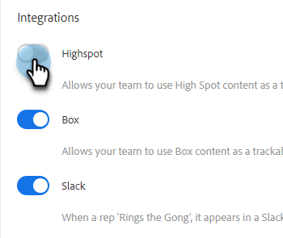

# Highspot整合 {#highspot-integration}

銷售人員可以存取Sales Insight Actions的Highspot功能，並在整個銷售週期中獲得更高的可見度、效率和效能。 Sales Insight Action使用者可以選取儲存在Highspot的銷售啟用平台上的銷售內容，並將其直接插入電子郵件、電子郵件範本和銷售行銷活動中，同時在Highspot和Sales Insight Actions中擷取內容追蹤和分析。

## 啟用Highspot整合 {#enabling-highspot-integration}

>[!NOTE]
>
>您必須具有管理員許可權，才能為Sales Insight Actions執行個體啟用Highspot。

1. 按一下齒輪圖示並選取 **設定**.

   

1. 下 **管理員設定**，選取 **一般**.

   

1. 捲動至 **整合** 卡片並按一下滑桿以啟用Highspot。

   

現在，使用者在撰寫視窗、範本編輯器和行銷活動電子郵件編輯器中選取內容上傳按鈕時，將看到選取高點的選項。

## 透過電子郵件存取熱點內容和共用內容 {#accessing-highspot-content}

從Sales Insight Actions撰寫視窗、範本編輯器和銷售行銷活動電子郵件編輯器，存取Highspot並將內容新增至您的電子郵件。 以下是如何從撰寫視窗存取內容的步驟。

1. 建立您的電子郵件草稿(有多種方式可以執行此操作，在此範例中，我們選取 **撰寫** （在標題中）。

   

1. 填入「收件者」欄位並輸入「主旨」。

   

1. 撰寫您的訊息。 按一下您要在電子郵件中插入Highspot內容的位置。 按一下箭頭下拉式清單（位於影像圖示旁）並選取 **亮點**.

   

1. 登入您的Highspot帳戶（如果您尚未登入）。

   

1. 選取您想要的內容，然後按一下 **新增內容** 按鈕。

   

   >[!TIP]
   >
   >如果您無法快速看見想要的內容，請使用頂端的搜尋列。

   內容會在您的電子郵件中顯示為連結。 收件者可以按一下連結來檢視/下載。

   

## 追蹤對熱點內容的點按 {#tracking-clicks-on-highspot-content}

當收件者開啟您傳送的內容時，您將在即時摘要中收到通知。 活動將顯示為點按，其中包含有關內容連結的詳細資訊。 此外，內容和下載的檢視將會在Highspot中受到追蹤。

