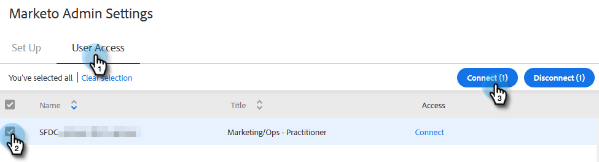

# 授予Marketo對用戶的訪問權限 {#grant-marketo-access-to-users}

按照本文中的步驟，授予您的Sales Insight Actions用戶訪問Marketo連接的權限。 這將釋放諸如即時訂閱源中的有趣時刻和市場營銷活動訪問等功能。

您需要邀請用戶 [Sales Insight操作](/help/marketo/product-docs/marketo-sales-insight/actions/admin/invite-users-and-admins.md#invite-users) 在「Marketo」>「團隊訪問」頁（在「Sales Insight操作」中）中可見之前，將授予對Marketo連接的訪問權限。

>[!CAUTION]
>
>在將Sales Insight Actions與Marketo連接後，請等待10分鐘，然後再執行這些步驟。

1. 按一下齒輪表徵圖並選擇 **設定**。

   

1. 在「Admin Settings（管理設定）」下，按一下 **Marketo**。

   

1. 按一下 **用戶訪問** 頁籤。 選擇一個或多個用戶，然後按一下 **連接**。

   

   >[!NOTE]
   >
   >在授予用戶訪問權限時，您只能執行一次工作區分配。 設定後，您必須斷開用戶的連接才能更改它。

1. 如果您的Marketo訂閱啟用了工作區，則您將能夠將工作區批量分配給每個用戶或一組用戶。 如果未選擇工作區，我們將將其分配到「預設Marketo」工作區。

   

   **可選步驟**:按一下「工作區」(Workspace)下拉框並選擇所需的工作區。

   

1. 按一下 **連接**。

   

您可以從「團隊管理」(Team Management)頁面添加其他用戶，然後按照上述步驟進行連接。
