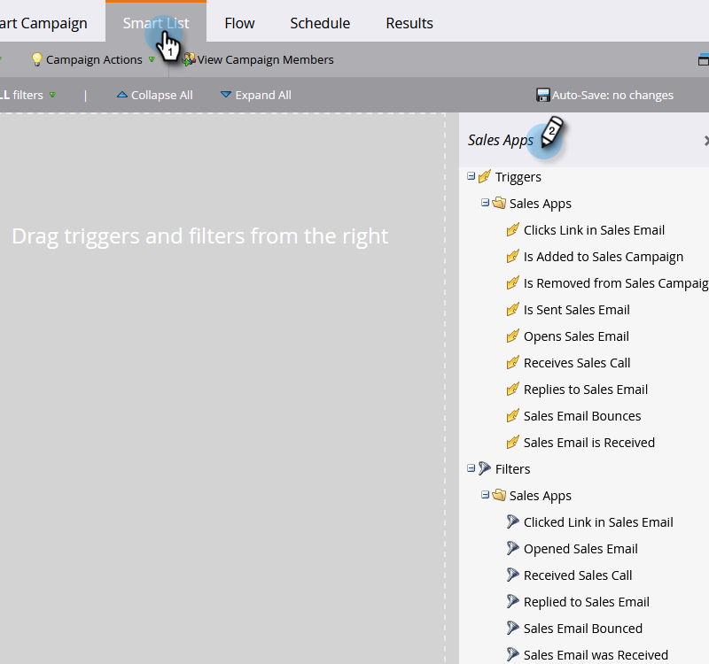

# 銷售活動觸發程序和篩選器 {#sales-activity-triggers-and-filters}

如果您想要更妥善地協調與銷售團隊的互動，或嘗試更清楚瞭解客戶在整個購買歷程中的互動情況，Marketo中的銷售活動深入分析將十分實用。

請依照下列步驟，瞭解如何在智慧行銷活動中利用銷售活動篩選器和觸發程式。

1. 找出並選取您想要的Smart Campaign。

   

1. 在&#x200B;**[!UICONTROL Smart List]**&#x200B;索引標籤中，搜尋&quot;[!UICONTROL Sales Apps]&quot;。

   

1. 選取並拖曳至所需的篩選器或觸發器上。

   

1. 選取任何需要的限制。

   

>[!NOTE]
>
>如需活動、限制和定義的完整清單，請參閱我們的[[!DNL Sales Insight Actions] 活動字彙表](/help/marketo/product-docs/marketo-sales-insight/actions/marketo/sales-insight-actions-activity-glossary.md)。
