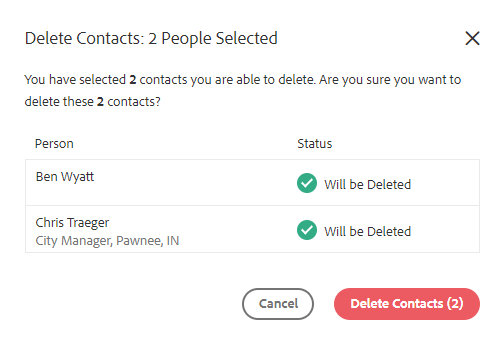

# 對人員的批量操作 {#bulk-actions-on-people}

您可以批量處理一些聯繫人以節省時間。

所有可用批量操作的第一步是選擇兩個或多個接觸點，然後按一下該接觸點（三個垂直點）。

## 將人員添加到組 {#add-people-to-group}

同時向組添加多個人。

## 來源 {#source}

我們會自動為進入資料庫的每個聯繫人分配一個來源。 使用此步驟更新該源。

>[!NOTE]
>
>無法自定義源。

## 授權 {#authorization}

符合 [格德普](https://eugdpr.org/)，使用授權來指示您如何獲得與這些聯繫人接觸的權限。

## 取消訂閱 {#unsubscribe}

對不想再收到您通信的聯繫人執行批量取消訂閱。

## 刪除 {#delete}

批量刪除聯繫人。 可找到完整步驟 [這裡](/help/marketo/product-docs/marketo-sales-insight/actions/people/managing-contacts/creating-and-deleting-contacts.md)。

