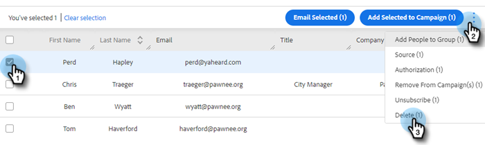

# 建立和刪除聯繫人 {#creating-and-deleting-contacts}

## 建立聯繫人 {#creating-contacts}

1. 在「人員」頁中，按一下 **操作** 按鈕 **建立聯繫人**。

   

1. 輸入姓氏/姓氏和電子郵件地址，以及您想要的任何其他資訊。 按一下 **建立** 完成時或 **新建和添加** 添加更多聯繫人。

   

   >[!TIP]
   >
   >是否同時添加多個聯繫人？ [按一下這裡](/help/marketo/product-docs/marketo-sales-insight/actions/people/managing-contacts/import-contacts-via-csv.md) 瞭解如何通過CSV導入聯繫人。

## 刪除聯繫人 {#deleting-contacts}

1. 在「人員」頁中，選中要刪除的聯繫人的框。 按一下渡渡河（三個垂直點）並選擇 **刪除**。

   

   >[!NOTE]
   >
   >要刪除多個聯繫人，只需選擇多個聯繫人。 其餘步驟將是相同的。

1. 按一下 **刪除聯繫人** 確認。

   
