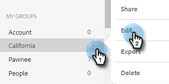

# 管理群組 {#manage-groups}

瞭解如何在Sales Insight Actions中管理您的群組。

## 群組型別 {#group-types}

<table> 
 <colgroup> 
  <col> 
  <col> 
 </colgroup> 
 <tbody> 
  <tr> 
   <th>群組</th> 
   <th>說明</th> 
  </tr> 
  <tr> 
   <td>所有人員</td> 
   <td>所有使用者中您可見的所有連絡人。</td> 
  </tr> 
  <tr> 
   <td>動態群組</td> 
   <td>我的連絡人：您擁有的所有連絡人。 取消訂閱：已選擇退出接收通訊的連絡人。</td> 
  </tr> 
  <tr> 
   <td>我的群組</td> 
   <td>您已建立的群組。 它們可以包含您的連絡人或已與您共用的連絡人。</td> 
  </tr> 
  <tr> 
   <td>團隊群組</td> 
   <td>與您和/或共用的群組。 它們可以包含您的隊友擁有的聯絡人或您與他們共用的聯絡人。</td> 
  </tr> 
 </tbody> 
</table>

## 建立群組 {#create-a-group}

1. 在「人物」頁面中，按一下 **+** 「群組」旁邊。

   

1. 為您的群組命名，然後按一下 **建立**.

   

   完成了！

## 新增連絡人至群組 {#add-contacts-to-a-group}

1. 在「人員」頁面中，尋找並選取您要新增人員的群組。

   

1. 按一下 **群組動作** 並選取 **建立連絡人並新增至群組**.

   

   >[!NOTE]
   >
   >這將會一次新增一個連絡人。 若要同時新增多個連絡人，請遵循 [這些步驟](/help/marketo/product-docs/marketo-sales-insight/actions/people/managing-contacts/import-contacts-via-csv.md).

1. 填寫連絡人的資訊，然後按一下 **建立** (或 **建立和新增** 以新增另一個)。

   

   而且您已完成！

   >[!NOTE]
   >
   >您可能需要點選「重新整理」才能檢視任何新增的連絡人。

## 共用群組 {#share-a-group}

1. 在「人員」頁面中，尋找並選取您要共用的群組。

   

1. 按一下圓點（三個垂直的點）並選取 **共用**.

   

1. 按一下下拉式清單，選擇您要共用群組的團隊，然後按一下 **共用**.

   

   您仍擁有群組，但群組現在會顯示於 _團隊群組_.

## 取消共用群組 {#unshare-a-group}

1. 在「人員」頁面中，尋找並選取您要取消共用的群組。

   

1. 按一下圓點（三個垂直的點）並選取 **共用**.

   

1. 按一下 **X** 在您共用群組的團隊旁邊，然後按一下退出強制回應視窗。

   

   群組現在會取消共用。

## 重新命名群組 {#rename-a-group}

1. 在「人員」頁面中，尋找並選取您要重新命名的群組。

   

1. 按一下圓點（三個垂直的點）並選取 **編輯**.

   

1. 輸入新名稱，然後按一下 **儲存**.

   

## 刪除群組 {#delete-a-group}

1. 在「人員」頁面中，尋找並選取您要刪除的群組。

   

1. 按一下圓點（三個垂直的點）並選取 **刪除**.

   

1. 按一下 **刪除** 以確認。

   
