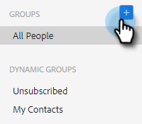

# 管理群組 {#manage-groups}

瞭解如何在[!DNL Sales Insight Actions]中管理您的群組。

## 群組類型 {#group-types}

<table>
 <colgroup>
  <col>
  <col>
 </colgroup>
 <tbody>
  <tr>
   <th>群組</th>
   <th>說明</th>
  </tr>
  <tr>
   <td>[!UICONTROL All People]</td>
   <td>您看得見的所有使用者的所有連絡人。</td>
  </tr>
  <tr>
   <td>[!UICONTROL Dynamic Groups]</td>
   <td>我的連絡人：您擁有的所有連絡人。 取消訂閱：已選擇退出接收通訊的連絡人。</td>
  </tr>
  <tr>
   <td>[!UICONTROL My Groups]</td>
   <td>您已建立的群組。 它們可以包含您的連絡人或與您共用的連絡人。</td>
  </tr>
  <tr>
   <td>[!UICONTROL Team Groups]</td>
   <td>已與您和/或由您共用的群組。 它們可以包含您隊友擁有的連絡人或您與他們共用的連絡人。</td>
  </tr>
 </tbody>
</table>

## 建立群組 {#create-a-group}

1. 在[!UICONTROL People]頁面中，按一下&#x200B;**旁的**+[!UICONTROL Groups]。

   

1. 命名您的群組並按一下&#x200B;**[!UICONTROL Create]**。

   

   完成了！

## 新增連絡人至 {#add-contacts-to-a-}

1. 在[!UICONTROL People]頁面中，尋找並選取您要新增人員的群組。

1. 按一下&#x200B;**[!UICONTROL Group Actions]**&#x200B;並選取&#x200B;**[!UICONTROL Create Contact and add to Group]**。

   

1. 填寫連絡人資訊，然後按一下&#x200B;**建立** （或&#x200B;**建立並新增新的**&#x200B;以新增其他）。

   

   而您已完成！

   >[!NOTE]
   >
   >您可能必須點選「重新整理」才能檢視任何新增的連絡人。

## 新增連絡人至群組 {#add-contacts-to-a-group}

1. 在&#x200B;_群組_&#x200B;下，選取&#x200B;**所有人員**。

   

1. 搜尋您要新增的一或多個人員。

   

1. 按一下名稱旁的核取方塊以選取名稱。

   

1. 按一下「更多動作」圖示()並選取&#x200B;**新增人員至群組**。

   

1. 選取您要新增它們的群組，然後按一下[新增]。**&#x200B;**

   

## 共用群組 {#share-a-group}

1. 在[!UICONTROL People]頁面中，尋找並選取您要共用的群組。

   

1. 按一下dota （三個垂直點）並選取&#x200B;**[!UICONTROL Share]**。

   

1. 按一下下拉式清單，選擇您要共用群組的團隊，然後按一下&#x200B;**[!UICONTROL Share]**。

   

   您仍然擁有群組，但它現在會顯示在&#x200B;_團隊群組_&#x200B;下。

## 取消共用群組 {#unshare-a-group}

1. 在[!UICONTROL People]頁面中，尋找並選取您要取消共用的群組。

   

1. 按一下dota （三個垂直點）並選取&#x200B;**[!UICONTROL Share]**。

   

1. 按一下您共用群組的團隊旁的&#x200B;**X**，然後按一下退出強制回應視窗。

   

   群組現在會取消共用。

## 重新命名群組 {#rename-a-group}

1. 在[!UICONTROL People]頁面中，尋找並選取您要重新命名的群組。

   

1. 按一下dota （三個垂直點）並選取&#x200B;**[!UICONTROL Edit]**。

   

1. 輸入新名稱並按一下&#x200B;**[!UICONTROL Save]**。

   

## 刪除群組 {#delete-a-group}

1. 在「人員」頁面中，尋找並選取您要刪除的群組。

   

1. 按一下dota （三個垂直點）並選取&#x200B;**[!UICONTROL Delete]**。

   

1. 按一下&#x200B;**[!UICONTROL Delete]**&#x200B;確認。

   
