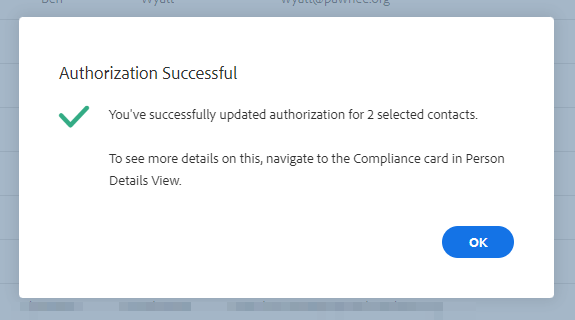

# Sales Insight Actions和GDPR Compliance {#sales-insight-actions-and-gdpr-compliance}

《一般資料保護條例》是2018年5月25日生效的歐盟立法。

## 概述 {#overview}

其目的是加強歐洲聯盟（歐盟）和歐洲經濟區（歐洲經濟區）內有關個人資料的使用和保護的資料主題的權利。 「個人資料」是指與已識別或可識別的自然人相關的任何資訊。

《日間公約》圍繞六項關鍵原則（立法第5條對此作了詳細闡述）:

1. 資料的使用方式和用途的透明度。
1. 確保收集的資料僅用於收集時明確指定的目的。
1. 將資料收集限制在為收集資料的目的而需要的範圍內。
1. 確保資料準確。
1. 只在其預期目的範圍內儲存資料。
1. 通過部署適當的安全措施防止未經授權的使用或資料意外丟失。

此外，還有一項新的責任要求，即能夠證明如何管理和跟蹤法規遵從性。 這意味著要記錄收集個人資料的方式和原因以及為保護這些資料而制定的流程的文檔。

## 對誰適用？ {#to-whom-does-it-apply}

GDPR適用於歐盟內外任何向歐盟和歐洲經濟區內資料主體推銷商品或服務和/或跟蹤資料主體行為的組織。 如果您在歐洲與涉及處理其個人資料的資料主題進行業務往來，此法案適用於您。 對不遵守規定的處罰很重，對違反規定者處以高額罰款；一次違規的最高罰款為2000萬歐元，佔全球年營業額的4%，以兩者中較高者為準。

## 對市場營銷的影響 {#implications-for-marketing}

營銷人員的目標是創造具有個人感和人性感的客戶體驗，這種體驗建立在信任的基礎上，並以謹慎的態度提供。 儘管GDPR沒有使用這些條款，但目標是相同的 — 尊重客戶的權利並贏得他們的信任。 要建立和維持這種信任，營銷人員必須瞭解客戶希望如何、何時以及為什麼參與。 必須尊重客戶偏好，這不僅是法律要求，而且是以客戶為中心的接洽實踐的基礎。

營銷人員如何解決在收集、使用和安全個人資料過程中經常使用的更高期望值是關鍵，而Marketo可以幫助滿足這些期望值。

GDPR有兩個關鍵方面，營銷人員需要回顧過去、現在和未來的實踐。 第一是個人同意處理其個人資料，第二是問責，即能夠證明GDPR的原則是如何被遵循的。

我們在電子書的Marketo平台內提供關於同意和問責的廣泛資訊， [GDPR和營銷者](https://www.marketo.com/ebooks/the-gdpr-and-the-marketer/)。 但是，在這篇文章中，我們將重點介紹Sales Insight Actions中的新功能，這些功能將幫助您的組織遵守GDPR規則。

## Sales Insight操作中的GDPR法規遵從性 {#gdpr-compliance-in-marketo-sales-connect}

Sales Insight Actions是Marketo項目平台的一部分，是一個功能強大的應用程式，它為銷售和市場營銷提供了單一的工作流和視圖，通過協作項目來共同加快管道的開發。 Sales Insight Actions中的新功能是專門在考慮GDPR法規遵從性的情況下建立的。 我們將概述所有這三項功能，並解釋它們在正確使用時如何幫助您組織的GDPR法規遵從性工作。

## 合規卡 {#compliance-card}

Sales Insight Actions在「人員詳細資訊視圖」中包括一張符合性卡，用於提供有關聯繫人的授權類型及其來源類型的關鍵資訊。 這使用戶能夠輕鬆添加和跟蹤對資料隱私至關重要的資訊，並幫助他們在活動/外聯策略方面做出更明智的決策。

**聯繫人授權類型**

在合規性卡中，用戶可以通過授權下拉清單跟蹤處理聯繫人個人資料的法律依據。 瞭解聯繫人的授權類型有助於Sales Insight Actions用戶在外聯實踐方面做出更明智的決策，確保每項活動或項目都是合法和適當的。

用戶有多種選項可供選擇，包括：

* 同意
* 合法利益
* 合同的履行
* 遵守法律義務
* 重大利益保護
* 公共利益/官方機構
* 其他

**聯繫人源類型**

在新的合規性卡中，用戶可以跟蹤聯繫人的來源。 「來源類型」定義最初上載到Sales Insight Actions時聯繫人資訊的來源。 瞭解聯繫人的來源類型還有助於就外聯做法做出決策，並確定儲存了哪些其他系統或地點的個人資料，從而確保每項服務都符合GDPR法規。

同樣，用戶有許多可選擇的下拉選項，包括：

* CRM同步
* 導入
* 手動上載
* Chrome擴展
* 其他

**編輯符合性卡**

開啟「人員詳細資訊視圖」後，按一下 **編輯** 的下界。

您將看到兩個下降：授權類型和源類型。

如果選擇「同意」作為授權類型，則有兩個必需欄位：將出現「同意日期」和「處理目的」。 這兩個欄位不適用於其他選項。

如果為「授權類型」或「來源類型」選擇「其它」，則可以輸入描述「來源類型」的文本。

**批量操作**

Sales Insight Actions還允許批量更新聯繫人的授權和來源類型，從而節省了法規遵從性流程中的寶貴時間。

從「人員」頁面選擇一個或多個聯繫人時，右側會出現一個dota（三點菜單）。 按一下它，您將看到「授權」和「源」是選項。 您可以同時設定多個聯繫人的授權或來源。

按一下「授權」模式時，將出現一個彈出窗口，其中包含與符合性卡中的選項相匹配的下拉清單選項。

更新授權類型後，您將收到一個確認彈出窗口，並且您將能夠在「人員詳細資訊視圖」的合規性卡中查看更新的詳細資訊。

同樣，也可以通過按一下「源」(Source)模式批量更新「源類型」(Source Type)。

為所選聯繫人選擇正確的「源類型」後，將顯示一個確認窗口來確認成功更新。

## 從Sales Insight操作導出聯繫人資料 {#exporting-contact-data-from-marketo-sales-connect}

您能夠從「人員詳細資訊視圖」導出聯繫資訊。 導出將下載包含以下列的.CSV檔案：

<table> 
 <colgroup> 
  <col> 
  <col> 
  <col> 
 </colgroup> 
 <tbody> 
  <tr> 
   <td>名字</td> 
   <td>網站</td> 
   <td>Facebook</td> 
  </tr> 
  <tr> 
   <td>姓氏</td> 
   <td>其他</td> 
   <td>Twitter</td> 
  </tr> 
  <tr> 
   <td>公司</td> 
   <td>更新時間</td> 
   <td>LinkedIn</td> 
  </tr> 
  <tr> 
   <td>標題</td> 
   <td>建立時間</td> 
   <td>導出於</td> 
  </tr> 
  <tr> 
   <td>電子郵件ID</td> 
   <td>Salesforce ID</td> 
   <td> </td> 
  </tr> 
  <tr> 
   <td>電話號碼</td> 
   <td>人員ID</td> 
   <td> </td> 
  </tr> 
 </tbody> 
</table>

>[!NOTE]
>
>一次只能進行一次聯繫。 當前沒有允許批量導出聯繫人的功能。

要導出聯繫資訊，請按一下「人員詳細資訊視圖」標題中的三個垂直點，然後選擇 **導出**。 .CSV檔案將自動下載。

>[!NOTE]
>
>GDPR還要求能夠從UI中刪除聯繫人，但Sales Insight Actions已經具備此功能。

## 取消訂閱 {#unsubscribes}

GDPR的一個常被誤解的領域涉及取消訂閱組織資料庫的聯繫人。 為了遵守有關保護選擇取消訂閱者資料的新規則，Sales Insight Actions中包含了以下功能：

**取消訂閱連結：** 取消訂閱連結將自動附加到從Sales Connect Web應用程式發送的所有電子郵件中，以確保為聯繫人提供了選擇退出的可訪問方式。\
**取消訂閱同步：** 用戶可以同步CRM(Salesforce)的未訂閱者和未訂閱者，以確保選擇退出是最新的。\
**取消訂閱歷史記錄：** 用戶可以在「人員詳細資訊視圖」中查看歷史選擇退出和選擇加入。\
**取消訂閱刪除：** 選擇未訂閱的聯繫人重新登錄要求用戶具有管理員權限並證明該聯繫人已重新同意與他們聯繫。

## 將來更新 {#future-updates}

作為積極倡導參與經濟的力量和以客戶為中心的人，Marketo深知將隱私和資料保護置於資料主題之下的重要性。 與其他資料保護法律一樣， GDPR法規遵從性需要Marketo和我們的客戶做出承諾。 本文旨在幫助您以適當的方式使用Marketo，以支援您組織的GDPR合規性。

我們將繼續密切跟蹤監管當局發佈的相關GDPR指引和相關立法。 更新將發佈到我們的信任中心，地址為 [trust.marketo.com](https://trust.marketo.com)。
