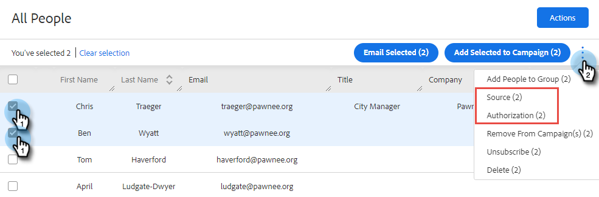

# Sales Insight Actions與GDPR法規遵循 {#sales-insight-actions-and-gdpr-compliance}

一般資料保護規範(GDPR)是歐盟法律，於2018年5月25日生效。

## 概觀 {#overview}

其目的在於加強歐盟(EU)和歐洲經濟區(EEA)內資料主體對其個人資料的使用和保護方式的權利。 「個人資料」是指與已識別或可識別的自然人相關的任何資訊。

GDPR是圍繞六項主要原則所建構（詳細說明於法例第5條）：

1. 資料使用方式及用途的透明度。
1. 確保收集的資料僅用於收集時明確指定的用途。
1. 將資料收集限制在符合收集目的所需的範圍內。
1. 確保資料準確。
1. 僅在資料預期用途範圍內視需要儲存資料。
1. 透過部署適當的安全措施，防止未經授權使用或意外遺失資料。

此外，還有一項新的責任要求，要能夠展示如何管理及追蹤合規性。 這表示要維護收集個人資料之方式與原因的記錄，以及保護資料之程式檔案的記錄。

## 適用對象？ {#to-whom-does-it-apply}

GDPR適用於歐盟內或歐盟以外任何向歐盟及EEA內的資料主體行銷商品或服務及/或追蹤其行為的組織。 如果您與歐洲資料主體有業務往來，涉及處理其個人資料，此法規即適用於您。 違規者將受到嚴厲的處罰，違規者會被處以鉅額罰款；單次違規的最高罰款為2,000萬歐元，或全球每年營業額的4%，以金額較大者為準。

## 對行銷的影響 {#implications-for-marketing}

行銷人員目標是打造個人與人性化的客戶體驗，並以信任為基礎，謹慎交付。 雖然GDPR並未使用這些條款，但其目標相同，即尊重客戶權利及贏得客戶信任。 為了建立及維持這種信任，行銷人員必須瞭解客戶希望參與的方式、時間以及原因。 尊重客戶的喜好非常重要，這不僅是作為法律要求，也是以客戶為中心的參與實務的基礎。

行銷人員如何針對其工作過程中例行使用的個人資料收集、使用及安全性解決這些更高的期望是關鍵，Marketo可協助您達成這些期望。

GDPR有兩個主要層面，行銷人員需要檢閱過去、目前和未來的實務。 第一個是個人同意處理其個人資料，第二個是責任，即能夠示範GDPR原則如何得到遵守。

我們在電子書中，針對Marketo平台的同意與責任提供廣泛的資訊， [GDPR與行銷人員](https://www.marketo.com/ebooks/the-gdpr-and-the-marketer/). 不過，在本文中，我們特別強調Sales Insight Actions的新功能，協助您的組織遵守GDPR規則。

## Sales Insight Actions中的GDPR合規性 {#gdpr-compliance-in-marketo-sales-connect}

Sales Insight Actions是一個功能強大的應用程式，屬於Marketo Engagement Platform的一部分，可提供單一工作流程和檢視，供銷售和行銷人員透過合作參與以集體方式更快速地推動管道。 Sales Insight Actions中的新功能是針對GDPR法規遵循專門建立的。 我們將概述所有這三個功能，並說明其在正確使用時，將如何協助貴組織的GDPR法規遵循工作。

## 合規性卡 {#compliance-card}

「銷售分析作業」在「人員詳細資料檢視」中包含「規定卡」，以提供有關連絡人授權型別及其來源型別的主要資訊。 這可讓使用者輕鬆新增及追蹤對資料隱私權至關重要的資訊，並協助他們針對行銷活動/外聯策略做出更明智的決策。

**連絡人授權型別**

在「合規性卡」中，使用者可透過「授權」下拉式清單，追蹤處理連絡人個人資料的法律依據。 瞭解聯絡人的授權型別，可協助Sales Insight Actions使用者針對外聯實務做出更明智的決策，確保每個行銷活動或參與都是合法且適當的。

使用者有許多選項可供選擇，包括：

* 同意
* 合法利益
* 合約績效
* 遵守法律義務
* 保護重要利益
* 公共利益/官方機關
* 其他

**聯絡來源型別**

在新的合規性卡片中，使用者可以追蹤聯絡人的來源。 來源型別定義聯絡人的資訊最初上傳至銷售分析動作時的來源。 瞭解聯絡人的來源型別也有助於就外聯活動實踐做出決策，以及確定儲存個人資料的其他系統或位置，確保每個參與都符合GDPR法規。

同樣地，使用者有許多下拉式清單選項可供選擇，包括：

* CRM同步
* 匯入
* 手動上傳
* Chrome擴充功能
* 其他

**編輯合規性卡片**

當人員詳細資料檢視開啟時，按一下 **編輯** 在法規遵循卡中。

您會看到兩個下拉式清單：「授權型別」和「來源型別」。

如果您選擇「同意」作為授權型別，則會出現兩個必填欄位：「同意日期」和「處理的目的」。 這兩個欄位不適用於其他選項。

如果為「授權型態」或「來源型態」選擇「其他」，您可以輸入文字來說明「來源型態」。

**大量動作**

「銷售分析動作」也可讓您大量更新連絡人的「授權」和「來源」型別，在法規遵循程式中節省寶貴的時間。

當您從「人物」頁面選取一或多個連絡人時，會在右側顯示一個圓點（三個點選單）。 按一下它，您會看到「授權」和「來源」是選項。 您可以同時設定多個連絡人的授權或來源。

當您按一下「授權」強制回應視窗時，就會出現快顯視窗，其中包含符合「法規遵循卡」中的下拉式選項。

更新「授權型別」後，您將會收到確認快顯視窗，而且您可以在「人員詳細資料檢視」的「合規卡」中檢視更新的詳細資訊。

同樣地，來源型別也可以透過按一下來源強制回應視窗大量更新。

為您選取的連絡人選取正確的來源型別後，將會顯示確認視窗以確認更新成功。

## 從Sales Insight動作匯出聯絡資料 {#exporting-contact-data-from-marketo-sales-connect}

您可以從「人員詳細資料檢視」匯出聯絡資訊。 匯出將會下載包含下列欄位的.CSV檔案：

<table> 
 <colgroup> 
  <col> 
  <col> 
  <col> 
 </colgroup> 
 <tbody> 
  <tr> 
   <td>名字</td> 
   <td>網站</td> 
   <td>Facebook</td> 
  </tr> 
  <tr> 
   <td>姓氏</td> 
   <td>其他</td> 
   <td>Twitter</td> 
  </tr> 
  <tr> 
   <td>公司</td> 
   <td>更新時間</td> 
   <td>LinkedIn</td> 
  </tr> 
  <tr> 
   <td>標題</td> 
   <td>建立時間</td> 
   <td>匯出時間</td> 
  </tr> 
  <tr> 
   <td>電子郵件ID</td> 
   <td>Salesforce ID</td> 
   <td> </td> 
  </tr> 
  <tr> 
   <td>電話號碼</td> 
   <td>個人 ID</td> 
   <td> </td> 
  </tr> 
 </tbody> 
</table>

>[!NOTE]
>
>一次只能進行一個連絡人。 目前沒有允許大量匯出連絡人的功能。

若要匯出聯絡資訊，請按一下「人員詳細資料檢視表頭」中的三個垂直點，然後選取 **匯出**. 將自動下載.CSV檔案。

>[!NOTE]
>
>GDPR也要求能夠從UI刪除聯絡人，但Sales Insight Actions已具備此功能。

## 取消訂閱 {#unsubscribes}

GDPR的一個普遍誤解領域涉及從組織資料庫取消訂閱的聯絡人。 為了遵循新的規則，保護選擇取消訂閱者的資料，銷售分析動作已包含下列功能：

**取消訂閱連結：** 取消訂閱連結會自動附加至Sales Connect網路應用程式傳送的所有電子郵件，以確保連絡人可透過存取方式選擇退出。\
**取消訂閱同步處理：** 使用者可與其CRM (Salesforce)同步取消訂閱，以確保選擇退出為最新狀態。\
**取消訂閱歷史記錄：** 使用者可在人員詳細資料檢視中檢視過去的選擇退出和選擇加入。\
**取消訂閱移除：** 選擇取消訂閱的連絡人重新加入需要使用者具有管理員許可權，並證明連絡人已同意重新連絡他們。

## 未來的更新 {#future-updates}

Marketo熱心倡導參與經濟的強大功能和以客戶為中心，瞭解將隱私權和資料保護交由資料主體掌控的重要性。 如同其他資料保護法律，GDPR合規性需要Marketo和客戶的共同承諾。 本文旨在協助您以適當方式使用Marketo，以支援貴組織遵循GDPR的規定。

我們會繼續密切追蹤監管機構發佈的適用GDPR指引及相關法規。 更新將發佈到我們的信任中心： [trust.marketo.com](https://trust.marketo.com).
