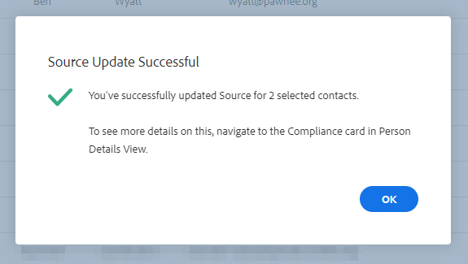

# 銷售分析行動與GDPR法規遵循 {#sales-insight-actions-and-gdpr-compliance}

一般資料保護規範(GDPR)為2018年5月25日生效的歐盟法規。

## 總覽 {#overview}

其目的是加強歐盟(EU)和歐洲經濟區(EEA)內資料主體在個人資料的使用和保護方面的權利。 個人資料是指與已識別或可識別的自然人相關的任何資訊。

GDPR的架構以六項主要原則為基礎（法規第5條詳述）:

1. 透明度，了解資料的使用方式及用途。
1. 確保收集的資料僅用於收集時明確指定的目的。
1. 將資料收集限制為符合資料收集目的所需的項目。
1. 確保資料準確。
1. 只要在其預期用途內儲存資料的時間，即可。
1. 通過部署適當的安全措施防止資料被未經授權使用或意外丟失。

此外，還有一項新的問責要求，即能夠證明如何管理和跟蹤法規遵從性。 這意味著要保存收集個人資料的方式和原因的記錄，以及為保護個人資料而制定的流程的文檔。

## 這適用於誰？ {#to-whom-does-it-apply}

GDPR適用於歐盟內外向歐盟和EEA內的資料主體行銷商品或服務，及/或追蹤其行為的任何組織。 如果您在歐洲與涉及處理個人資料的資料主體有業務往來，本法規適用於您。 對不遵守規定的人處以高額罰款；單次違規的最高罰款金額為2000萬歐元，即全球年營業額的4%，以其中的更高者為準。

## 行銷的含意 {#implications-for-marketing}

行銷人員的目標是建立以信任為基礎、以關懷為內容的個人和人性化客戶體驗。 雖然GDPR未使用這些詞語，但目標相同 — 尊重客戶權利並贏得其信任。 為了建立及維持這種信任，行銷人員必須了解客戶想要參與的方式、時間及原因。 必須尊重客戶偏好，這不僅是法律要求，也是以客戶為中心的參與實踐的基礎。

行銷人員如何處理在工作過程中經常使用之個人資料的收集、使用和安全性方面的這些高期望值，是關鍵所在，而Marketo可協助達成這些期望值。

GDPR的兩個主要方面，是行銷人員需要回顧過去、目前和未來的實務。 第一是個人同意處理其個人資料，第二是問責制，即能夠示範GDPR原則的遵循方式。

我們在電子書中提供關於Marketo平台內同意和問責的廣泛資訊， [GDPR與行銷人員](https://www.marketo.com/ebooks/the-gdpr-and-the-marketer/). 不過，在本文中，我們將特別著重於「銷售分析動作」中的新功能，以協助貴組織遵守GDPR規則。

## 銷售分析行動中的GDPR法規遵循 {#gdpr-compliance-in-marketo-sales-connect}

Sales Insight Actions是功能強大的應用程式(Marketo參與平台的一部分)，提供單一的工作流程和檢視供銷售和行銷使用，以透過協作參與更快地推動管道。 「銷售分析動作」中的新功能已特別建立，並符合GDPR法規遵循。 我們將概述這三項功能，並說明若正確使用這些功能，將如何協助貴組織的GDPR法規遵循工作。

## 合規性卡 {#compliance-card}

「銷售分析活動」在「人員詳細資訊」視圖中包括「合規性卡」，以提供有關聯繫人的授權類型及其源類型的關鍵資訊。 這可讓使用者輕鬆新增及追蹤對資料隱私權至關重要的資訊，並協助他們在行銷活動/外聯策略上做出更明智的決策。

**聯繫授權類型**

在「合規性卡」內，使用者可以透過「授權」下拉式清單追蹤處理連絡人個人資料的法律依據。 了解聯絡人的授權類型有助於Sales Insight Actions使用者在外聯實務方面做出更明智的決策，確保每個行銷活動或參與都是合法且適當的。

使用者有許多可選擇的選項，包括：

* 同意
* 合法利益
* 合同的履行
* 遵守法律義務
* 重大利益保護
* 公共利益/官方機構
* 其他

**聯繫人源類型**

在新的「合規性卡」中，用戶可以跟蹤聯繫人的來源。 「源類型」定義了聯繫人的資訊最初上載到「銷售分析操作」時的來源。 了解連絡人的來源類型也有助於決定外展實務，以及決定要儲存哪些其他系統或位置的個人資料，確保每個參與都符合GDPR法規。

同樣地，使用者有許多下拉式清單選項可供選擇，包括：

* CRM同步
* 匯入
* 手動上傳
* Chrome擴充功能
* 其他

**編輯合規性卡**

開啟「人員詳細資訊」視圖時，按一下 **編輯** 在「合規性」卡中。

您會看到兩個下拉式清單：授權類型和源類型。

如果您選擇「同意」作為「授權類型」，則有兩個必填欄位：將顯示「同意日期」和「處理目的」。 這兩個欄位不適用於其他選項。

如果為「授權類型」或「源類型」選擇了「其他」，則可以輸入說明「源類型」的文本。

**大量動作**

Sales Insight Actions還允許批量更新聯繫人的授權和源類型，從而節省了法規遵從性過程中的寶貴時間。

當您從「人員」頁面中選取一或多個連絡人時，右側會出現一個資料（三個點功能表）。 按一下它，您會看到「授權」和「源」是選項。 您可以同時設定多個聯繫人的授權或來源。

按一下「授權」強制回應時，會出現一個彈出式視窗，其中包含符合「合規性卡」中選項的下拉式選項。

更新授權類型後，您將會收到確認彈出窗口，您將可以在「人員詳細資訊視圖」的「合規性卡」中查看更新的詳細資訊。

同樣地，也可以按一下「來源」強制回應視窗，以大量更新「來源類型」。

為所選聯繫人選擇正確的源類型後，將顯示一個確認窗口以確認更新是否成功。

## 從Sales Insight操作導出聯繫人資料 {#exporting-contact-data-from-marketo-sales-connect}

您可以從「人員詳細資訊視圖」導出聯繫資訊。 匯出將下載包含下列欄的.CSV檔案：

<table> 
 <colgroup> 
  <col> 
  <col> 
  <col> 
 </colgroup> 
 <tbody> 
  <tr> 
   <td>名字</td> 
   <td>網站</td> 
   <td>Facebook</td> 
  </tr> 
  <tr> 
   <td>姓氏</td> 
   <td>其他</td> 
   <td>Twitter</td> 
  </tr> 
  <tr> 
   <td>公司</td> 
   <td>更新日期：</td> 
   <td>LinkedIn</td> 
  </tr> 
  <tr> 
   <td>標題</td> 
   <td>建立時間</td> 
   <td>匯出位置</td> 
  </tr> 
  <tr> 
   <td>電子郵件ID</td> 
   <td>Salesforce ID</td> 
   <td> </td> 
  </tr> 
  <tr> 
   <td>電話號碼</td> 
   <td>個人 ID</td> 
   <td> </td> 
  </tr> 
 </tbody> 
</table>

>[!NOTE]
>
>一次只能執行一次聯絡。 當前沒有允許批量導出聯繫人的功能。

要導出聯繫資訊，請按一下「人員詳細資訊視表徵圖題」中的三個垂直點，然後選擇 **匯出**. .CSV檔案會自動下載。

>[!NOTE]
>
>GDPR也需要能夠從UI刪除聯絡人，但Sales Insight Actions已具備此功能。

## 取消訂閱數 {#unsubscribes}

GDPR中常被誤解的一個領域是取消訂閱組織資料庫的聯絡人。 為了遵守有關保護選擇取消訂閱者資料的新規則，Sales Insight Actions中已包含下列功能：

**取消訂閱連結：** 取消訂閱連結會自動附加至從Sales Connect Web應用程式發送的所有電子郵件，以確保為聯繫人提供一種可訪問的選擇退出方式。\
**取消訂閱同步：** 使用者可以同步其CRM(Salesforce)的取消訂閱與取消訂閱，以確保選擇退出為最新狀態。\
**取消訂閱歷史記錄：** 使用者可以在「人員詳細資料檢視」中看到歷史選擇退出和選擇加入。\
**取消訂閱刪除：** 選擇取消訂閱的聯繫人重新加入要求用戶擁有管理員權限，並證明該聯繫人已經授予與他們聯繫的新同意。

## 未來更新 {#future-updates}

Marketo是參與式經濟的強大力量及以客戶為中心的熱心倡導者，了解將隱私權和資料保護交由資料主體處理的重要性。 與其他資料保護法律一樣，GDPR法規遵循需要Marketo和客戶雙方承諾。 本文旨在協助您以適當方式使用Marketo，以支援貴組織的GDPR法規遵循。

我們將繼續密切追蹤監管機構及相關法規發佈的適用GDPR指引。 更新將發佈至我們的信任中心，網址為 [trust.marketo.com](https://trust.marketo.com).
