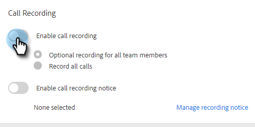

# 啟用呼叫錄制 {#enable-call-recording}

作為管理員，您可以為Sales Insight Actions調用啟用呼叫記錄。 錄制您團隊的呼叫是指導銷售代表瞭解最佳呼叫做法的絕佳方法。

1. 按一下「設定」表徵圖，然後選擇 **設定**。

   

1. 在「Admin Settings（管理設定）」下，按一下 **撥號器**。

   

1. 選擇 **啟用呼叫錄制** 切換。

   

1. 如果您希望讓銷售商能夠為自己啟用或禁用呼叫錄制，請按一下 **所有團隊成員的可選錄制**。 如果要自動記錄所有呼叫，請按一下 **記錄所有呼叫**。

   

>[!MORELIKETHIS]
>
>[雙方同意設定](/help/marketo/product-docs/marketo-sales-insight/actions/phone/two-party-consent-settings.md)
