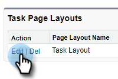
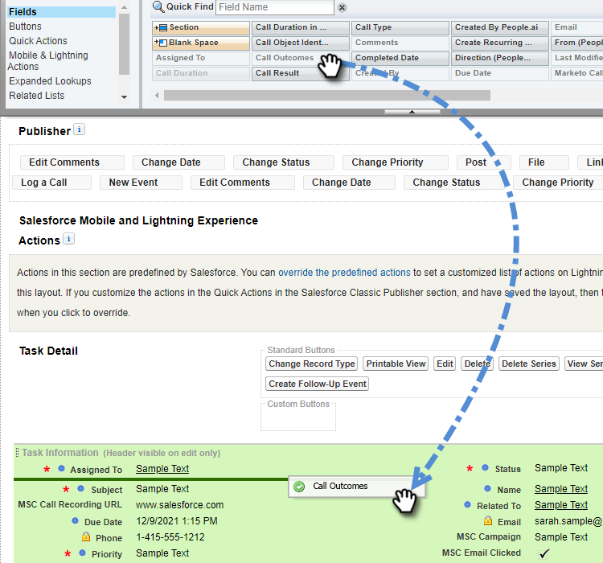

# 將來電原因與來電結果記錄到Salesforce {#log-call-reasons-and-call-outcomes-to-salesforce}

如果您想要將通話結果記錄下來，並為了報告或可見性而向Salesforce呼叫原因，您可以為每個建立自訂活動欄位。 每個欄位都必須使用特定的API名稱（在Salesforce中稱為「欄位名稱」）。

* 通話結果欄位名稱：mktosales_call_outcome
* 來電原因欄位名稱： mktosales_call_reason

若要利用這些欄位，您首先需要將欄位建立為自訂活動欄位。 為了讓使用者看得見，您需要將它新增至任務物件頁面版面配置。

## Salesforce Classic {#salesforce-classic}

### 在Salesforce Classic中建立自訂活動欄位  {#create-custom-activity-field-in-salesforce-classic}

1. 在Salesforce中，按一下 **設定**.

   

1. 在「快速尋找」方塊中輸入「活動」。

   

1. 按一下 **活動自訂欄位**.

   

1. 按一下 **新增**.

   

1. 選取資料型別「文字」並按一下 **下一個**.

   

1. 為自訂欄位指定上述定義的欄位名稱。 欄位長度有255個字元的限制。 欄位標籤將是您的銷售團隊可見的欄位，並且可以根據您團隊的需求進行自訂。

   

1. 其餘設定是選用的。 完成設定後，請按一下 **下一個**.

   

1. 為此欄位選取所需的欄位層級安全性設定，然後按一下 **下一個** （以下影像隻是範例）。

   

   >[!NOTE]
   >
   >請確定您的Sales Insight Actions使用者所使用的個人資料可看見自訂欄位，以及您想看見的其他內容。

1. 選取您要新增欄位的頁面配置，然後按一下 **儲存** (您也可以按一下 **儲存並新增** 並針對「來電原因」欄位重複此程式)。

   

### 在Salesforce Classic中新增自訂活動欄位至任務頁面配置 {#add-custom-activity-field-to-task-page-layout-in-salesforce-classic}

>[!NOTE]
>
>如果您沒有在上面的步驟9中選取想要的頁面配置，您只需依照這些步驟操作。

1. 在Salesforce中，按一下 **設定**.

   

1. 在「快速尋找」方塊中輸入「任務」。

   

1. 按一下 **任務頁面配置**.

   

1. 按一下 **編輯** 在您要新增此欄位的「任務頁面配置」旁邊。

   

1. 將欄位拖放至「任務」頁面配置的所需區段。

   

1. 按一下 **儲存**.

   

## Salesforce Lightning {#salesforce-lightning}

### 在Salesforce Lightning中建立自訂活動欄位 {#create-custom-activity-field-in-salesforce-lightning}

1. 在Salesforce中，按一下右上方的齒輪圖示並選取 **設定**.

   

1. 按一下 **物件管理員**.

   

1. 在「快速尋找」方塊中輸入「Activity」。

   

1. 按一下 **活動** 標籤。

   

1. 按一下 **欄位和關係**.

   

1. 按一下 **新增**.

   

### 在Salesforce Lightning中新增自訂活動欄位至任務頁面配置 {#add-custom-activity-field-to-task-page-layout-in-salesforce-lightning}

1. 在Salesforce中，按一下右上方的齒輪圖示並選取 **設定**.

   

1. 按一下 **物件管理員**.

   

1. 在「快速尋找」方塊中輸入「任務」。

   

1. 按一下 **任務** 標籤。

   

1. 按一下 **頁面配置**.

   

1. 按一下您要新增此欄位的工作頁面配置。

   

1. 將欄位拖放至「任務」頁面配置的所需區段。

   

1. 按一下 **儲存**.

   

>[!MORELIKETHIS]
>
>* [呼叫結果](/help/marketo/product-docs/marketo-sales-insight/actions/phone/call-outcomes.md)
>* [來電原因](/help/marketo/product-docs/marketo-sales-insight/actions/phone/call-reasons.md)
