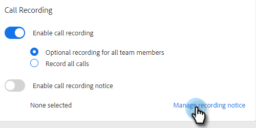

# 雙方同意設定 {#two-party-consent-settings}

為了確保錄製通話時遵守美國雙方同意法，身為管理員，您可以啟用您選擇的預先錄製訊息，在通話錄製時於通話開始時播放。

>[!PREREQUISITES]
>
>在依照下列步驟操作之前，您必須先 [啟用通話錄製](/help/marketo/product-docs/marketo-sales-insight/actions/phone/enable-call-recording.md).

1. 按一下設定圖示並選取 **設定**.

   

1. 在「管理設定」底下，按一下 **一般**.

   

1. 在通話記錄卡中，按一下 **管理錄製通知**.

   

1. 按一下 **匯入錄製**.

   

   >[!NOTE]
   >
   >僅支援Wav和MP3檔案。 您無法上傳超過30秒的檔案。

1. 從硬碟中選取所需的音訊檔案。

   

1. 上傳完成後，在檔案管理員中選取點（三個點），然後按一下 **選取作為同意通知**. 按一下 **確定** 完成時。

   

1. 按一下切換按鈕，即可啟用選取的訊息在您所錄製的通話開始時播放。

   
