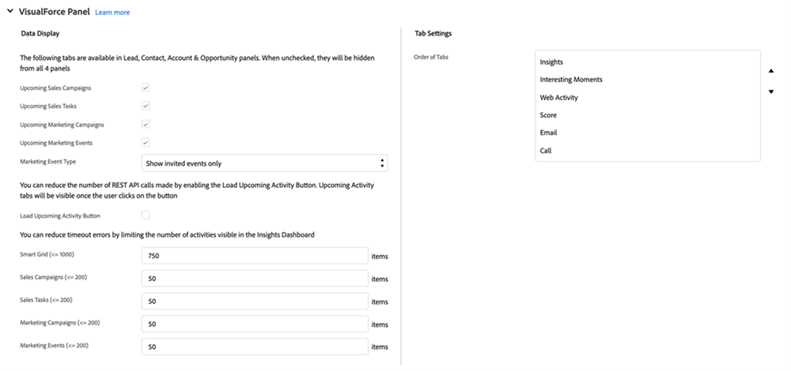

# Salesforce中的MSI操作配置 {#msi-actions-configuration-in-salesforce}

>[!PREREQUISITES]
>
>* [安裝](/help/marketo/product-docs/marketo-sales-insight/msi-for-salesforce/installation/install-marketo-sales-insight-package-in-salesforce-appexchange.md) 或 [升級](/help/marketo/product-docs/marketo-sales-insight/msi-for-salesforce/upgrading/upgrading-your-msi-package.md) Salesforce實例中的Sales Insight包
>* [在Salesforce Enterprise/Unlimited中配置MarketoSales Insight](/help/marketo/product-docs/marketo-sales-insight/msi-for-salesforce/configuration/configure-marketo-sales-insight-in-salesforce-enterprise-unlimited.md)

## 在Salesforce中添加新遠程站點 {#add-new-remote-site-in-salesforce}

1. 在Salesforce中，按一下 **設定**。

   

1. 搜索「遠程站點」並選擇 **遠程站點設定**。
   

1. 按一下 **新建遠程站點**。

   

1. 輸入遠程站點名稱（它可能類似於「MarketoSalesInsight」）。 輸入遠程站點URL(https://ims-na1-stg1.adobelogin.com)，然後按一下 **保存**。

   

## 在CRM中啟用MSI操作 {#enabling-msi-actions-across-the-crm}

1. 在Salesforce中，按一下 **MarketoSales Insight配置** 頁籤。

   

   >[!NOTE]
   >
   >如果您在頂欄中未看到「Marketo銷售洞察力配置」，請按一下 **+** 在「All Tabs（所有頁籤）」下簽名並查找。

1. 選擇 **啟用MSI操作** 複選框。

   

1. 輸入API密鑰。

   

   >[!NOTE]
   >
   >如果您的API密鑰不方便使用，您可以按照中的步驟找到它 [這篇文章](/help/marketo/product-docs/marketo-sales-insight/msi-for-salesforce/configuration/configure-marketo-sales-insight-in-salesforce-enterprise-unlimited.md)。

1. 按一下 **保存** 完成。

這將自動啟用功能概述文章中概述的所有MSI操作功能。

>[!NOTE]
>
>只需取消選中「啟用MSI操作」複選框，即可禁用所有MSI操作功能。

## MSI-Actions治理 {#msi-actions-governance}

1. 您可以禁用「銷售市場活動」和/或「即將到來的」部分中的「任務」標籤。 這將適用於銷售線索、聯繫人、客戶和機會小組。

   

1. 通過取消檢查「操作」設定下的相應功能，可以禁用MSI操作。

   

>[!NOTE]
>
>治理設定適用於所有MSI用戶。
