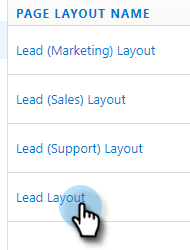

# 解除安裝Salesforce Lightning自訂套件 {#uninstall-salesforce-lightning-customization-package}

開始使用MSI操作包後，請從Salesforce帳戶卸載Marketo Sales Connect包。

## 從「頁面佈局」中刪除「銷售連接」欄位 {#remove-sales-connect-fields-from-page-layout}

1. 在Salesforce Lightning中，按一下齒輪表徵圖並選擇 **設定**.

   

1. 按一下 **物件管理員**.

   

1. 向下捲動至並選取 **銷售機會**.

   

1. 按一下 **頁面配置**.

   

1. 按一下 **銷售機會佈局**.

   

   >[!NOTE]
   >
   >尚未在Salesforce Lightning中更新「編輯頁面」版面檢視。

1. 在主控台中，選取 **欄位**. 在快速查找中，搜索「MSC」。 所有灰色欄位已新增至您的頁面配置。 你必須刪除它們。

   

   >[!NOTE]
   >
   >如果沒有任何欄位會變灰，表示您尚未將它們新增至頁面配置。 您可以略過本節。

1. 捲動至包含「Sales Connect自定義」欄位的部分。

   

1. 可新增10種MSC欄位至此區段。 移除您新增的所有欄位，或直接刪除整個區段。

1. 按一下 **快速儲存** 時才能使用。

   

## 從頁面佈局中刪除Sales Connect按鈕 {#remove-sales-connect-buttons-from-page-layouts}

1. 在主控台中（上述步驟4），選取 **按鈕**. 搜索&quot;MSC&quot;。 所有灰色的按鈕已新增至您的自訂按鈕區段。 你必須刪除它們。

   

   >[!NOTE]
   >
   >如果沒有任何按鈕呈灰色，表示您尚未新增這些按鈕。 您可以略過本節。

1. 將MSC按鈕從「自定義按鈕」部分拖放到控制台。

   

1. 按一下 **快速儲存** 時才能使用。

   

## 從「活動歷史記錄」部分刪除「銷售連接」欄位 {#remove-sales-connect-fields-from-activity-history-section}

1. 捲動至頁面底部至「活動歷史記錄」相關清單區段，然後按一下「扳手」圖示。

   

1. 從「選定欄位」區域中選擇「銷售連接欄位」，然後按一下「刪除」箭頭。 按一下 **確定** 時才能使用。

   

   >[!NOTE]
   >
   >退化MSE _is_ 銷售連接。 這只是前一個名字，「Marketo銷售活動」。

1. 按一下 **儲存** 當您完成銷售機會頁面時。

## 從「銷售線索清單」視圖中刪除Sales Connect批量操作按鈕 {#remove-sales-connect-bulk-action-buttons-from-lead-list-view}

1. 在Salesforce Lightning中，按一下齒輪表徵圖並選擇 **設定**.

   

1. 按一下 **物件管理員**.

   

1. 向下捲動至並選取 **銷售機會**.

   

1. 按一下 **搜尋配置**.

   

1. 按一下「List View（清單視圖）」旁的箭頭，然後選擇 **編輯**.

   

1. 選擇 **新增至MSC促銷活動**, **具有MSC的電子郵件**，和 **推送至MSC**，然後按一下「移除」箭頭。 然後按一下 **儲存**.

   

您不應再看到銷售機會清單檢視上的按鈕。

## 刪除聯繫人的MSC配置 {#remove-msc-configuration-for-contacts}

1. 在Salesforce Lightning中，按一下齒輪表徵圖並選擇 **設定**.

1. 按一下 **物件管理員**.

1. 向下捲動至並選取 **連絡人**.

1. 按一下 **頁面配置**.

1. 按一下 **連絡人版面**.

1. 從全部三個部分重複步驟。

## 刪除Opportunity的MSC配置 {#remove-msc-configuration-for-opportunity}

1. 在Salesforce Lightning中，按一下齒輪表徵圖並選擇 **設定**.

1. 按一下 **物件管理員**.

1. 向下捲動至並選取 **機會**.

1. 按一下 **頁面配置**.

1. 按一下 **機會佈局**.

Opportunity視圖只包含一個按鈕 — 「發送MSE電子郵件」和以下欄位：

## 刪除帳戶的MSC配置 {#remove-msc-configuration-for-account}

1. 在Salesforce Lightning中，按一下齒輪表徵圖並選擇 **設定**.

1. 按一下 **物件管理員**.

1. 向下捲動至並選取 **帳戶**.

1. 按一下 **頁面配置**.

1. 按一下 **帳戶配置**.

帳戶檢視只有一個按鈕 — 「傳送MSE電子郵件」和下列欄位：

## 移除Marketo銷售寄件匣 {#remove-marketo-sales-outbox}

1. 在Salesforce中，按一下 **+** 標籤。

1. 按一下 **自訂我的索引標籤**.

1. 從右側選擇「Marketo銷售出貨箱」選項。 按一下「移除」箭頭，然後按一下 **儲存**.

## 刪除Sales Connect包 {#delete-sales-connect-package}

從Salesforce帳戶中刪除所有對象後，請執行以下步驟。

1. 在Salesforce Lightning中，按一下齒輪表徵圖並選擇 **設定**.

1. 在「快速查找」框中，輸入「Apex類」。

1. 按一下 **刪除** 」或「MarketoSalesEngageCustomization」項目旁邊。

你都準備好了！

以下是需要從Salesforce實例中刪除的所有對象的清單：

## Sales Connect定制詳細資訊 {#sales-connect-customization-details}

<table>
 <tr>
  <th>自訂活動欄位</th>
  <th>說明</th>
  <th>類型</th>
  <th>資料類型</th>
 </tr>
 <tr>
  <td>MSC呼叫本地存在ID</td>
  <td>作為用戶，當我從MSC Phone進行呼叫時，我可以選擇「本地存在」作為選項。 傳入的呼叫將顯示接收器的本地號碼</td>
  <td>活動</td>
  <td>文字</td>
 </tr>
 <tr>
  <td>MSC呼叫記錄URL</td>
  <td>可以記錄呼叫，並在此處記錄錄制的連結 </td>
  <td>活動</td>
  <td>文字</td>
 </tr>
 <tr>
  <td>MSC Campaign</td>
  <td>記錄連絡人/銷售機會所在之MSC促銷活動的名稱</td>
  <td>活動</td>
  <td>文字</td>
 </tr>
 <tr>
  <td>MSC促銷活動URL</td>
  <td>將URL記錄到在MSC中建立的促銷活動。 按一下此按鈕將開啟MSC網頁應用程式中的促銷活動</td>
  <td>活動</td>
  <td>文字</td>
 </tr>
 <tr>
  <td>MSC促銷活動目前步驟</td>
  <td>如果聯絡人/銷售機會位於促銷活動上，此欄位將記錄他們目前所在步驟的名稱</td>
  <td>活動</td>
  <td>核取方塊</td>
 </tr>
 <tr>
  <td>已查看MSC電子郵件附件</td>
  <td>當電子郵件與收件者所檢視的附件一起傳送時，記錄資料</td>
  <td>活動</td>
  <td>核取方塊</td>
 </tr>
 <tr>
  <td>已點按MSC電子郵件</td>
  <td>當收件者按一下電子郵件中的連結時，記錄核取記號</td>
  <td>活動</td>
  <td>核取方塊</td>
 </tr>
 <tr>
  <td>MSC電子郵件已回復</td>
  <td>當收件者回覆電子郵件時，記錄核取記號</td>
  <td>活動</td>
  <td>文字</td>
 </tr>
 <tr>
  <td>MSC電子郵件狀態</td>
  <td>顯示電子郵件是否已傳送/進行中/已跳出（追蹤已跳出的電子郵件取決於使用的傳送管道）</td>
  <td>活動</td>
  <td>文字</td>
 </tr>
 <tr>
  <td>MSC電子郵件模板</td>
  <td>記錄傳送至銷售機會/連絡人之電子郵件中所使用之MSC範本的名稱</td>
  <td>活動</td>
  <td>文字</td>
 </tr>
 <tr>
  <td>MSC電子郵件模板URL</td>
  <td>將URL記錄到在MSC中建立的模板。 按一下此按鈕將開啟MSC Web應用程式中的模板</td>
  <td>活動</td>
  <td>文字</td>
 </tr>
 <tr>
  <td>MSC電子郵件URL</td>
  <td>按一下此URL將開啟MSC中的命令中心，並拉出「人員詳細資訊視圖」歷史記錄頁簽，用戶可以在該頁簽中查看發送的電子郵件</td>
  <td>活動</td>
  <td>文字</td>
 </tr>
 <tr>
  <td>已查看MSC電子郵件</td>
  <td>當收件者檢視電子郵件時，記錄核取記號</td>
  <td>活動</td>
  <td>核取方塊</td>
 </tr>
</table>

<table>
 <tr>
  <th>MSC Rollup Logging欄位</th>
  <th>說明</th>
  <th>類型</th>
  <th>資料類型</th>
 </tr>
 <tr>
  <td>MSC — 上次行銷參與</td>
  <td>上次從行銷傳入的參與</td>
  <td>
  
帳戶
  
連絡人
  
銷售機會
  
機會</td>
  <td>資料和時間</td>
 </tr>
 <tr>
  <td>MSC — 上次行銷參與日期</td>
  <td>來自行銷的參與時間戳記</td>
  <td>
  
帳戶 
  
連絡人 
  
銷售機會 
  
機會</td>
  <td>資料和時間</td>
 </tr>
 <tr>
  <td>MSC — 上次行銷參與設計</td>
  <td>參與說明</td>
  <td>
  
帳戶 
  
連絡人 
  
銷售機會 
  
機會</td>
  <td>文字</td>
 </tr>
 <tr>
  <td>MSC — 上次行銷參與來源</td>
  <td>行銷參與來源</td>
  <td>
  
帳戶 
  
連絡人 
  
銷售機會 
  
機會</td>
  <td>文字</td>
 </tr>
 <tr>
  <td>MSC — 上次行銷參與類型</td>
  <td>參與類型(例如：Web活動)</td>
  <td>
  
帳戶 
  
連絡人 
  
銷售機會 
  
機會</td>
  <td>文字</td>
 </tr>
 <tr>
  <td>MSC — 按銷售列出的上次活動</td>
  <td>銷售團隊執行的上次傳出活動</td>
  <td>
  
帳戶 
  
連絡人 
  
銷售機會 
  
機會</td>
  <td>資料和時間</td>
 </tr>
 <tr>
  <td>MSC — 上次答復</td>
  <td>銷售電子郵件的最後一封電子郵件回復</td>
  <td>
  
帳戶 
  
連絡人 
  
銷售機會 
  
機會</td>
  <td>資料和時間</td>
 </tr>
 <tr>
  <td>MSC — 當前銷售活動</td>
  <td>記錄連絡人/銷售機會所在之MSC促銷活動的名稱</td>
  <td>
  
帳戶 
  
連絡人 
  
銷售機會 
  
機會</td>
  <td>文字</td>
 </tr>
 <tr>
  <td>MSC — 上次銷售參與</td>
  <td>來自Sales的上次傳入參與</td>
  <td>
  
帳戶
  
連絡人
  
銷售機會
  
機會</td>
  <td>資料和時間</td>
 </tr>
 <tr>
  <td>MSC — 選擇退出</td>
  <td>退出欄位</td>
  <td>
  
帳戶 
  
連絡人 
  
銷售機會 
  
機會</td>
  <td>核取方塊</td>
 </tr>
</table>

<table>
 <tr>
  <th>MSC按鈕</th>
  <th>說明</th>
  <th>類型</th>
 </tr>
 <tr>
  <td>發送MSC電子郵件</td>
  <td>從Salesforce傳送銷售電子郵件</td>
  <td>
  
帳戶 
  
連絡人 
  
銷售機會 
  
機會</td>
 </tr>
 <tr>
  <td>新增至MSC促銷活動</td>
  <td>從Salesforce新增至MSC促銷活動</td>
  <td>
  
連絡人
  
銷售機會</td>
 </tr>
 <tr>
  <td>推送至MSC</td>
  <td>將聯繫人從Salesforce推送到MSC</td>
  <td>
  
連絡人
  
銷售機會</td>
 </tr>
 <tr>
  <td>用MSC呼叫</td>
  <td>從Salesforce進行銷售呼叫</td>
  <td>
  
連絡人
  
銷售機會</td>
 </tr>
</table>

<table>
 <tr>
  <th>MSC批量操作按鈕</th>
  <th>說明</th>
  <th>類型</th>
 </tr>
 <tr>
  <td>新增至MSC促銷活動</td>
  <td>從Salesforce新增至MSC促銷活動</td>
  <td>
  
連絡人
  
銷售機會</td>
 </tr>
 <tr>
  <td>推送至MSC</td>
  <td>將聯繫人從Salesforce推送到MSC</td>
  <td>
  
連絡人
  
銷售機會</td>
 </tr>
 <tr>
  <td>具有MSC的電子郵件</td>
  <td>從Salesforce向MSC發送電子郵件</td>
  <td>
  
連絡人
  
銷售機會</td>
 </tr>
</table>
