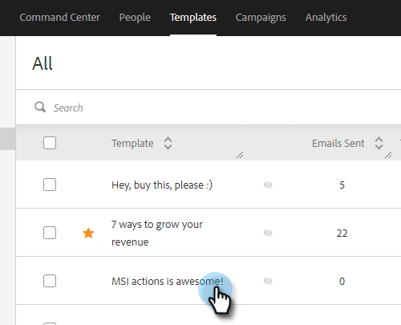

# 新增超連結文字 {#add-hyperlinked-text}

請依照下列步驟，瞭解如何將超連結新增至您的電子郵件範本。

1. 在[!UICONTROL Templates]頁面中，選取所需的範本（或建立新範本）。

   

1. 按一下「**[!UICONTROL Edit]**」。

   

1. 輸入您要超連結的文字（亦即「按一下這裡」）。 [!DNL Highlight]它，然後按一下編輯器中的連結按鈕。

   

1. 輸入您希望連結的URL （亦即`https://experienceleague.adobe.com/docs/marketo/using/home.html`）。 選擇您要在相同或新視窗中開啟URL，然後按一下&#x200B;**[!UICONTROL Save]**。

   

1. 再按一下&#x200B;**[!UICONTROL Save]**。

   

>[!NOTE]
>
>如果您編輯的範本目前用作任何行銷活動的電子郵件步驟，您將可以選擇更新特定（或所有）行銷活動的措辭。
