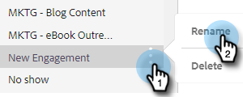

# 管理範本類別 {#manage-template-categories}

## 建立類別 {#create-a-category}

1. 按一下 **範本** 標籤。

   

1. 按一下 **+** 表徵圖 **類別**.

   

1. 輸入新類別的名稱，然後按一下 **建立**.

   

## 重新命名範本類別 {#rename-a-template-category}

1. 按一下 **範本** 標籤。

   

1. 將滑鼠指標暫留在您要重新命名的範本上，然後按一下資料（三個點）。 選擇 **重新命名**.

   

1. 輸入新名稱。 按Enter鍵（或按一下畫面上的其他位置）以儲存。

   

## 刪除範本類別 {#delete-a-template-category}

1. 按一下 **範本** 標籤。

   

1. 將滑鼠指標暫留在您要重新命名的範本上，然後按一下資料（三個點）。 選擇 **刪除**.

   

1. 按一下 **刪除** 確認。

   

>[!NOTE]
>
>如果類別中仍有範本，則無法刪除類別。 刪除類別之前，請移動或刪除所有範本。
