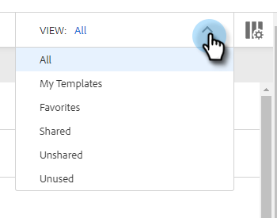
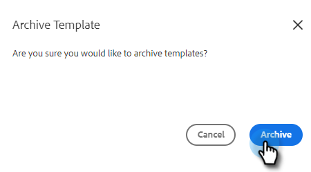

# 管理模板 {#manage-templates}

## 建立模板 {#create-a-new-template}

1. 導航到 **模板** 頁籤。

   

1. 按一下 **建立模板**。

   

1. 選擇 **名稱** 和 **類別** ，然後按一下 **建立**。

   

1. 在模板編輯器中，為電子郵件建立主題行並鍵入所需的消息。 使用編輯工具（字型、文本大小等） 的子菜單。 按一下 **保存** 完成更改。

   

>[!TIP]
>
>始終將文本直接鍵入到模板中，或從純文字檔案編輯器（如記事本或文本編輯）中複製。 從富格文本編輯器（例如，MS Word）複製和貼上可能會導致格式不規則。

## 查看模板詳細資訊 {#view-template-details}

「模板詳細資訊」區域包含多個頁籤。

<table>
 <tr>
  <td><strong>模板</strong></td>
  <td>審閱並編輯、設定條件以使模板成為推薦的模板、添加註釋</td>
 </tr>
 <tr>
  <td><strong>分析</strong></td>
  <td>查看模板的項目分析。 執行篩選搜索。</td>
 </tr>
 <tr>
  <td><strong>電子郵件</strong></td>
  <td>查看已使用此模板發送的所有電子郵件。 執行篩選搜索。</td>
 </tr>
 <tr>
  <td><strong>市場活動</strong></td>
  <td>查看模板正在使用的市場活動。</td>
 </tr>
</table>

## 共用模板 {#share-a-template}

如果您使用我們的團隊帳戶之一，則預設情況下，所有模板仍為私有。

1. 導航到 **模板** 頁籤。

   

1. 查找並選擇所需模板。

   

1. 按一下 **共用** 按鈕

   

   >[!NOTE]
   >
   >與您共用的模板將顯示在 **團隊模板** 頁眉。 團隊僅適用於高級用戶。

1. 按一下「與共用」(Share With)下拉框，然後選擇要與其共用的團隊。

   

1. 您可以選擇將模板保留在當前類別中或將其移動到其他類別。 在這個例子中，我們將它保留在當前的例子中。 按一下 **共用** 完成。

   

## 模板收藏夾 {#favorite-a-template}

您可以將任何類別的模板添加到收藏夾清單。 這會自動在清單頂部生成一個新類別，以便您能夠快速訪問您最常用的模板。

1. 導航到 **模板** 頁籤。

   

1. 查找所需模板並將其懸停在上面。 按一下模板名稱左側的星形。

   

   被喜愛後，星星將繼續存在。

   

## 自定義模板視圖 {#customize-template-view}

從 **視圖** 下拉框中，您可以選擇查看：所有模板、模板、收藏夾模板、共用模板、未共用模板或未使用的模板（過去90天內未使用過的模板）。

>[!NOTE]
>
>此外，按一下視圖下拉框右側的設定表徵圖，可以在模板視圖中添加/刪除列。

## 存檔模板 {#archive-a-template}

存檔模板，使銷售內容保持組織和集中，而不丟失任何模板資料。

1. 選中要存檔的模板旁邊的框。

   

1. 按一下 **存檔**。

   

1. 按一下 **存檔** 確認。

   

>[!NOTE]
>
>模板存檔後，便無法編輯或使用。 要再次使用它，請將模板從「存檔」中移出並移入任何其他類別。

您還可以選擇「未使用」過濾器來查看和存檔90天以上未使用的模板。

## 刪除模板 {#delete-a-template}

按照以下步驟刪除模板。

>[!CAUTION]
>
>刪除模板還會刪除與其關聯的所有跟蹤和分析。

1. 選中要刪除的模板旁邊的框。

   

1. 按一下 **刪除**。

   

1. 按一下 **刪除** 確認。

   
