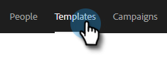

# 推薦模板 {#recommended-templates}

Sales Insight Action的「推薦模板」可幫助您在節省時間的同時獲得正確的消息。 這樣，您在發送電子郵件時就可以獲得更大的流量，並在嘗試為適當的人找到合適的電子郵件時減少了不確定性。

1. 轉到「模板」頁籤。

   

1. 選擇要推薦的模板。

   

1. 在「Recommended Template（推薦的模板）」卡中，按一下 **編輯**。

   

1. 選擇 **建立推薦模板** 複選框，然後按一下 **保存**。

   

>[!NOTE]
>
>要瞭解有關模板條件的詳細資訊，請參閱下面的內容。

## 全部與任何 {#all-vs-any}

選擇 **全部** 如果希望在滿足所有條件時建議使用模板。 選擇 **任意** 如果希望在滿足任何一個條件時推薦您的模板。

## 設定條件 {#setting-criteria}

您的條件將設定建議使用模板的條件。 最多可設定3個條件。 首先選擇要在模板中指向的動態欄位。

## 條件 {#conditions}

現在，選擇您的條件。 滿足動態欄位的條件後，將建議使用該模板。 從4個不同的條件中進行選擇。

**等於**:值必須是完全匹配(例如，Marketo等於Marketo)

**不等於**:價值必須完全不是完全匹配（例如， Marketing Nation不等於Marketing）

**包含**:只需要包含值(例如，Marketo岩！ 包含Marketo

**不包含**:值不得在動態欄位中(例如，Marketo岩！ 不包含「酷」)

## 推薦的模板的外觀 {#what-a-recommended-template-looks-like}

既然您已經映射了第一個模板，現在就該映射出其餘模板了。 瀏覽您最成功的模板並推薦它們。 不要忘記與您的團隊共用模板。 您建議的任何模板設定也將在您的團隊中共用。
