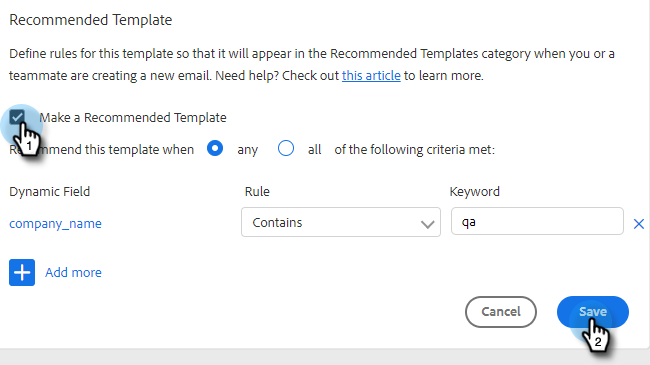

# 建議的範本 {#recommended-templates}

[!DNL Sales Insight Action]的建議範本可幫助您取得正確的訊息，同時節省您的時間。 這樣可讓您在傳送電子郵件時獲得更大的流程，並在嘗試為合適的人尋找合適電子郵件時減少不確定性。

1. 前往您的&#x200B;**[!UICONTROL Templates]**&#x200B;標籤。

   

1. 選取您要建議的範本。

   

1. 在[!UICONTROL Recommended Template]卡片中，按一下&#x200B;**[!UICONTROL Edit]**。

   

1. 選取&#x200B;**[!UICONTROL Make a Recommended Template]**&#x200B;核取方塊並按一下&#x200B;**[!UICONTROL Save]**。

   

>[!NOTE]
>
>若要深入瞭解範本條件，請參閱下文。

## 全部與任何 {#all-vs-any}

如果您想要在符合所有條件時推薦您的範本，請選取&#x200B;**[!UICONTROL All]**。 如果想要在符合任一條件時建議您的範本，請選取&#x200B;**[!UICONTROL Any]**。

## 設定條件 {#setting-criteria}

您的條件即將設定建議使用範本的條件。 您最多可以設定3個條件。 首先，選取您要在範本中指向的動態欄位。

## 條件 {#conditions}

現在，請選取您的條件。 當您的動態欄位條件符合時，將建議使用範本。 從4個不同條件中選擇。

**[!UICONTROL Equals]**：值必須為完全相符的值(例如Marketo等於Marketo)

**[!UICONTROL Does not Equal]**：值必須為完全相符的專案（例如，「行銷國家」不等於「行銷」）

**[!UICONTROL Contains]**：只需要包含值(例如Marketo Rocks！ 包含Marketo)

**[!UICONTROL Does Not Contain]**：值不得位於動態欄位中(例如Marketo Rocks！ 不包含「棒極了」)

## 建議的範本是什麼樣子 {#what-a-recommended-template-looks-like}

現在您已對應第一個範本，是時候對應其餘範本了。 瀏覽您最成功的範本，並加以推薦。 同時別忘了與團隊共用範本。 您針對任何範本建議的設定也會在您的團隊之間分享。
