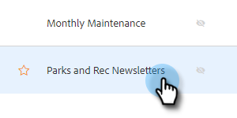
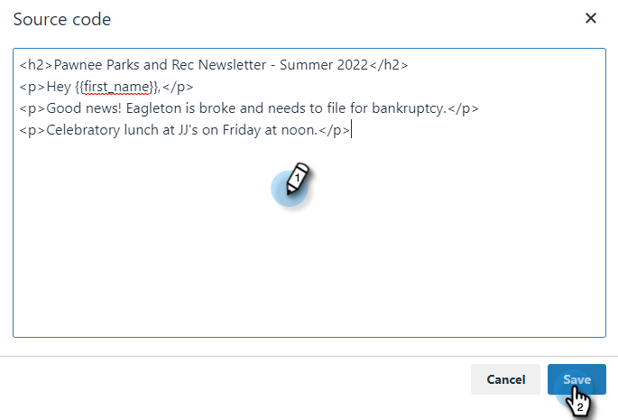

# 使用HTML {#using-html}

1. 在您用來在HTML中建立電子郵件的工具(例如Marketo的電子郵件編輯器)中，複製來自您電子郵件的原始碼。

1. 選取您要新增HTML的範本。

   

1. 在「範本編輯器」卡片中，按一下 **編輯**.

   

1. 按一下 **來源** 按鈕。

   

1. 貼上原始碼，然後按一下 **儲存**.

   

>[!NOTE]
>
>如果您看見「錯誤 — 移除樣式/java/html標籤」錯誤，表示您有我們不支援的樣式。 您應搜索Word樣式的原始碼，並刪除 ``.
