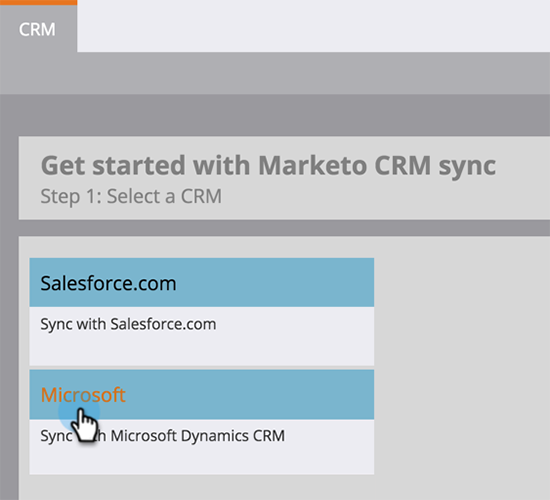

# 下載[!DNL Marketo Sales Insight]的[!DNL Microsoft Dynamics]解決方案 {#download-the-marketo-sales-insight-solution-for-microsoft-dynamics}

>[!NOTE]
>
>**需要管理員許可權**

>[!IMPORTANT]
>
>Marketo Engage此頁面上的外掛程式適用於使用Marketo的原生CRM同步解決方案同步至[!DNL Dynamics 365]的使用者。 對於擁有自訂同步[!DNL MS Dynamics 365 Online] （9.x及更高版本）並已購買[!DNL Marketo Sales Insight]的使用者，[封裝在這裡](https://mktg-cdn.marketo.com/community/MarketoSalesInsight_NonNative.zip){target="_blank"}。

1. 前往「**[!UICONTROL Admin]**」區域。

   

1. 按一下&#x200B;**CRM**。

   

1. 選取&#x200B;**Microsoft**。

   

1. 選取「**[!UICONTROL Download Marketo Solution]**」。

   

1. 為您的[!DNL Microsoft Dynamics]版本選取適當的解決方案。

   

太棒了！ 解決方案的zip檔案將會下載至您的裝置。
