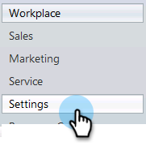

# 在[!DNL Marketo Sales Insight]中安裝並設定[!DNL Microsoft Dynamics 2011] {#install-and-configure-marketo-sales-insight-in-microsoft-dynamics}

[!DNL Marketo Sales Insight]是您銷售團隊的好工具。 以下逐步說明如何在[!DNL Microsoft Dynamics 2011]內部部署中安裝和設定它。

>[!PREREQUISITES]
>
>完成您的Marketo-Microsoft整合。
>
>[下載您](/help/marketo/product-docs/marketo-sales-insight/msi-for-microsoft-dynamics/installing/download-the-marketo-sales-insight-solution-for-microsoft-dynamics.md) CRM版本的正確解決方案[!DNL Microsoft Dynamics]。

## 匯入解決方案 {#import-solution}

1. 登入[!DNL Microsoft Dynamics] CRM。 按一下左下方功能表中的&#x200B;**[!UICONTROL Settings]**。

   

1. 在樹狀結構中選取&#x200B;**[!UICONTROL Solutions]**。

   

1. 按一下&#x200B;**匯入** ( )。

   

   >[!NOTE]
   >
   >在繼續之前，您應該已安裝[並設定](/help/marketo/product-docs/marketo-sales-insight/msi-for-microsoft-dynamics/installing/install-and-configure-marketo-sales-insight-in-microsoft-dynamics-2011.md) Marketo解決方案。

1. 按一下&#x200B;**[!UICONTROL Browse]**。 選取您[!DNL Marketo Sales Insight]下載的[解決方案](/help/marketo/product-docs/marketo-sales-insight/msi-for-microsoft-dynamics/installing/download-the-marketo-sales-insight-solution-for-microsoft-dynamics.md)。 按一下「**[!UICONTROL Next]**」。

   

1. 驗證解決方案的詳細資料，然後按一下&#x200B;**[!UICONTROL Next]**。

   

1. 請確定已勾選SDK訊息選項。 按一下「**[!UICONTROL Next]**」。

   

1. 現在請等待匯入完成。

   

1. 按一下「**[!UICONTROL Close]**」。

   

1. [!DNL Marketo Sales Insight]現在會顯示在方案清單中。 耶！

   

1. 選取[!DNL Marketo Sales Insight]並按一下&#x200B;**發佈所有自訂** ( )。

   

## 連結Marketo與Sales Insight  {#connect-marketo-and-sales-insight}

>[!NOTE]
>
>**需要管理員許可權**

1. 登入Marketo並按一下&#x200B;**[!UICONTROL Admin]**。

   

1. 在&#x200B;**[!UICONTROL Sales Insight]**&#x200B;區段下，按一下&#x200B;**[!UICONTROL Edit API Configuration]**。

   

1. 複製&#x200B;**[!UICONTROL Marketo Host]**、**[!UICONTROL API URL]**&#x200B;和&#x200B;**[!UICONTROL API User Id]**&#x200B;以供稍後步驟使用。 輸入您選擇的&#x200B;**[!UICONTROL API Secret Key]**&#x200B;並按一下&#x200B;**[!UICONTROL Save]**。

   >[!CAUTION]
   >
   >請勿在您的API秘密金鑰中使用&amp;符號。

   

   >[!NOTE]
   >
   >下列欄位必須與Marketo同步，_銷售機會和連絡人_&#x200B;才能讓銷售Insight運作：
   >
   >* 優先順序
   >* 急迫性
   >* 相對分數
   >
   >如果缺少這些欄位，您會在Marketo中看到錯誤訊息，其中包含缺少欄位的名稱。 若要修正此問題，請執行[此程式](/help/marketo/product-docs/marketo-sales-insight/msi-for-microsoft-dynamics/setting-up-and-using/required-fields-for-syncing-marketo-with-dynamics.md)。

1. 返回Dynamics，選取&#x200B;**[!UICONTROL Settings]**。

   

1. 在樹狀結構中選取&#x200B;**[!UICONTROL Marketo API Config]**。

   

1. 按一下「**[!UICONTROL Default Configuration]**」。

   

1. 輸入您先前從Marketo取得的資訊。

   

1. 按一下「**[!UICONTROL Save]**」。

   

## 設定使用者存取權 {#set-user-access}

設定使用者角色以授與特定使用者對[!DNL Sales Insight]的存取權。

1. 選擇「**[!UICONTROL Settings]**」。

   

1. 在樹狀結構中選取&#x200B;**[!UICONTROL Administration]**。

   

1. 按一下「**[!UICONTROL Users]**」。

   

1. 選取您要授與存取許可權的使用者，然後按一下&#x200B;**[!UICONTROL Manage Roles]**。

   

1. 選取&#x200B;**[!UICONTROL Marketo Sales Insight]**&#x200B;角色並按一下&#x200B;**[!UICONTROL OK]**。

   

   就是這樣！ 所有使用者有權存取，現在可以在銷售機會/聯絡人詳細資料檢視中檢視銷售insight區段。

   

   恭喜！ 您現在已釋放[!DNL Marketo Sales Insight]的力量。

>[!MORELIKETHIS]
>
>[設定潛在客戶/連絡人記錄的星星和火焰](/help/marketo/product-docs/marketo-sales-insight/msi-for-microsoft-dynamics/setting-up-and-using/setting-up-stars-and-flames-for-lead-contact-records.md)
