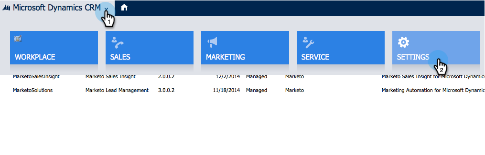

# 在Microsoft Dynamics 2013 {#install-and-configure-marketo-sales-insight-in-microsoft-dynamics}中安裝及設定Marketo Sales Insight

Marketo Sales Insight是一套絕佳的工具，可讓銷售團隊透過「視窗」瞭解行銷團隊所擁有的豐富資料。 以下是如何安裝和設定它。

>[!PREREQUISITES]
>
>完成您的Marketo-Microsoft整合。
>
>[下載適用於](/help/marketo/product-docs/marketo-sales-insight/msi-for-microsoft-dynamics/installing/download-the-marketo-sales-insight-solution-for-microsoft-dynamics.md) 您Microsoft Dynamics CRM版本的正確解決方案。

## 匯入解決方案{#import-solution}

好，現在是時候將Marketon Sales Insight解決方案匯入Microsoft Dynamics了。

1. 在&#x200B;**Microsoft Dynamics CRM**&#x200B;下，按一下&#x200B;**Settings**。

   

1. 在&#x200B;**Settings**&#x200B;下，按一下&#x200B;**Customizations**。

   

1. 按一下&#x200B;**Solutions**。

   

   >[!NOTE]
   >
   >您應已安裝並設定Marketto，然後再繼續

1. 按一下&#x200B;**Import**。

   

1. 在新視窗中，按一下「瀏覽」。****

   

1. 尋找並選取您上述下載的解決方案。

   

1. 按一下&#x200B;**Next**。

   

1. 解決方案將上傳。 您可以視需要檢視套件內容。 按一下&#x200B;**Next**。

   

1. 請務必勾選方塊，然後按一下「匯入」。****

   

1. 請隨時下載記錄檔。 按一下&#x200B;**關閉**。

   

1. 太棒了！ 您現在應該看到解決方案。 如果沒有，請重新整理您的畫面。

   

## Connect Marketo和Sales Insight {#connect-marketo-and-sales-insight}

讓我們將您的Marketo實例與Dynamics中的Sales Insight系結。

>[!NOTE]
>
>需要管理員權限。

1. 登入Marketo並前往&#x200B;**Admin**&#x200B;區段。

   

1. 在&#x200B;**Sales Insight**&#x200B;區段下，按一下&#x200B;**Edit API Configuration**。

   

1. 複製&#x200B;**Marketo Host**、**API URL**&#x200B;和&#x200B;**API使用者Id**，以用於後續步驟。 輸入您選擇的&#x200B;**API密鑰**，然後按一下&#x200B;**保存**。

   >[!CAUTION]
   >
   >請勿在API密鑰中使用&amp;符號。

   

   >[!NOTE]
   >
   >_Lead和Contact_&#x200B;必須與Marketo同步下列欄位，Sales Insight才能運作：
   >
   >* 優先順序
   >* 緊急
   >* 相對分數

   >
   >如果這些欄位中有任何欄位遺失，您會在Marketo中看到錯誤訊息，其名稱為遺失欄位。 要修復此問題，請執行[此過程](/help/marketo/product-docs/marketo-sales-insight/msi-for-microsoft-dynamics/setting-up-and-using/required-fields-for-syncing-marketo-with-dynamics.md)。

1. 回到Microsoft Dynamics，請至&#x200B;**Settings**。

   

1. 在「**Settings**」下方，按一下「Marketo API Config **」。**

   

1. 按一下&#x200B;**新建**。

   

1. 輸入您從Marketing前往的資訊，然後按一下「儲存」。****

   

## 設定用戶訪問{#set-user-access}

最後，您可讓特定使用者存取Marketo Sales Insight。

1. 前往&#x200B;**Settings**。

   

1. 按一下&#x200B;**用戶**。

   

1. 選擇要授予Sales Insight訪問權限的用戶，然後按一下&#x200B;**管理角色**。

   

1. 選擇&#x200B;**Marketo Sales Insight**&#x200B;角色，然後按一下&#x200B;**確定**。

   

   你們該完蛋了！ 最後，若要測試，請以可存取Marketo Sales Insight的使用者身分登入Dynamics，並查看銷售線索或連絡人。

   

您現在已為您的銷售團隊釋放Marketo Sales Insight的強大功能。

>[!MORELIKETHIS]
>
>[為銷售線索／聯繫人記錄設定星形和火焰](/help/marketo/product-docs/marketo-sales-insight/msi-for-microsoft-dynamics/setting-up-and-using/setting-up-stars-and-flames-for-lead-contact-records.md)
