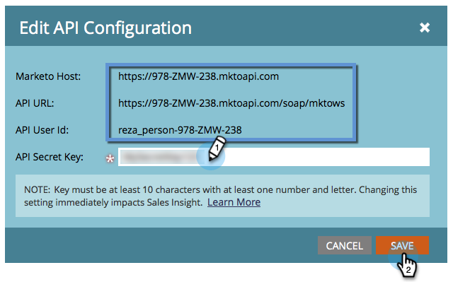
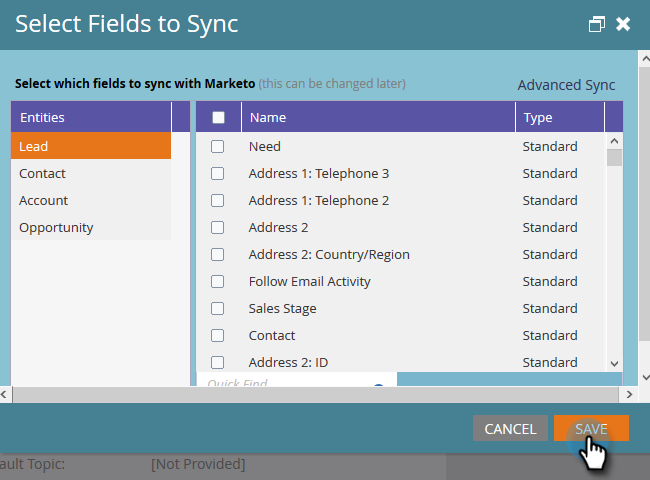

# 在Microsoft Dynamics Online中安裝和設定Marketo Sales Insight {#install-and-configure-marketo-sales-insight-in-microsoft-dynamics-online}

Marketo Sales Insight是絕佳的工具，可讓您的銷售團隊透過「視窗」了解行銷團隊所擁有的豐富資料。 以下說明如何在Microsoft Dynamics Online中安裝和設定。

>[!PREREQUISITES]
>
>完成Marketo-Microsoft整合。
>
>[下載正確的解決方案](/help/marketo/product-docs/marketo-sales-insight/msi-for-microsoft-dynamics/installing/download-the-marketo-sales-insight-solution-for-microsoft-dynamics.md) ，以取得Microsoft Dynamics CRM的版本。

## 匯入解決方案 {#import-solution}

>[!NOTE]
>
>如果您使用的是統一介面，請在下列步驟1之前，按一下右上角的「設定」圖示，然後選取 **進階設定**.

1. 在Microsoft Dynamics CRM底下，按一下 **設定**.

   

1. 在「設定」下，按一下 **自訂**.

   

1. 按一下 **解決方案**.

   

   >[!NOTE]
   >
   >您應先安裝並設定Marketo解決方案，再繼續進行。

1. 按一下 **匯入**.

   

1. 在新視窗中，按一下 **瀏覽**.

   

1. 在您的電腦上，尋找並安裝您剛下載的解決方案。

1. 按一下 **下一個**.

   

1. 解決方案將上傳。 您可以視需要檢視套件內容。 按一下 **下一個**.

   

1. 請務必保留核取方塊，然後按一下 **匯入**.

   

1. 您可以下載記錄檔，然後按一下 **關閉**.

   

1. 太棒了！ 您應該立刻看到解決方案。 如果沒有，請重新整理您的畫面。

   

1. 按一下 **發佈自訂**.

   >[!NOTE]
   >
   >請務必啟用全局MS Dynamics同步。

## Connect Marketo和Sales Insight {#connect-marketo-and-sales-insight}

將您的Marketo執行個體系結至Dynamics中的Sales Insight 。 方法如下：

>[!NOTE]
>
>**需要管理權限**

1. 登入Marketo並前往 **管理** 區段。

   

1. 在「銷售分析」區段下，按一下 **編輯API設定**.

   

1. 複製 **Marketo名嘴**, **API URL**，和 **API使用者Id** 以用於後續步驟。 輸入您選擇的API密鑰，然後按一下 **儲存**.

   >[!CAUTION]
   >
   >請勿在API密鑰中使用&amp;符號。

   

   >[!NOTE]
   >
   >下列欄位必須與Marketo同步，才能 _銷售機會和聯繫人_ 讓Sales Insight發揮作用：
   >
   >* 優先順序
   >* 緊急
   >* 相對分數

   >
   >如果缺少其中任何欄位，您會在Marketo中看到錯誤訊息，其名稱為缺少的欄位。 若要修正此問題，請執行 [本程式](/help/marketo/product-docs/marketo-sales-insight/msi-for-microsoft-dynamics/setting-up-and-using/required-fields-for-syncing-marketo-with-dynamics.md).

1. 回到Microsoft Dynamics，前往 **設定**.

   

1. 在 **設定**，按一下 **Marketo API設定**.

   

1. 按一下 **新增**.

   

1. 輸入您先前從Marketo擷取的資訊，然後按一下 **儲存**.

   

## 啟用同步 {#enable-sync}

1. 在Marketo中，按一下 **管理**.

   

1. 在「整合」下，選取 **Microsoft Dynamics**.

   

1. 按一下 **啟用同步**.

   

1. 按一下 **編輯** 欄位同步詳細資訊旁邊。

   

1. 這將 _自動_ 選擇以前禁用的MSI欄位（緊急、相對分數和優先順序）。 只需按一下 **儲存** 以開始同步資料。

   

## 設定使用者存取權 {#set-user-access}

最後，您必須授予特定使用者使用Marketo Sales Insight的存取權。

1. 前往 **設定**.

   

1. 前往 **安全性**.

   

1. 按一下 **使用者**.

   

1. 選擇要授予Sales Insight訪問權限的用戶，然後按一下 **管理角色**.

   

1. 選取Marketo Sales Insight角色，然後按一下 **確定**.

   

   你們該完蛋了！ 最後，若要測試，請以可存取Marketo Sales Insight的使用者身分登入Dynamics，並查看銷售機會或連絡人。

   

>[!MORELIKETHIS]
>
>[設定線索/聯繫記錄的星光和火焰](/help/marketo/product-docs/marketo-sales-insight/msi-for-microsoft-dynamics/setting-up-and-using/setting-up-stars-and-flames-for-lead-contact-records.md)
