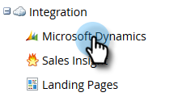

# 在[!DNL Marketo Sales Insight]中安裝並設定[!DNL Microsoft Dynamics Online] {#install-and-configure-marketo-sales-insight-in-microsoft-dynamics-online}

[!DNL Marketo Sales Insight]是絕佳的工具，可讓您的銷售團隊透過一個「視窗」瞭解行銷團隊擁有的豐富資料。 以下說明如何在[!DNL Microsoft Dynamics Online]中安裝和設定它。

>[!PREREQUISITES]
>
>完成您的Marketo-Microsoft整合。
>
>[下載您](/help/marketo/product-docs/marketo-sales-insight/msi-for-microsoft-dynamics/installing/download-the-marketo-sales-insight-solution-for-microsoft-dynamics.md)版本的正確解決方案[!DNL Microsoft Dynamics CRM]。

## 匯入解決方案 {#import-solution}

>[!NOTE]
>
>如果您使用統一介面，請在下方的步驟1之前，按一下右上角的「設定」圖示並選取「**[!UICONTROL Advanced Settings]**」。

1. 在Microsoft Dynamics CRM底下，按一下&#x200B;**[!UICONTROL Settings]**。

   

1. 在[設定]下，按一下[**[!UICONTROL Customizations]**]。

   

1. 按一下「**[!UICONTROL Solutions]**」。

   

   >[!NOTE]
   >
   >在繼續之前，您應該已安裝並設定Marketo解決方案。

1. 按一下「**[!UICONTROL Import]**」。

   

1. 在新視窗中，按一下&#x200B;**[!UICONTROL Browse]**。

   

1. 在您的電腦上，尋找並安裝您剛才下載的解決方案。

1. 按一下「**[!UICONTROL Next]**」。

   

1. 解決方案將會上傳。 您可以視需要檢視封裝內容。 按一下「**[!UICONTROL Next]**」。

   

1. 請確定保持核取方塊，然後按一下&#x200B;**[!UICONTROL Import]**。

   

1. 歡迎下載記錄檔，然後按一下&#x200B;**[!UICONTROL Close]**。

   

1. 棒極了！ 您現在應該會看到解決方案。 如果不在那裡，請重新整理您的熒幕。

   

1. 按一下「**[!UICONTROL Publish Customization]**」。

   >[!NOTE]
   >
   >請確定啟用全域[!DNL MS Dynamics]同步處理。

## 連線Marketo和[!DNL Sales Insight] {#connect-marketo-and-sales-insight}

讓我們在[!DNL Sales Insight]中將您的Marketo執行個體連結至[!DNL Dynamics]。 方法如下：

>[!NOTE]
>
>**需要管理員許可權**

1. 登入Marketo並移至&#x200B;**[!UICONTROL Admin]**&#x200B;區段。

   

1. 在[!UICONTROL Sales Insight]區段下，按一下&#x200B;**[!UICONTROL Edit API Configuration]**。

   

1. 複製&#x200B;**[!UICONTROL Marketo Host]**、**[!UICONTROL API URL]**&#x200B;和&#x200B;**[!UICONTROL API User Id]**&#x200B;以供稍後步驟使用。 輸入您選擇的API秘密金鑰，然後按一下&#x200B;**[!UICONTROL Save]**。

   >[!CAUTION]
   >
   >請勿在您的API秘密金鑰中使用&amp;符號。

   

   >[!NOTE]
   >
   >下列欄位必須與Marketo同步，_潛在客戶和連絡人_&#x200B;才能使用[!DNL Sales Insight]：
   >
   >* 優先順序
   >* 急迫性
   >* 相對分數
   >
   >如果缺少這些欄位，您會在Marketo中看到錯誤訊息，其中包含缺少欄位的名稱。 若要修正此問題，請執行[此程式](/help/marketo/product-docs/marketo-sales-insight/msi-for-microsoft-dynamics/setting-up-and-using/required-fields-for-syncing-marketo-with-dynamics.md)。

1. 返回[!DNL Microsoft Dynamics]，移至&#x200B;**[!UICONTROL Settings]**。

   

1. 在&#x200B;**[!UICONTROL Settings]**&#x200B;底下，按一下&#x200B;**[!UICONTROL Marketo API Config]**。

   

1. 按一下「**[!UICONTROL New]**」。

   

1. 輸入您先前從Marketo取得的資訊，然後按一下&#x200B;**[!UICONTROL Save]**。

   

## 啟用同步 {#enable-sync}

1. 在Marketo中，按一下&#x200B;**[!UICONTROL Admin]**。

   

1. 在整合下，選取&#x200B;**[!UICONTROL Microsoft Dynamics]**。

   

1. 按一下「**[!UICONTROL Enable Sync]**」。

   

1. 按一下&#x200B;**[!UICONTROL Edit]**&#x200B;旁的[!UICONTROL Field Sync Details]。

   

1. 這會&#x200B;_自動_&#x200B;選取先前已停用的MSI欄位（[!UICONTROL Urgency]、[!UICONTROL Relative Score]和[!UICONTROL Priority]）。 只要按一下&#x200B;**[!UICONTROL Save]**&#x200B;即可開始同步資料。

   

## 設定使用者存取權 {#set-user-access}

最後，您必須授予特定使用者使用[!DNL Marketo Sales Insight]的存取權。

1. 移至&#x200B;**[!UICONTROL Settings]**。

   

1. 移至&#x200B;**[!UICONTROL Security]**。

   

1. 按一下「**[!UICONTROL Users]**」。

   

1. 選取您要授與[!DNL Sales Insight]存取權的使用者，然後按一下&#x200B;**[!UICONTROL Manage Roles]**。

   

1. 選取[!DNL Marketo Sales Insight]角色並按一下&#x200B;**[!UICONTROL OK]**。

   

   而且您應該已全部完成！ 最後，若要進行測試，請以可存取[!DNL Dynamics]的使用者身分登入[!DNL Marketo Sales Insight]，並檢視潛在客戶或連絡人。

   

>[!MORELIKETHIS]
>
>[設定潛在客戶/連絡人記錄的星星和火焰](/help/marketo/product-docs/marketo-sales-insight/msi-for-microsoft-dynamics/setting-up-and-using/setting-up-stars-and-flames-for-lead-contact-records.md)
