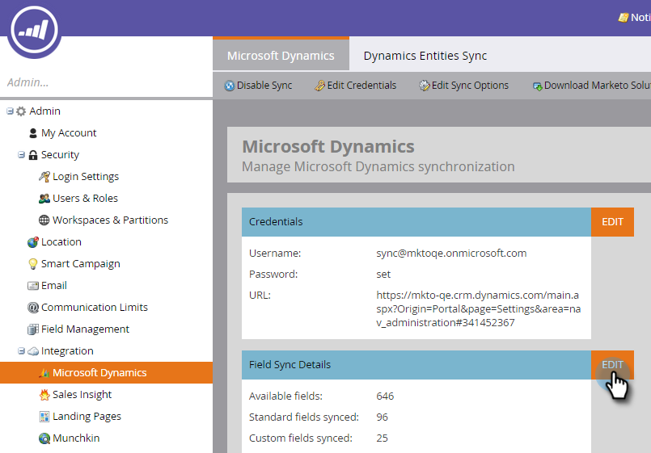
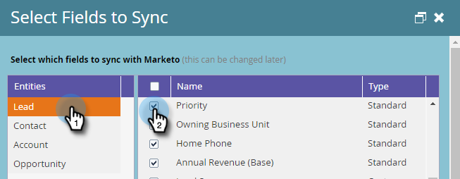
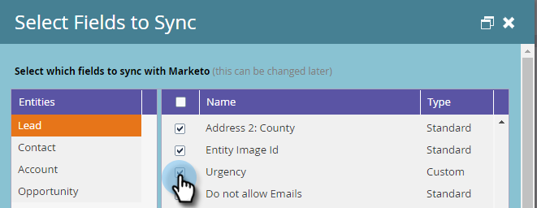
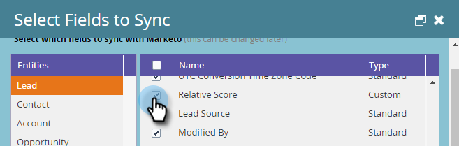
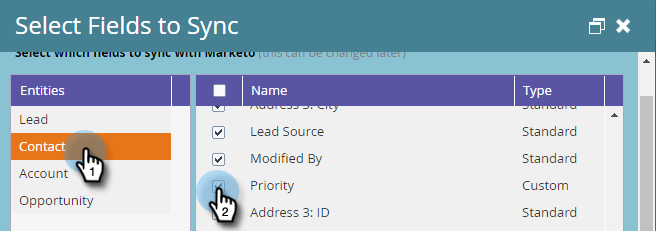

# 與[!DNL Dynamics]同步Marketo的必要欄位 {#required-fields-for-syncing-marketo-with-dynamics}

這些欄位&#x200B;*必須*&#x200B;與Marketo同步，以便[!UICONTROL Lead]和[!UICONTROL Contact]都能夠運作[!DNL Sales Insight]：

* 優先順序
* 急迫性
* 相對分數

如果缺少這些欄位，您會在Marketo中看到錯誤訊息，其中包含缺少欄位的名稱。 若要修正此問題，請簽入您的執行個體，以確定欄位已同時為&#x200B;**[!UICONTROL Lead]**&#x200B;和&#x200B;**[!UICONTROL Contact]**&#x200B;同步。 如果沒有，請新增它們。

以下說明如何驗證和新增同步欄位。

1. 移至[!UICONTROL Admin]並按一下&#x200B;**[!UICONTROL Microsoft Dynamics]**。

   

1. 在[!UICONTROL Field Sync Details]上按一下&#x200B;**[!UICONTROL Edit]**。

   

1. 在[!UICONTROL Lead]底下，核取[!UICONTROL Priority]核取方塊。

   

1. 現在，向下捲動並勾選[!UICONTROL Urgency]核取方塊……

   

1. ...和[!UICONTROL Relative Score]核取方塊。

   

1. 接下來，核取[!UICONTROL Contact]的[!UICONTROL Priority]、[!UICONTROL Urgency]和[!UICONTROL Relative Score]核取方塊。

   

1. 按一下「**[!UICONTROL Save]**」。

   

>[!NOTE]
>
>確認您已修正問題前，請務必等候至少10分鐘讓同步執行。

>[!MORELIKETHIS]
>
>[設定潛在客戶/連絡人記錄的星星和火焰](/help/marketo/product-docs/marketo-sales-insight/msi-for-microsoft-dynamics/setting-up-and-using/setting-up-stars-and-flames-for-lead-contact-records.md)
