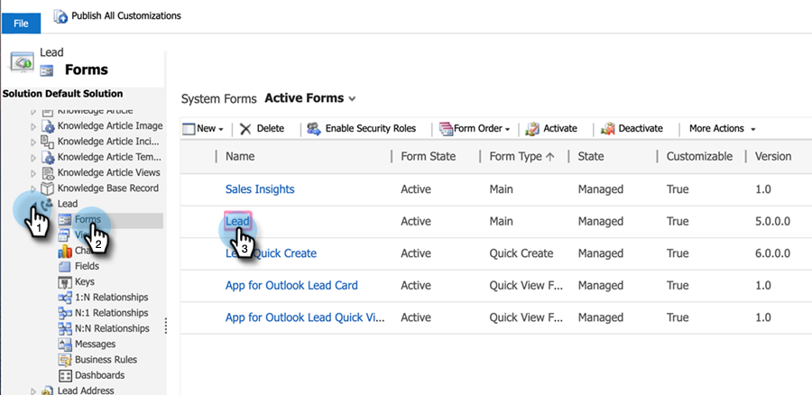

# 設定線索/聯繫記錄的星光和火焰 {#setting-up-stars-and-flames-for-lead-contact-records}

潛在客戶/聯繫記錄上的星號和火焰取決於：前置分數、相對分數、緊急程度和優先順序欄位。 在安裝和配置MSI解決方案後，預設情況下，這些欄位可用。 如果您沒有Stars和Flame，先前的設定/自訂可能會導致移除。 請依照下列步驟來新增。

1. 在Microsoft Dynamics中，按一下「銷售」下拉式清單，然後選取 **設定**. 按一下 **自訂**，然後 **自訂系統**.

1. 在左側面板中，按一下 **實體**.

1. 尋找並按一下 **銷售機會**，然後 **Forms**，然後選擇要編輯的表單。

   

1. 按一下 **Marketo Sales Insight** 的下界。 在右側面板中，按一下「篩選」下拉式清單，然後選取 **自訂欄位**.

   

1. 拖放下列項目：前置分數、相對分數、緊急程度和優先順序欄位。 以最適合您的方式安排。 您也可以按兩下任何欄位，以設定欄位格式。

1. 完成後，按一下 **儲存並關閉**.
