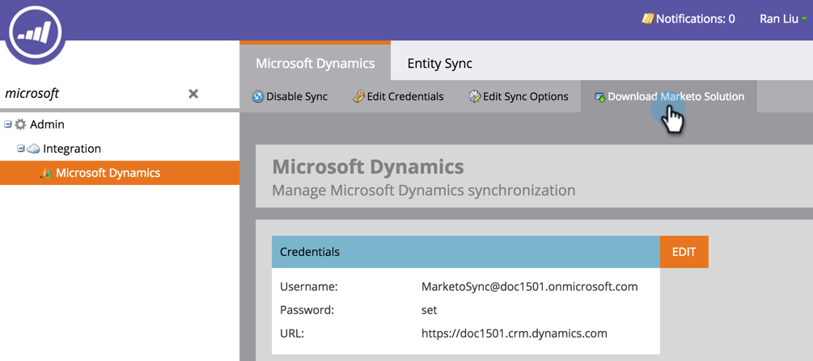

# 升級[!DNL Microsoft Dynamics]的[!DNL Marketo Sales Insight]解決方案 {#upgrade-the-marketo-sales-insight-solution-for-microsoft-dynamics}

當針對[!DNL Sales Insight]發行新的[!DNL Microsoft Dynamics]解決方案時，您可以從帳戶的[!UICONTROL Admin]區域下載升級。

>[!NOTE]
>
>**需要管理員權限**

1. 前往「**[!UICONTROL Admin]**」區域。

   

1. 按一下「**[!UICONTROL Microsoft Dynamics]**」。

   

1. 選取「**[!UICONTROL Download Marketo Solution]**」。

   

1. 為您的[!DNL Microsoft Dynamics]版本選取適當的解決方案。

   

   棒極了！ 解決方案的zip檔案現在將下載至您的裝置。

## 執行升級 {#performing-the-upgrade}

1. 匯入解決方案的最新版本，而非您[!DNL Dynamics CRM]的現有版本（例如：如果您的[!DNL Dynamics CRM]版本為1.4，而最新版本為1.5，您將會匯入&#x200B;_超過_&#x200B;版本1.4）。

2. 您會看到下列快顯視窗。 選取&#x200B;**[!UICONTROL Stage for Upgrade]**&#x200B;和&#x200B;**[!UICONTROL Maintain customizations]**，然後按一下&#x200B;**[!UICONTROL Import]**。

