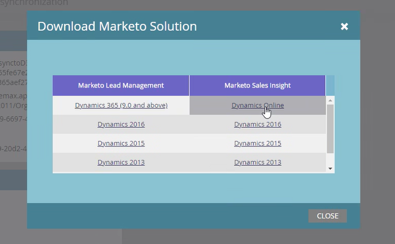

# 升級適用於Microsoft Dynamics的Marketo Sales Insight解決方案 {#upgrade-the-marketo-sales-insight-solution-for-microsoft-dynamics}

針對Sales Insight發行新的Microsoft Dynamics解決方案時，您可以從帳戶的「管理員」區域下載升級。

>[!NOTE]
>
>**需要管理員許可權**

1. 前往 **管理員** 區域。

   

1. 按一下 **Microsoft Dynamics**.

   

1. 選取 **下載Marketo解決方案**.

   

1. 為您的Microsoft Dynamics版本選取適當的解決方案。

   

   棒極了！ 解決方案的zip檔案現在將下載至您的裝置。

## 執行升級 {#performing-the-upgrade}

1. 匯入最新版本的解決方案，以取代現有的Dynamics CRM版本(例如：如果您的Dynamics CRM版本為1.4，而最新版本為1.5，您將會匯入 _超過_ 1.4版)。

2. 您會看到下列快顯視窗。 選取 **暫存升級** 和 **維護自訂**，然後按一下 **匯入**.

