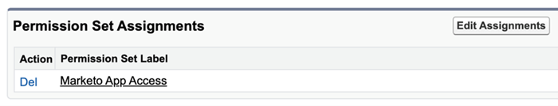

# 添加Sales Insight權限集 {#add-sales-insight-permission-set}

使用以下步驟可添加對Salesforce中Sales Insight功能的訪問。 Salesforce經典與閃電

>[!PREREQUISITES]
>
>[更新Sales Insight Salesforce包](/help/marketo/product-docs/marketo-sales-insight/msi-for-salesforce/upgrading/upgrading-your-msi-package.md){target=&quot;_blank&quot;}到1.8000或更高版本以使用此功能。

>[!IMPORTANT]
>
>如果您以前已經為所有用戶授予了Sales Insight對所有配置檔案和/或實施的Sales Insight的訪問權限，則必須 [刪除配置檔案級別訪問](/help/marketo/product-docs/marketo-sales-insight/msi-for-salesforce/configuration/remove-sales-insight-access.md){target=&quot;_blank&quot;}可使用此權限集。

## 概述 {#overview}

「Marketo應用」權限是Sales Insight Salesforce包的一部分。 它包括對以下對象、頂層類和可視化強制頁面的訪問。 這些是訪問所有Sales Insight功能所必需的。

**對象設定**

<table> 
 <tbody> 
 <tr> 
   <td>BestBetsCache</td> 
   <td>讀取、建立、編輯、刪除、查看全部、修改全部</td> 
  </tr> 
  <tr> 
   <td>最佳匹配視圖詳細資訊</td> 
   <td>讀取、建立、編輯、刪除、查看全部、修改全部</td> 
  </tr> 
  <tr> 
   <td>最佳最佳視圖</td> 
   <td>讀取、建立、編輯、刪除、查看全部、修改全部</td> 
  </tr> 
  <tr> 
   <td>EmailActivityCache</td> 
   <td>讀取、建立、編輯、刪除、查看全部、修改全部</td> 
  </tr> 
  <tr> 
   <td>GetMethodArgus</td> 
   <td>讀取、建立、編輯、刪除、查看全部、修改全部</td> 
  </tr> 
  <tr> 
   <td>GroupedWebActivityCache</td> 
   <td>讀取、建立、編輯、刪除、查看全部、修改全部</td> 
  </tr> 
  <tr> 
   <td>有趣的瞬間快取</td> 
   <td>讀取、建立、編輯、刪除、查看全部、修改全部</td> 
  </tr> 
  <tr> 
   <td>MarketoSales Insight配置</td> 
   <td>讀取、建立、編輯、刪除、查看全部、修改全部</td> 
  </tr> 
  <tr> 
   <td>計分快取</td> 
   <td>讀取、建立、編輯、刪除、查看全部、修改全部</td> 
  </tr> 
  <tr> 
   <td>值</td> 
   <td>讀取、建立、編輯、刪除、查看全部、修改全部</td> 
  </tr> 
  <tr> 
   <td>WebActivityCache</td> 
   <td>讀取、建立、編輯、刪除、查看全部、修改全部</td> 
  </tr> 
 </tbody> 
</table>

* Apex類訪問：159個帶有&quot;mkto_si&quot;的頂點類
* VisualForce頁面訪問：64使用&quot;mkto_si&quot;的VisualForce頁面
* 自定義設定定義：mkto_si.Marketo設定和mkto_si.用戶首選項

## 將Marketo應用權限集添加到用戶 {#adding-marketo-app-permission-set-to-users}

1. 登錄到Salesforce帳戶。

1. 按一下 **設定**。

   

1. 在「管理員」(Administrator)下，按一下展開 **管理用戶**，則 **用戶**。

   

1. 在「所有用戶」下，選擇要提供訪問權限的用戶，然後按一下 **權限集分配**。

   

1. 按一下 **編輯分配**。

   

1. 選擇 **Marketo應用程式訪問** 從可用權限集，然後 **添加**。 按一下 **保存**。

   

1. 現在，當向下滾動「用戶詳細資訊」頁面時，您將在「權限集分配」下看到「Marketo應用訪問」。

   

>[!NOTE]
>
>無權訪問Sales Insight的用戶將看到以下消息：&quot;您沒有足夠的權限訪問此頁籤。&quot;

就這樣！ 您已成功添加Sales Insight訪問權限。 對要為其添加訪問權限的任何其他配置檔案重複相同步驟。
