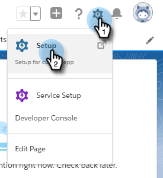

# Salesforce Lightning中的批量操作 {#bulk-actions-in-salesforce-lightning}

下面是如何在Salesforce Lightning中設定批量活動。

1. 在Salesforce中，按一下「設定」表徵圖，然後選擇 **設定**。

   

1. 按一下 **對象管理器** 頁籤。

   

1. 查找並選擇 **線索** 的子菜單。

   

1. 按一下 **搜索Salesforce經典版佈局**。

   

   查找「清單視圖」佈局。 按一下右側的下拉框並選擇 **編輯**。

   

1. 在「自定義按鈕」下，查找並選擇 **添加到Marketo活動（閃電）** 和 **發送Marketo電子郵件（閃電）**。 按一下 **添加** 按鈕

   

1. 按一下 **保存**。

   

   您現在將能夠在「銷售線索清單視圖」中查看批量操作按鈕。

   >[!NOTE]
   >
   >重複相同步驟，在「聯繫人清單」視圖中添加批量操作。
