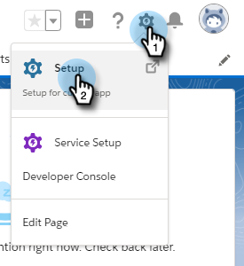
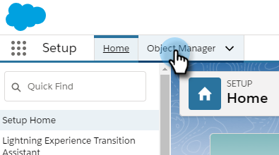
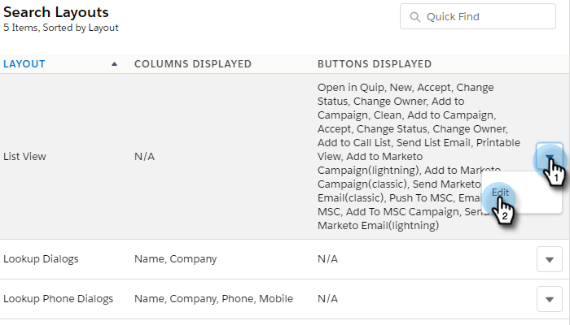
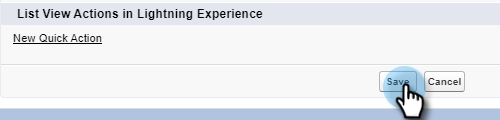

# [!DNL Salesforce Lightning]中的大量動作 {#bulk-actions-in-salesforce-lightning}

以下說明如何在[!DNL Salesforce Lightning]中設定大量動作。

1. 在[!DNL Salesforce]中，按一下「設定」圖示並選取&#x200B;**[!UICONTROL Setup]**。

   

1. 按一下「**[!UICONTROL Object Manager]**」索引標籤。

   

1. 尋找並選取&#x200B;**[!UICONTROL Lead]**&#x200B;標籤。

   

1. 按一下「**[!UICONTROL Search Layouts for Salesforce Classic]**」。

   

   尋找「清單檢視」版面配置。 按一下右側的下拉式清單，然後選取&#x200B;**[!UICONTROL Edit]**。

   

1. 在[自訂按鈕]下，尋找並選取&#x200B;**[!UICONTROL Add to Marketo Campaign (lightning)]**&#x200B;和&#x200B;**[!UICONTROL Send Marketo Email (lightning)]**。 按一下&#x200B;**[!UICONTROL Add]**&#x200B;按鈕。

   

1. 按一下「**[!UICONTROL Save]**」。

   

   您現在可以在「潛在客戶清單檢視」中看到大量動作按鈕。

   >[!NOTE]
   >
   >重複相同的步驟，在連絡人清單檢視中新增大量動作。
