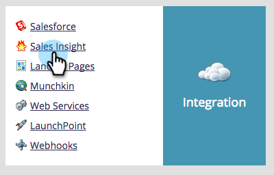

# 在Salesforce Enterprise/Unlimited中設定Marketo Sales Insight {#configure-marketo-sales-insight-in-salesforce-enterprise-unlimited}

以下是在Salesforce Enterprise/Unlimited Editions中設定Marketo Sales Insight所需執行的步驟。 我們開始吧。

>[!PREREQUISITES]
>
>* [在SalesforceAppExchange中安裝Marketo Sales Insight套件](/help/marketo/product-docs/marketo-sales-insight/msi-for-salesforce/installation/install-marketo-sales-insight-package-in-salesforce-appexchange.md)

>[!NOTE]
**需要管理權限**

## 在Marketo中設定Sales Insight {#configure-sales-insight-in-marketo}

1. 開啟新的瀏覽器視窗，從您的Marketo帳戶取得Marketo Sales Insight認證。

1. 前往「管理員」區域，然後選取&#x200B;**Sales Insight**。

   

1. 按一下「**編輯API配置**」。

   

1. 輸入您選擇的API密鑰，然後按一下&#x200B;**Save**。 請勿在API密鑰中使用&amp;符號。

   

   >[!NOTE]
   您的API密鑰就像組織的密碼，應該是安全的。

1. 按一下「Rest API配置」面板中的「**檢視**」以填入憑證。

   

1. 您會看到確認快顯視窗。 按一下&#x200B;**確定**。

   

## 在Salesforce中設定Sales Insight {#configure-sales-insight-in-salesforce}

1. 在Salesforce中，按一下&#x200B;**Setup**。

   

1. 搜索「遠程站點」並選擇&#x200B;**遠程站點設定**。

   

1. 按一下「**新建遠程站點**」。

   

1. 輸入遠端網站名稱（可以是&quot;MarketoSoapAPI&quot;）。 從Marketo的「Soap API設定」面板中，輸入遠端網站URL，即您的Marketo主機URL。 按一下「**儲存**」。 您現在已為Soap API建立了遠程站點設定。

   

1. 再次按一下「**新建遠程站點**」。

   

1. 輸入遠端網站名稱（可以是&quot;MarketoRestAPI&quot;）。 輸入遠端網站URL，這是您來自Marketo中Rest API設定面板的API URL。 按一下「**儲存**」。 您現在已為Rest API建立遠端網站設定。

## 設定Marketo Sales Insight {#set-up-marketo-sales-insight}

1. 登入您的Marketo例項，然後按一下&#x200B;**Admin**。

   

1. 按一下&#x200B;**Sales Insight**。

   

1. 按一下「**編輯API配置**」。

   

1. 輸入&#x200B;**API密鑰**，然後按一下&#x200B;**保存**。

   >[!CAUTION]
   請勿在API密鑰中使用&amp;符號。

   

   >[!TIP]
   把窗戶保持開啟。 您稍後將在Salesforce中需要此資訊。

1. 返回Salesforce，按一下&#x200B;**Setup**。

   

1. 搜索&quot;remote site&quot;，然後按一下&#x200B;**安全控制**&#x200B;下的&#x200B;**遠程站點設定**。

   

1. 按一下「**新建遠程站點**」。

   

1. 輸入&#x200B;**遠程站點名稱**&#x200B;和&#x200B;**遠程站點URL**，然後按一下&#x200B;**保存**。

   

   >[!NOTE]
   您可以選擇您的&#x200B;**遠端網站名稱**（此處使用MarketoAPI）。 您可以在步驟4的「編輯API設定」對話方塊的「Marketo主機」欄位中，找到&#x200B;**遠端網站URL**。

## 自訂頁面配置 {#customize-page-layouts}

1. 按一下&#x200B;**Setup**。

   

1. 搜索「page layout」，並在&#x200B;**Leads**&#x200B;下選擇&#x200B;**Page Layout**。

   

1. 按一下左側的&#x200B;**視覺效果強制頁面**。 拖曳&#x200B;**Section**&#x200B;至「自訂連結」區段下的版面。

   

1. 輸入&quot;Marketo Sales Insight&quot;作為&#x200B;**節名**。 選擇&#x200B;**1-Column**&#x200B;並按一下&#x200B;**OK**。

   

1. 將&#x200B;**Lead**&#x200B;拖放到新區段中。

   

   >[!TIP]
   此框的名稱將根據對象類型而更改。 例如，如果您修改Contacts的頁面佈局，則會顯示Contact。

1. 按兩下您剛添加的&#x200B;**Lead**&#x200B;塊。

   

1. 將高度編輯為&#x200B;**450**&#x200B;像素，然後按一下&#x200B;**確定**。

   

   >[!TIP]
   建議Accounts和Opportunity對象的高度為410像素。

1. 按一下左側的&#x200B;**欄位**。 然後，搜尋並拖曳&#x200B;**Engagement**&#x200B;標籤至&#x200B;**Marketo Sales Insight**&#x200B;版面。

   

1. 對這些欄位也重複上述步驟。

   <table> 
    <tbody> 
     <tr> 
      <td colspan="1">參與</td> 
     </tr> 
     <tr> 
      <td colspan="1" rowspan="1">
相對分數值
</td> 
     </tr> 
     <tr> 
      <td colspan="1" rowspan="1">
緊急值
</td> 
     </tr> 
     <tr> 
      <td colspan="1" rowspan="1">
最後一個有趣的時刻
</td> 
     </tr> 
     <tr> 
      <td colspan="1" rowspan="1">
最後一個有趣的時刻Desc
</td> 
     </tr> 
     <tr> 
      <td colspan="1" rowspan="1">
最後一個有趣的時刻源
</td> 
     </tr> 
     <tr> 
      <td colspan="1" rowspan="1">
最後一個有趣的時刻類型
</td> 
     </tr> 
    </tbody> 
   </table>

1. 完成後，按一下「**儲存**」。

   

1. 重複此過程，為&#x200B;**Contact**、**Account**&#x200B;和&#x200B;**Opportunity**&#x200B;添加Visualforce頁面區段和Sales Insight欄位。

1. 重複步驟5-7為Contact、Account和Opportunity添加Visualforce頁面部分。 然後，重複步驟8-10以為&#x200B;**Contact**&#x200B;添加Sales Insight欄位。 請務必在進行任何變更後儲存。

## 映射自訂人員欄位 {#map-custom-person-fields}

Marketo人員欄位必須對應至Salesforce連絡欄位，以確保轉換正常運作。 這是方法。

1. 按一下&#x200B;**Setup**。

   

1. 在搜索欄中搜索&quot;fields&quot;，然後按一下&#x200B;**Leads**&#x200B;下的&#x200B;**Fields**。

   

1. 按一下「**映射銷售機會欄位**」。

   

1. 按一下右側的下拉式清單，查看&#x200B;**參與**。

   

1. 在清單中選擇&#x200B;**Contact.Engagement**。

   

1. 重複這些欄位並對應這些欄位。

   <table> 
    <tbody> 
     <tr> 
      <th colspan="1" rowspan="1">Marketo人員自訂欄位</th> 
      <th colspan="1" rowspan="1">Salesforce聯繫人自定義欄位</th> 
     </tr> 
     <tr> 
      <td colspan="1" rowspan="1">
參與
</td> 
      <td colspan="1" rowspan="1">
Contact.Engagement
</td> 
     </tr> 
     <tr> 
      <td colspan="1" rowspan="1">
相對分數值
</td> 
      <td colspan="1" rowspan="1">
Contact.Relative Score值
</td> 
     </tr> 
     <tr> 
      <td colspan="1" rowspan="1">
緊急值
</td> 
      <td colspan="1" rowspan="1">
Contact.Urgency值
</td> 
     </tr> 
     <tr> 
      <td colspan="1" rowspan="1">
最後一個有趣的時刻
</td> 
      <td colspan="1" rowspan="1">
Contact.最後一個有趣的時刻日期
</td> 
     </tr> 
     <tr> 
      <td colspan="1" rowspan="1">
最後一個有趣的時刻Desc
</td> 
      <td colspan="1" rowspan="1">
Contact.最後一個有趣的時刻Desc
</td> 
     </tr> 
     <tr> 
      <td colspan="1" rowspan="1">
最後一個有趣的時刻源
</td> 
      <td colspan="1" rowspan="1">
Contact.最後一個有趣的時刻源
</td> 
     </tr> 
     <tr> 
      <td colspan="1" rowspan="1">
最後一個有趣的時刻類型
</td> 
      <td colspan="1" rowspan="1">
Contact.最後一個有趣的力矩類型
</td> 
     </tr> 
    </tbody> 
   </table>

1. 完成後，按一下「**儲存**」。

## Marketo Sales Insight設定 {#marketo-sales-insight-config}

1. 按一下&#x200B;**+**，然後選取&#x200B;**Marketo Sales Insight Config**。

   

1. 檢查&#x200B;**啟用Marketo API**。 然後在Marketo Admin](#set-up-marketo-sales-insight)中填入[ API設定資訊。 完成後，按一下「**儲存變更**」。

   

   >[!NOTE]
   如果診斷測試失敗，則可能需要[將更多欄位添加到頁面佈局](https://nation.marketo.com/docs/DOC-1115)。

就這樣！ 您應該能夠看到銷售機會、聯繫人、帳戶和業務機會的「Marketo銷售分析」欄位。

>[!NOTE]
對於帳戶，Sales Insight將包含所有電子郵件，但只包含最近的有趣時刻、網路活動和分數變更。

## 存取Marketo Sales Insight {#access-marketo-sales-insight}

1. 在Salesforce中，按一下標籤欄結尾的&#x200B;**+** ，然後按一下&#x200B;**Marketo Sales Insight Config**。

1. 選取&#x200B;**啟用Marketo API**&#x200B;核取方塊。

1. 從Marketo的「銷售分析管理」頁面中的「Soap API」面板複製憑證，然後貼到「Salesforce銷售分析設定」頁面的「Soap API」區段中。

1. 從Marketo的「Sales Insight管理」頁面的「Rest API」面板複製憑證，並貼到「Salesforce Sales Insight設定」頁面的「Rest API」區段中。

   

>[!MORELIKETHIS]
* [優先順序、緊急程度、相對分數和最佳賭注](/help/marketo/product-docs/marketo-sales-insight/msi-for-salesforce/features/stars-and-flames/priority-urgency-relative-score-and-best-bets.md)
* [將Marketo Sales Insight標籤和按鈕添加到Salesforce](/help/marketo/product-docs/marketo-sales-insight/msi-for-salesforce/features/bulk-actions/add-marketo-sales-insight-tab-and-buttons-to-salesforce.md)
* [為您的團隊設定Sales Insight](/help/marketo/product-docs/marketo-sales-insight/msi-for-salesforce/configuration/setting-up-sales-insight-for-your-team.md)

