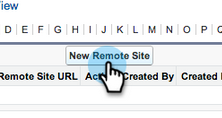

# 在Salesforce Enterprise/Unlimited中設定Marketo Sales Insight {#configure-marketo-sales-insight-in-salesforce-enterprise-unlimited}

以下是在Salesforce Enterprise/Unlimited Editions中設定Marketo Sales Insight所需執行的步驟。 我們開始吧。

>[!PREREQUISITES]
>
>[在SalesforceAppExchange中安裝Marketo Sales Insight套件](/help/marketo/product-docs/marketo-sales-insight/msi-for-salesforce/installation/install-marketo-sales-insight-package-in-salesforce-appexchange.md)

>[!NOTE]
>
>**需要管理權限**

## 在Marketo中設定Sales Insight {#configure-sales-insight-in-marketo}

1. 在Marketo中獲取您的MSI憑據。 前往「管理員」區域，然後選取 **Sales Insight**.

   

1. 按一下 **編輯API設定**.

   

1. 輸入您選擇的API密鑰，然後按一下 **儲存**. 請勿在API密鑰中使用&amp;符號。

   

   >[!NOTE]
   >
   >您的API密鑰就像組織的密碼，應該是安全的。

1. 按一下 **檢視** 填入憑證。

   

1. 您會看到確認快顯視窗。 按一下 **確定**.

   

   >[!TIP]
   >
   >把窗戶保持開啟。 稍後在Salesforce中需要此資訊。

## 在Salesforce中設定Sales Insight {#configure-sales-insight-in-salesforce}

1. 在Salesforce中，按一下 **設定**.

   

1. 搜索「遠程站點」並選擇 **遠程站點設定**.

   

1. 按一下 **新遠程站點**.

   

1. 輸入遠端網站名稱（可以是&quot;MarketoSoapAPI&quot;）。 從Marketo的「Soap API設定」面板中，輸入遠端網站URL，即您的Marketo主機URL。 按一下 **儲存**. 您現在已為Soap API建立了遠程站點設定。

   

1. 按一下 **新遠程站點** 。

   

1. 輸入遠端網站名稱（可以是&quot;MarketoAPI&quot;）。 輸入遠端網站URL，這是您來自Marketo中Rest API設定面板的API URL。 按一下 **儲存**. 您現在已為Rest API建立遠端網站設定。

   >[!NOTE]
   >
   >_您_ 選擇 **遠程站點名稱** （此處使用MarketoAPI）。 此 **遠程站點URL** 可從「在Marketo中設定銷售分析」區段的步驟3，在「編輯API設定」對話方塊的「Marketo主機」欄位中找到。

## 自訂頁面配置 {#customize-page-layouts}

1. 按一下 **設定**.

   

1. 搜尋「頁面配置」並選取 **頁面配置** 在 **銷售機會**.

   

1. 按一下 **視覺效果強制頁面** 左邊。 拖曳 **區段** 至「自訂連結」區段下的版面。

   

1. 輸入「Marketo Sales Insight」作為 **區段名稱**. 選擇 **1欄** 按一下 **確定**.

   

1. 拖放 **銷售機會** 新區段中。

   

   >[!TIP]
   >
   >此框的名稱將根據對象類型而更改。 例如，如果您修改Contacts的頁面佈局，則會顯示Contact。

1. 按兩下 **銷售機會** 阻止您剛添加。

   

1. 將高度編輯為 **450** 像素和點按 **確定**.

   

   >[!NOTE]
   >
   >檢查 **顯示捲軸** 如果您需要存取捲動活動。

   >[!TIP]
   >
   >建議Accounts和Opportunity對象的高度為410像素。

1. 按一下 **欄位** 左邊。 然後搜尋並拖曳 **緊急** 標籤 **Marketo Sales Insight** 版面配置。

   

1. 對這些欄位也重複上述步驟。

   <table> 
    <tbody> 
     <tr> 
      <td>最後一個有趣的時刻</td> 
     </tr> 
     <tr> 
      <td>最後一個有趣的時刻</td> 
     </tr> 
     <tr> 
      <td>最後一個有趣的時刻Desc</td> 
     </tr> 
     <tr> 
      <td>最後一個有趣的時刻源</td> 
     </tr> 
     <tr> 
      <td>最後一個有趣的時刻類型</td> 
     </tr> 
     <tr> 
      <td>上次Marketo活動（按銷售）</td> 
     </tr> 
     <tr> 
      <td>上次Marketo參與（按銷售）</td> 
     </tr> 
     <tr> 
      <td>MSI聯繫人ID</td> 
     </tr> 
     <tr> 
      <td>相對分數</td> 
     </tr> 
     <tr> 
      <td>相對分數值</td> 
     </tr> 
     <tr> 
      <td>緊急</td> 
     </tr> 
     <tr> 
      <td>緊急值</td> 
     </tr> 
     <tr> 
      <td>在Marketo中檢視</td> 
     </tr> 
    </tbody> 
   </table>

1. 按一下 **儲存** 完成時。

   

1. 重複步驟5-7，為新增「視覺效果」頁面區段和「銷售分析」欄位 **連絡人**, **帳戶** 和 **機會**.

1. 重複步驟8-10，從下面的清單中添加Sales Insight欄位， **連絡人**. 請務必儲存任何變更。

<table> 
    <tbody> 
     <tr> 
      <td>最後一個有趣的時刻</td> 
     </tr> 
     <tr> 
      <td>最後一個有趣的時刻</td> 
     </tr> 
     <tr> 
      <td>最後一個有趣的時刻Desc</td> 
     </tr> 
     <tr> 
      <td>最後一個有趣的時刻源</td> 
     </tr> 
     <tr> 
      <td>最後一個有趣的時刻類型</td> 
     </tr> 
     <tr> 
      <td>上次Marketo活動（按銷售）</td> 
     </tr> 
     <tr> 
      <td>上次Marketo參與（按銷售）</td> 
     </tr> 
     <tr> 
      <td>MKTO銷售機會分數</td> 
     </tr> 
     <tr> 
      <td>相對分數</td> 
     </tr> 
     <tr> 
      <td>相對分數值</td> 
     </tr> 
     <tr> 
      <td>Sales Insight — 開啟聯繫人完整清單頁面</td> 
     </tr> 
     <tr> 
      <td>緊急</td> 
     </tr> 
     <tr> 
      <td>緊急值</td> 
     </tr> 
    </tbody> 
   </table>

## 映射自訂人員欄位 {#map-custom-person-fields}

Marketo人員欄位必須對應至Salesforce連絡欄位，以確保轉換正常運作。 這是方法。

1. 按一下 **設定**.

   

1. 在搜尋列中搜尋「欄位」，然後按一下 **欄位** 在 **銷售機會**.

   

1. 按一下 **映射銷售機會欄位**.

   

1. 按一下右側的下拉式清單， **參與**.

   

1. 選擇 **Contact.Engagement** 在清單中。

   

1. 重複這些欄位並對應這些欄位。

   <table> 
    <tbody> 
     <tr> 
      <th colspan="1" rowspan="1">Marketo人員自訂欄位</th> 
      <th colspan="1" rowspan="1">Salesforce聯繫人自定義欄位</th> 
     </tr> 
     <tr> 
      <td colspan="1" rowspan="1">
參與
</td> 
      <td colspan="1" rowspan="1">
Contact.Engagement
</td> 
     </tr> 
     <tr> 
      <td colspan="1" rowspan="1">
相對分數值
</td> 
      <td colspan="1" rowspan="1">
Contact.Relative Score值
</td> 
     </tr> 
     <tr> 
      <td colspan="1" rowspan="1">
緊急值
</td> 
      <td colspan="1" rowspan="1">
Contact.Urgency值
</td> 
     </tr> 
     <tr> 
      <td colspan="1" rowspan="1">
最後一個有趣的時刻
</td> 
      <td colspan="1" rowspan="1">
Contact.最後一個有趣的時刻日期
</td> 
     </tr> 
     <tr> 
      <td colspan="1" rowspan="1">
最後一個有趣的時刻Desc
</td> 
      <td colspan="1" rowspan="1">
Contact.最後一個有趣的時刻Desc
</td> 
     </tr> 
     <tr> 
      <td colspan="1" rowspan="1">
最後一個有趣的時刻源
</td> 
      <td colspan="1" rowspan="1">
Contact.最後一個有趣的時刻源
</td> 
     </tr> 
     <tr> 
      <td colspan="1" rowspan="1">
最後一個有趣的時刻類型
</td> 
      <td colspan="1" rowspan="1">
Contact.最後一個有趣的力矩類型
</td> 
     </tr> 
    </tbody> 
   </table>

1. 按一下 **儲存** 等你完事了。

## Marketo Sales Insight設定標籤 {#marketo-sales-insight-configuration-tab}

1. 在Salesforce中，按一下 **+** 在索引標籤列的結尾，按一下 **Marketo Sales Insight設定**.

1. 從以下位置的Soap API面板複製憑證： [Marketo的Sales Insight管理頁面](/help/marketo/product-docs/marketo-sales-insight/msi-for-salesforce/configuration/configure-marketo-sales-insight-in-salesforce-professional-edition.md#set-up-marketo-sales-insight){target=&quot;_blank&quot;}，然後將其貼到「Salesforce銷售分析設定」頁面的「Soap API」區段中。

1. 從以下位置的「Rest API」面板複製憑證： [Marketo的Sales Insight管理頁面](/help/marketo/product-docs/marketo-sales-insight/msi-for-salesforce/configuration/configure-marketo-sales-insight-in-salesforce-professional-edition.md#set-up-marketo-sales-insight){target=&quot;_blank&quot;}，並貼到「Salesforce Sales Insight設定」頁面的「Rest API」區段中。

   

就這樣！ 您應該能夠看到銷售機會、聯繫人、帳戶和業務機會的「Marketo銷售分析」欄位。

>[!NOTE]
>
>如果診斷測試失敗，則可能需要 [新增更多欄位至頁面版面](https://nation.marketo.com/docs/DOC-1115){target=&quot;_blank&quot;}。

>[!NOTE]
>
>對於帳戶，Sales Insight將包含所有電子郵件，但只包含最近的有趣時刻、網路活動和分數變更。

>[!MORELIKETHIS]
>
>* [優先順序、緊急程度、相對分數和最佳賭注](/help/marketo/product-docs/marketo-sales-insight/msi-for-salesforce/features/stars-and-flames/priority-urgency-relative-score-and-best-bets.md)
>* [將Marketo標籤新增至Salesforce](/help/marketo/product-docs/marketo-sales-insight/msi-for-salesforce/configuration/add-marketo-tab-to-salesforce.md)
>* [將Sales Insight存取權新增至設定檔](/help/marketo/product-docs/marketo-sales-insight/msi-for-salesforce/configuration/add-sales-insight-access-to-profiles.md){target=&quot;_blank&quot;}

