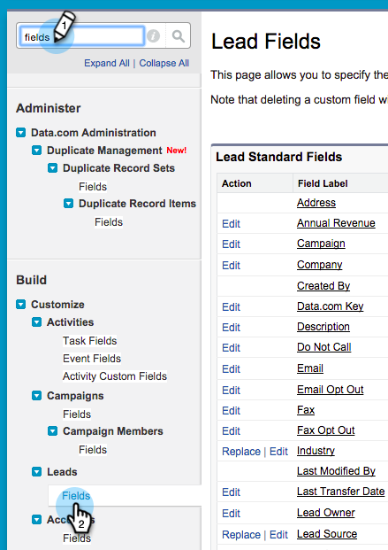

# 在Salesforce專業版中配置MarketoSales Insight {#configure-marketo-sales-insight-in-salesforce-professional-edition}

以下是在Salesforce Professional Edition中配置MarketoSales Insight所需的步驟。 開始吧。

>[!PREREQUISITES]
>
>* 在Salesforce專業版中安裝Marketo。
>
>* [在SalesforceAppExchange中安裝MarketoSales Insight軟體包](/help/marketo/product-docs/marketo-sales-insight/msi-for-salesforce/installation/install-marketo-sales-insight-package-in-salesforce-appexchange.md)

>[!NOTE]
>
>**需要管理權限**

## 在Marketo配置Sales Insight {#configure-sales-insight-in-marketo}

1. 開啟新瀏覽器窗口，從您的Marketo帳戶獲取MarketoSales Insight憑據。
1. 轉到「管理」區域並選擇 **銷售洞察**。

   

1. 按一下 **編輯API配置**。

   

1. 輸入所選的API密鑰，然後按一下 **保存**。 請勿在API密鑰中使用&amp;符號。

   

   >[!NOTE]
   >
   >您的API密鑰類似於組織的密碼，應是安全的。

1. 按一下 **視圖** 在「Rest API配置」面板中填充憑據。

   

1. 您將看到確認彈出窗口。 按一下 **確定**。

   

## 在Salesforce中配置Sales Insight {#configure-sales-insight-in-salesforce}

1. 在Salesforce中，按一下 **設定**。

   

1. 搜索「遠程站點」並選擇 **遠程站點設定**。

   

1. 按一下 **新建遠程站點**。

   

1. 輸入遠程站點名稱（可以是類似「MarketoSoapAPI」的內容）。 輸入遠程站點URL，該URL是您在Marketo的「Soap API配置」面板中的Marketo主機URL。 按一下 **保存**。 您現在已為Soap API建立遠程站點設定。

   

1. 按一下 **新建遠程站點** 的雙曲餘切值。

   

1. 輸入遠程站點名稱（可以是類似於「MarketoRestAPI」）。 輸入遠程站點URL，該URL是來自Marketo的「Rest API配置」面板的API URL。 按一下 **保存**。 您現在已為Rest API建立遠程站點設定。

## 設定Marketo銷售洞察 {#set-up-marketo-sales-insight}

1. 登錄到您的Marketo實例，然後按一下 **管理**。

   

1. 按一下 **銷售洞察**。

   

1. 按一下 **編輯API配置**。

   

1. 輸入 **API密鑰** 按一下 **保存**。

   >[!CAUTION]
   >
   >請勿在API密鑰中使用&amp;符號。

   

   >[!TIP]
   >
   >保持窗口開啟。 您稍後將需要Salesforce中的此資訊。

1. 返回Salesforce，按一下 **設定**。

   

1. 搜索「遠程站點」並按一下 **遠程站點設定** 在 **安全控制**。

   

1. 按一下 **新建遠程站點**。

   

1. 輸入 **遠程站點名稱** 和 **遠程站點URL**，然後按一下 **保存**。

   

   >[!NOTE]
   >
   >您選擇 **遠程站點名稱** （此處使用MarketoAPI）。 的 **遠程站點URL** 可在步驟4的「編輯API配置」對話框的「Marketo主機」欄位中找到。

## 自定義頁面佈局 {#customize-page-layouts}

1. 按一下 **設定**。

   

1. 搜索「頁面佈局」並選擇 **頁面佈局** 在 **銷售線索**。

   

1. 按一下 **VisualForce頁面** 左邊。 拖動 **節** 到「自定義連結」部分下的佈局。

   

1. 輸入「Marketo銷售洞察」作為 **節名稱**。 選擇 **1列** 按一下 **確定**。

   

1. 拖放 **線索** 的下界。

   

   >[!TIP]
   >
   >此框的名稱將根據對象類型更改。 例如，如果要修改「聯繫人」的頁面佈局，則它將表示「聯繫人」。

1. 按兩下 **線索** 阻止您剛才添加的內容。

   

1. 將高度編輯為 **450** 像素，按一下 **確定**。

   

   >[!TIP]
   >
   >我們建議Accounts和Opportunity對象的高度為410像素。

1. 按一下 **欄位** 左邊。 然後搜索並拖動 **參與** 標籤 **Marketo銷售洞察** 的下界。

   

1. 對這些欄位重複上述步驟。

<table> 
 <tbody> 
  <tr> 
   <td colspan="1">參與</td> 
  </tr> 
  <tr> 
   <td colspan="1" rowspan="1">
相對分數值
</td> 
  </tr> 
  <tr> 
   <td colspan="1" rowspan="1">
緊急值
</td> 
  </tr> 
  <tr> 
   <td colspan="1" rowspan="1">
最後有趣的時刻日期
</td> 
  </tr> 
  <tr> 
   <td colspan="1" rowspan="1">
《最後一個有趣的時刻》
</td> 
  </tr> 
  <tr> 
   <td colspan="1" rowspan="1">
最後有趣的時刻源
</td> 
  </tr> 
  <tr> 
   <td colspan="1" rowspan="1">
最後有趣的時刻類型
</td> 
  </tr> 
 </tbody> 
</table>

1. 舔 **保存** 的子菜單。

   

1. 重複此過程，為添加VisualForce頁面部分和Sales Insight欄位 **聯繫人**。 **帳戶** 和 **機會**。
1. 重複步驟5-7，為Contact 、 Account和Opportunity添加Visualforce頁面部分。 然後，重複步驟8-10以添加Sales Insight欄位 **聯繫人**。 請確保更改後保存。

## 映射自定義人員欄位 {#map-custom-person-fields}

Marketo人員欄位需要映射到Salesforce聯繫人欄位，以確保轉換正常工作。 這是方法。

1. 按一下 **設定**。

   

1. 在搜索欄中搜索「欄位」，然後按一下 **欄位** 在 **銷售線索**。

   

1. 按一下 **映射潛在客戶欄位**。

   

1. 按一下右邊的下拉清單 **參與**。

   

1. 選擇 **聯繫人。項目** 的下界。

   

1. 重複並映射這些欄位。

<table> 
 <tbody> 
  <tr> 
   <th colspan="1" rowspan="1">Marketo人員自定義域</th> 
   <th colspan="1" rowspan="1">Salesforce聯繫人自定義欄位</th> 
  </tr> 
  <tr> 
   <td colspan="1" rowspan="1">
參與
</td> 
   <td colspan="1" rowspan="1">
Contact.Engagement
</td> 
  </tr> 
  <tr> 
   <td colspan="1" rowspan="1">
相對分數值
</td> 
   <td colspan="1" rowspan="1">
聯繫人。相對分數值
</td> 
  </tr> 
  <tr> 
   <td colspan="1" rowspan="1">
緊急值
</td> 
   <td colspan="1" rowspan="1">
聯繫人。緊急值
</td> 
  </tr> 
  <tr> 
   <td colspan="1" rowspan="1">
最後有趣的時刻日期
</td> 
   <td colspan="1" rowspan="1">
聯繫人。最後一個有趣的時刻日期
</td> 
  </tr> 
  <tr> 
   <td colspan="1" rowspan="1">
《最後一個有趣的時刻》
</td> 
   <td colspan="1" rowspan="1">
Contact.最後一個有趣的時刻設計
</td> 
  </tr> 
  <tr> 
   <td colspan="1" rowspan="1">
最後有趣的時刻源
</td> 
   <td colspan="1" rowspan="1">
聯繫人。最後一個有趣的時刻源
</td> 
  </tr> 
  <tr> 
   <td colspan="1" rowspan="1">
最後有趣的時刻類型
</td> 
   <td colspan="1" rowspan="1">
Contact.最後一個有趣的時刻類型
</td> 
  </tr> 
 </tbody> 
</table>

1. 按一下 **保存** 等你完事了。

   

## MarketoSales Insight配置 {#marketo-sales-insight-config}

1. 按一下 **+** ，然後選擇 **MarketoSales Insight配置**。

   

1. 檢查 **啟用MarketoAPI**。 然後填寫 [Marketo管理中的API配置資訊](#set-up-marketo-sales-insight)。 按一下 **保存更改** 等你做完。

   

   >[!NOTE]
   >
   >如果診斷test失敗，您可能需要 [將更多欄位添加到頁面佈局](https://nation.marketo.com/docs/DOC-1115)。

就這樣！ 您應該能夠看到Lead 、 Contacts 、 Accounts和Opportunity的MarketoSales Insight欄位。

>[!NOTE]
>
>對於客戶，Sales Insight將包括所有電子郵件，但只包括最近的有趣時刻、 Web活動和分數更改。

## 訪問Marketo銷售洞察 {#access-marketo-sales-insight}

1. 在Salesforce中，按一下 **+** 按一下 **MarketoSales Insight配置**。

1. 選擇 **啟用MarketoAPI** 複選框。

1. 從Marketo的「Sales Insight管理」頁中的「Soap API」面板複製憑據，並將它們貼上到Salesforce Sales Insight「配置」頁的「Soap API」部分。

1. 從Marketo的「Sales Insight管理」頁中的「Rest API」面板複製憑據，並將它們貼上到Salesforce Sales Insight「配置」頁的「Rest API」部分。

   

>[!MORELIKETHIS]
>
>* [優先順序、緊急性、相對分數和最佳匹配](/help/marketo/product-docs/marketo-sales-insight/msi-for-salesforce/features/stars-and-flames/priority-urgency-relative-score-and-best-bets.md)
>* [將「Marketo」頁籤添加到Salesforce](/help/marketo/product-docs/marketo-sales-insight/msi-for-salesforce/configuration/add-marketo-tab-to-salesforce.md)
>* [為團隊設定Sales Insight](/help/marketo/product-docs/marketo-sales-insight/msi-for-salesforce/configuration/setting-up-sales-insight-for-your-team.md)

