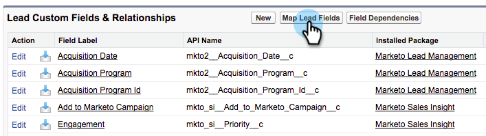

# 在Salesforce Professional Edition中設定Marketo Sales Insight {#configure-marketo-sales-insight-in-salesforce-professional-edition}

以下是在Salesforce Professional Edition中設定Marketo Sales Insight所需的步驟。 讓我們開始吧。

>[!PREREQUISITES]
>
>* 在Salesforce Professional Edition中安裝Marketo。
>
>* [以SalesforceAppExchange安裝Marketo Sales Insight套件](/help/marketo/product-docs/marketo-sales-insight/msi-for-salesforce/installation/install-marketo-sales-insight-package-in-salesforce-appexchange.md){target="_blank"}

>[!NOTE]
>
>**需要管理員許可權**

## 在Marketo中設定Sales Insight {#configure-sales-insight-in-marketo}

1. 開啟新的瀏覽器視窗，以從您的Marketo帳戶取得Marketo Sales Insight憑證。
1. 前往管理區域並選取 **銷售分析**.

   

1. 按一下 **編輯API設定**.

   

1. 輸入您選擇的API秘密金鑰，然後按一下 **儲存**. 請勿在您的API秘密金鑰中使用&amp;符號。

   

   >[!NOTE]
   >
   >您的API秘密金鑰就像您組織的密碼，應該是安全的。

1. 按一下 **檢視** 在「Rest API設定」面板中填入認證。

   

1. 您將會看到確認快顯視窗。 按一下 **確定**.

   

## 在Salesforce中設定Sales Insight {#configure-sales-insight-in-salesforce}

1. 在Salesforce中，按一下 **設定**.

   

1. 搜尋「遠端站台」並選取 **遠端站台設定**.

   

1. 按一下 **新增遠端站台**.

   

1. 輸入遠端網站名稱（類似「MarketoSoapAPI」）。 輸入遠端網站URL，這是您在Marketo的「Soap API設定」面板中的Marketo主機URL。 按一下 **儲存**. 您現在已建立Soap API的遠端站台設定。

   

1. 按一下 **新增遠端站台** 再來一次。

   

1. 輸入遠端網站名稱（類似「MarketoRestAPI」）。 輸入遠端網站URL，這是您在Marketo的Rest API設定面板中的API URL。 按一下 **儲存**. 您現在已建立Rest API的遠端站台設定。

## 設定Marketo Sales Insight {#set-up-marketo-sales-insight}

1. 登入您的Marketo執行個體，然後按一下 **管理員**.

   

1. 按一下 **銷售分析**.

   

1. 按一下 **編輯API設定**.

   

1. 輸入 **API秘密金鑰** 並按一下 **儲存**.

   >[!CAUTION]
   >
   >請勿在您的API秘密金鑰中使用&amp;符號。

   

   >[!TIP]
   >
   >保持此視窗開啟。 您稍後需要在Salesforce中取得此資訊。

1. 返回Salesforce，按一下 **設定**.

   

1. 搜尋「遠端站台」並按一下 **遠端站台設定** 在 **安全性控制**.

   

1. 按一下 **新增遠端站台**.

   

1. 輸入 **遠端站台名稱** 和 **遠端站台URL**，然後按一下 **儲存**.

   

   >[!NOTE]
   >
   >您選擇您的 **遠端站台名稱** （此處使用MarketoAPI）。 此 **遠端站台URL** 您可在步驟4中「編輯API設定」對話方塊的「Marketo主機」欄位中找到。

## 自訂頁面配置 {#customize-page-layouts}

1. 按一下 **設定**.

   

1. 搜尋「頁面配置」並選取 **頁面配置** 在 **銷售機會**.

   

1. 按一下 **Visualforce頁面** 左側。 拖曳 **章節** 至自訂連結區段下的版面。

   

1. 輸入「Marketo銷售分析」作為 **區段名稱**. 選取 **1欄** 並按一下 **確定**.

   

1. 拖放 **銷售機會** 放入新區段中。

   

   >[!TIP]
   >
   >此方塊的名稱將根據物件型別而變更。 例如，如果您正在修改「連絡人」的頁面配置，將會顯示「連絡人」。

1. 按兩下 **銷售機會** 您剛才新增的區塊。

   

1. 編輯高度至 **450** 畫素並按一下 **確定**.

   

   >[!NOTE]
   >
   >檢查 **顯示卷軸** 如果您需要存取權才能捲動活動。

   >[!TIP]
   >
   >我們建議將「帳戶」和「商機」物件的高度設為410畫素。

1. 按一下 **欄位** 左側。 然後搜尋並拖曳 **參與** 標籤放入 **Marketo Sales Insight** 版面。

   

1. 對這些欄位也重複上述步驟。

<table> 
 <tbody> 
  <tr> 
   <td colspan="1">參與</td> 
  </tr> 
  <tr> 
   <td colspan="1" rowspan="1">
相對分數值
</td> 
  </tr> 
  <tr> 
   <td colspan="1" rowspan="1">
緊急值
</td> 
  </tr> 
  <tr> 
   <td colspan="1" rowspan="1">
上一個有趣的時刻日期
</td> 
  </tr> 
  <tr> 
   <td colspan="1" rowspan="1">
上一個有趣時刻說明
</td> 
  </tr> 
  <tr> 
   <td colspan="1" rowspan="1">
上一個有趣時刻來源
</td> 
  </tr> 
  <tr> 
   <td colspan="1" rowspan="1">
上一個有趣的時刻型別
</td> 
  </tr> 
 </tbody> 
</table>

1. 按一下 **儲存** 完成後。

   

1. 重複此過程以新增Visualforce頁面區段和Sales Insight欄位 **連絡人**， **帳戶** 和 **商機**.
1. 重複步驟5至7，為聯絡人、帳戶和機會新增Visualforce頁面區段。 然後，重複步驟8至10，新增Sales Insight欄位 **連絡人**. 進行變更後請務必儲存。

## 對應自訂人員欄位 {#map-custom-person-fields}

Marketo人員欄位需要對應Salesforce聯絡人欄位，以確保轉換正常運作。 方法如下。

1. 按一下 **設定**.

   

1. 在搜尋列中搜尋「欄位」，然後按一下 **欄位** 在 **銷售機會**.

   

1. 按一下 **對應潛在客戶欄位**.

   

1. 按一下右側的下拉式清單 **參與**.

   

1. 選取 **Contact.Engagement** 在清單中。

   

1. 重複並對應這些欄位。

<table> 
 <tbody> 
  <tr> 
   <th colspan="1" rowspan="1">Marketo人員自訂欄位</th> 
   <th colspan="1" rowspan="1">Salesforce聯絡人自訂欄位</th> 
  </tr> 
  <tr> 
   <td colspan="1" rowspan="1">
參與
</td> 
   <td colspan="1" rowspan="1">
Contact.Engagement
</td> 
  </tr> 
  <tr> 
   <td colspan="1" rowspan="1">
相對分數值
</td> 
   <td colspan="1" rowspan="1">
Contact.Relative Score值
</td> 
  </tr> 
  <tr> 
   <td colspan="1" rowspan="1">
緊急值
</td> 
   <td colspan="1" rowspan="1">
Contact.Urginity值
</td> 
  </tr> 
  <tr> 
   <td colspan="1" rowspan="1">
上一個有趣的時刻日期
</td> 
   <td colspan="1" rowspan="1">
Contact.Last Interest時刻日期
</td> 
  </tr> 
  <tr> 
   <td colspan="1" rowspan="1">
上一個有趣時刻說明
</td> 
   <td colspan="1" rowspan="1">
Contact.Last Interest Moment Desc
</td> 
  </tr> 
  <tr> 
   <td colspan="1" rowspan="1">
上一個有趣時刻來源
</td> 
   <td colspan="1" rowspan="1">
Contact.Last Interest Moment Source
</td> 
  </tr> 
  <tr> 
   <td colspan="1" rowspan="1">
上一個有趣的時刻型別
</td> 
   <td colspan="1" rowspan="1">
Contact.Last Interest時刻型別
</td> 
  </tr> 
 </tbody> 
</table>

1. 按一下 **儲存** 完成時。

   

## Marketo Sales Insight設定索引標籤 {#marketo-sales-insight-configuration-tab}

1. 在Salesforce中，按一下 **+** 標籤列末端，然後按一下 **Marketo銷售分析設定**.

1. 從的Soap API面板複製認證 [Marketo的Sales Insight管理頁面](/help/marketo/product-docs/marketo-sales-insight/msi-for-salesforce/configuration/configure-marketo-sales-insight-in-salesforce-professional-edition.md#set-up-marketo-sales-insight){target="_blank"} 並將其貼到「Salesforce銷售分析設定」頁面的「Soap API」區段。

1. 從的Rest API面板複製認證 [Marketo的Sales Insight管理頁面](/help/marketo/product-docs/marketo-sales-insight/msi-for-salesforce/configuration/configure-marketo-sales-insight-in-salesforce-professional-edition.md#set-up-marketo-sales-insight){target="_blank"} 並貼到「Salesforce銷售分析設定」頁面的Rest API區段。

   

就是這樣！ 您應該能夠檢視銷售機會、聯絡人、帳戶和機會的Marketo銷售分析欄位。

>[!NOTE]
>
>如果診斷測試失敗，您可能需要 [新增更多欄位至您的頁面配置](https://nation.marketo.com/docs/DOC-1115){target="_blank"}.

>[!NOTE]
>
>對於帳戶，Sales Insight會包含所有電子郵件，但僅包含最近有趣的時刻、網頁活動和分數變更。

>[!MORELIKETHIS]
>
>* [優先順序、急迫性、相對分數和首選](/help/marketo/product-docs/marketo-sales-insight/msi-for-salesforce/features/stars-and-flames/priority-urgency-relative-score-and-best-bets.md){target="_blank"}
>* [將Marketo標籤新增至Salesforce](/help/marketo/product-docs/marketo-sales-insight/msi-for-salesforce/configuration/add-marketo-tab-to-salesforce.md){target="_blank"}
>* [將銷售分析存取權新增至設定檔](/help/marketo/product-docs/marketo-sales-insight/msi-for-salesforce/configuration/add-sales-insight-access-to-profiles.md){target="_blank"}
