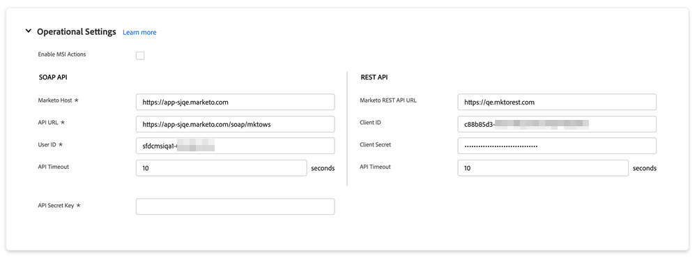

# Salesforce中的Marketo Sales Insight設定索引標籤 {#marketo-sales-insight-configuration-tab-in-salesforce}

## 操作設定 {#operational-settings}

您必須設定此專案，才能開始在SFDC中使用Sales Insight。

* MSI同時使用Soap和Rest API
* 您的Marketo帳戶中的「銷售分析」頁面有兩個相對應的、具有Soap和Rest API憑證的面板，您可以在此處複製並貼上
* Soap和Rest API有不同的逾時，您可以根據組織的需求加以設定。 允許的時間上限為120秒
* 停用前瞻分析控制面板：您可以移除Rest API認證，而只使用Soap API。 這麼做會停用所有MSI Visualforce面板中的「見解控制面板」標籤

## MSI設定 {#msi-configuration}

設定適用於所有MSI使用者，而非設定檔專用。

**Visualforce頁面設定**

* 啟用動作下拉式清單：
   * 能夠從潛在客戶與聯絡MSI配置中的下拉式清單中隱藏「傳送Marketo電子郵件」
   * 能夠從「銷售機會」和「聯絡MSI配置」的下拉式清單中隱藏「新增到Marketo促銷活動」選項
* 近期事件：可顯示受邀事件、對使用者顯示所有事件，或完全隱藏此標籤
* 即將推出的行銷活動：顯示所有電子郵件行銷活動或完全隱藏此索引標籤的功能
* 載入即將到來的行銷活動和事件：將事件和行銷活動索引標籤置於隨選「載入即將到來的專案」按鈕後面，能夠減少使用者發出的Rest API呼叫數量
* 索引標籤設定：預設情況下將可使用所有五個索引標籤。 您可以在「銷售分析」面板中選擇索引標籤的順序。 相同的順序將適用於所有版面配置（銷售機會、連絡人、客戶、商機）

**Marketo全域標籤**

* RSS摘要已啟用：啟用後，MSI使用者可以在RSS摘要中檢視其「銷售機會摘要」（除了Salesforce中的「銷售機會摘要」之外）。 RSS摘要只有在「權杖有效期」功能停用時才能運作。 此設定是在您的Marketo Sales Insight Admin頁面中控制。
* 最佳偵錯模式
* 預設隱藏：您在此處選擇的選項為按一下「隱藏」圖示時，Marketo中「首選」索引標籤中隱藏的首選天數
* 聯絡人狀態列位：您在此處選擇的選項將會是在Marketo中「最合適」索引標籤的「狀態標題」欄中填入的值
* 即時摘要設定：選擇只顯示即時摘要(在「銷售機會」、「聯絡人」、「帳戶」和「機會」面板以及全域Marketo頁面中)、只顯示銷售機會摘要(在「Marketo全域」頁面中)或同時顯示即時和銷售機會摘要的選項
* 索引標籤設定：預設情況下將可使用所有五個索引標籤。 您可以在Marketo全域頁面中選擇索引標籤的順序

**限制**

* 活動（有趣的時刻、網頁活動、電子郵件）預設為1000。 電子郵件行銷活動和事件預設設為200
* 如果您發現組織有逾時問題，您可以降低限制

**動作設定**

* 傳送Marketo電子郵件：啟用此項可讓所有Sales Insight使用者從Lead、Contact、Account、Opportunity面板和Best Bets索引標籤（大量動作和內嵌參與）傳送電子郵件
* 新增至Marketo Campaign：啟用此項可讓所有Sales Insight使用者從Lead、Contact、Account、Opportunity面板和Best Bets索引標籤（大量動作和內嵌參與）新增至行銷活動

## 重設Marketo Sales Insight {#reset-marketo-sales-insight}

若選擇這麼做，將會清除SFDC中的所有設定，且這些設定無法還原。 您必須重新設定所有內容。

>[!IMPORTANT]
>
>除非您使用Sales Insights Actions功能，否則請勿選取「啟用MSI動作」核取方塊。

>[!MORELIKETHIS]
>
>[將銷售分析存取權新增至設定檔](/help/marketo/product-docs/marketo-sales-insight/msi-for-salesforce/configuration/add-sales-insight-access-to-profiles.md){target="_blank"}
