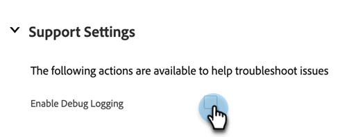

# Marketo Salesforce中的Sales Insight設定索引標籤 {#marketo-sales-insight-configuration-tab-in-salesforce}

## 操作設定 {#operational-settings}

您需要設定此設定，才能開始在SFDC中使用Sales Insight。

* MSI同時使用Soap和Rest API
* Marketo帳戶中的「銷售分析」頁面有兩個對應的面板，具有您可以複製並貼到此處的Soap和Rest API憑證
* Soap和Rest API有不同的逾時時間，您可以根據組織的需求加以設定。 允許的最長時間為120秒
* 停用前瞻分析控制面板：您可以移除Rest API憑證，且只使用Soap API。 這麼做會停用所有MSI視覺效果面板中的「前瞻分析控制面板」標籤

## MSI配置 {#msi-configuration}

配置適用於所有MSI用戶，並且不特定於配置檔案。

**視覺效果頁面設定**

* 啟用「動作」下拉式清單：
   * 能夠隱藏Lead和Contact MSI Layout中的Send Marketo電子郵件下拉清單
   * 能夠隱藏「Lead」和「Contact MSI Layout」中的「Add to Marketo Campaign」選項下拉清單
* 近期活動：可向使用者顯示受邀事件、所有事件，或完全隱藏此索引標籤
* 近期行銷活動：可顯示所有電子郵件促銷活動或完全隱藏此索引標籤
* 載入即將進行的促銷活動和事件：將事件和行銷活動索引標籤放在隨選「載入即將進行的項目」按鈕後面，以減少使用者呼叫的Rest API次數
* 標籤設定：預設會提供這五個索引標籤。 您可以在「銷售分析」面板中選擇標籤的順序。 同一訂單將適用於所有佈局（銷售機會、聯繫人、帳戶、銷售機會）

**Marketo全域標籤**

* 啟用RSS源：啟用後，MSI用戶可以在RSS源中查看其銷售機會饋送（除了Salesforce中的銷售機會饋送之外）。 RSS饋送只能在停用「代號過期」功能時運作。 您可在Marketo Sales Insight管理頁面中控制此設定。
* 最佳調試模式
* 預設隱藏：您在此處選擇的選項，是當您按一下「隱藏」圖示時，在Marketo的「最佳下注」標籤中隱藏的最佳下注天數
* 聯繫人狀態欄位：您在此選擇的選項，會是Marketo中「最佳下注」標籤中「狀態標題」欄中填入的值
* 即時摘要設定：選擇只顯示Live Feed(在Lead、Contact、Account和Opportunity面板以及Global Marketo頁面中)、 Lead Feed(在Marketo Global Page中)或Live和Lead Feed
* 標籤設定：預設會提供這五個索引標籤。 您可以在Marketo全域頁面中選擇索引標籤的順序

**限制**

* 活動（有趣的時刻、網頁活動、電子郵件）預設為1000。 電子郵件促銷活動和事件預設為200
* 如果您發現組織上出現逾時問題，可以降低限制

**動作設定**

* 傳送Marketo電子郵件：啟用此功能，所有Sales Insight用戶都可以從Lead 、 Contact 、 Account 、 Opportunity面板和Best Bets頁簽（批量操作和內聯參與）中發送電子郵件
* 新增至Marketo Campaign:啟用此功能，所有Sales Insight用戶都可以從Lead 、 Contact 、 Account 、 Opportunity面板和Best Bets頁簽（批量操作和內聯參與）添加到促銷活動

## 重設Marketo Sales Insight {#reset-marketo-sales-insight}

選擇這樣做將擦去SFDC中的所有配置，並且它們無法恢復。 您必須重新配置所有內容。

>[!IMPORTANT]
>
>除非您使用Sales Insights Actions功能，否則不要選中「啟用MSI操作」複選框。

>[!MORELIKETHIS]
>
>[將Sales Insight存取權新增至設定檔](/help/marketo/product-docs/marketo-sales-insight/msi-for-salesforce/configuration/add-sales-insight-access-to-profiles.md){target=&quot;_blank&quot;}
