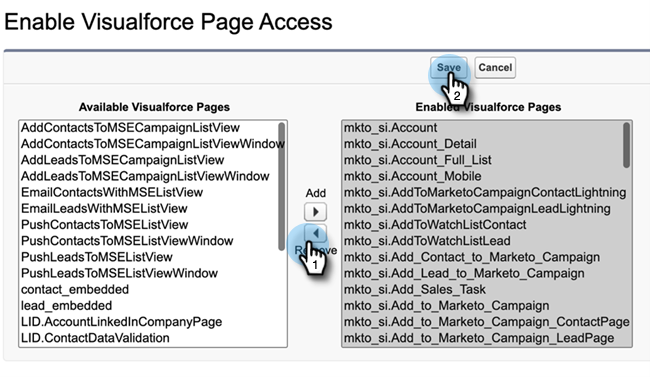

# 刪除Sales Insight訪問 {#remove-sales-insight-access}

使用以下步驟刪除對Salesforce中Sales Insight功能的訪問。 適用於Salesforce Classic和Lightning。

## 概述 {#overview}

要訪問所有Sales Insight功能，需要對以下對象、頂級類和VisualForce頁面的權限。 刪除這些內容將刪除對Sales Insight的訪問權限。

**對象設定**

<table> 
 <tbody> 
 <tr> 
   <td>BestBetsCache</td> 
   <td>讀取、建立、編輯、刪除、查看全部、修改全部</td> 
  </tr> 
  <tr> 
   <td>最佳匹配視圖詳細資訊</td> 
   <td>讀取、建立、編輯、刪除、查看全部、修改全部</td> 
  </tr> 
  <tr> 
   <td>最佳最佳視圖</td> 
   <td>讀取、建立、編輯、刪除、查看全部、修改全部</td> 
  </tr> 
  <tr> 
   <td>EmailActivityCache</td> 
   <td>讀取、建立、編輯、刪除、查看全部、修改全部</td> 
  </tr> 
  <tr> 
   <td>GetMethodArgus</td> 
   <td>讀取、建立、編輯、刪除、查看全部、修改全部</td> 
  </tr> 
  <tr> 
   <td>GroupedWebActivityCache</td> 
   <td>讀取、建立、編輯、刪除、查看全部、修改全部</td> 
  </tr> 
  <tr> 
   <td>有趣的瞬間快取</td> 
   <td>讀取、建立、編輯、刪除、查看全部、修改全部</td> 
  </tr> 
  <tr> 
   <td>MarketoSales Insight配置</td> 
   <td>讀取、建立、編輯、刪除、查看全部、修改全部</td> 
  </tr> 
  <tr> 
   <td>計分快取</td> 
   <td>讀取、建立、編輯、刪除、查看全部、修改全部</td> 
  </tr> 
  <tr> 
   <td>值</td> 
   <td>讀取、建立、編輯、刪除、查看全部、修改全部</td> 
  </tr> 
  <tr> 
   <td>WebActivityCache</td> 
   <td>讀取、建立、編輯、刪除、查看全部、修改全部</td> 
  </tr> 
 </tbody> 
</table>

* Apex類訪問：159個帶有&quot;mkto_si&quot;的頂點類
* VisualForce頁面訪問：64使用&quot;mkto_si&quot;的VisualForce頁面
* 自定義設定定義：mkto_si.Marketo設定和mkto_si.用戶首選項

## 刪除對Sales Insight的訪問 {#removing-access-to-sales-insight}

1. 登錄到Salesforce帳戶。

1. 按一下 **設定**。

   

1. 在管理員下，按一下 **管理用戶**，則 **配置檔案**。

1. 按一下要更新的配置檔案，然後 **編輯**。

1. 向下滾動到「Tab Settings（頁籤設定）」下的「Custom Tab Settings（自定義頁籤設定）」。

1. 從「Marketo銷售洞察配置」和「MSIMarketo銷售」發件箱的下拉框中選擇「標籤隱藏」選項。

   

   

1. 向下滾動到「自定義對象權限」。

1. 從以下對象中刪除「讀取、建立、編輯、刪除」訪問：

   * BestBetsCache
   * 最佳匹配視圖詳細資訊
   * 最佳最佳視圖
   * EmailActivityCache
   * GetMethodArgus
   * GroupedWebActivityCache
   * 有趣的瞬間快取
   * MarketoSales Insight配置
   * 計分快取
   * 值
   * WebActivityCache

1. 向下滾動到「已啟用的頂點類訪問」部分。 按一下 **編輯**。

1. 從「已啟用的頂點類」部分，選擇以「mkto_si」開頭的所有類。 這最多應該有159個類。

1. 按一下 **刪除**，則 **保存**。

   

1. 向下滾動到「已啟用VisualForce頁面訪問」部分。 按一下 **編輯**。

1. 從「啟用的VisualForce頁面」部分，選擇以「mkto_si」開頭的所有頁面。 這最多應該有64頁。

1. 按一下 **刪除**，則 **保存**。

   

1. 向下滾動到「已啟用自定義設定定義訪問」部分。 按一下 **編輯**。

1. 選擇「MarketoSales Insight.mkto_si.Marketo設定」和「MarketoSales Insight.mkto_si.User Preferences」。

1. 按一下 **刪除**，則 **保存**。

   

就這樣！ 您已成功刪除Sales Insight訪問權限。 對要刪除其訪問權限的任何其他配置檔案重複相同步驟。
