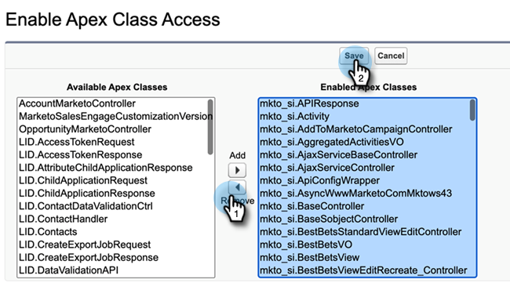

# 刪除Sales Insight訪問 {#remove-sales-insight-access}

使用下列步驟來移除Salesforce中Sales Insight功能的存取權。 適用於Salesforce Classic和Lightning。

## 總覽 {#overview}

需要有下列物件、頂點類別和視覺效果頁面的權限，才能存取所有Sales Insight功能。 移除這些項目將移除Sales Insight的存取權。

**物件設定**

<table> 
 <tbody> 
 <tr> 
   <td>BestBetsCache</td> 
   <td>讀取、建立、編輯、刪除、全部查看、全部修改</td> 
  </tr> 
  <tr> 
   <td>最佳視圖詳細資訊</td> 
   <td>讀取、建立、編輯、刪除、全部查看、全部修改</td> 
  </tr> 
  <tr> 
   <td>最佳檢視</td> 
   <td>讀取、建立、編輯、刪除、全部查看、全部修改</td> 
  </tr> 
  <tr> 
   <td>EmailActivityCache</td> 
   <td>讀取、建立、編輯、刪除、全部查看、全部修改</td> 
  </tr> 
  <tr> 
   <td>GetMethodArgus</td> 
   <td>讀取、建立、編輯、刪除、全部查看、全部修改</td> 
  </tr> 
  <tr> 
   <td>GroupedWebActivityCache</td> 
   <td>讀取、建立、編輯、刪除、全部查看、全部修改</td> 
  </tr> 
  <tr> 
   <td>InterestedMomentsCache</td> 
   <td>讀取、建立、編輯、刪除、全部查看、全部修改</td> 
  </tr> 
  <tr> 
   <td>Marketo Sales Insight設定</td> 
   <td>讀取、建立、編輯、刪除、全部查看、全部修改</td> 
  </tr> 
  <tr> 
   <td>ScoringCache</td> 
   <td>讀取、建立、編輯、刪除、全部查看、全部修改</td> 
  </tr> 
  <tr> 
   <td>值</td> 
   <td>讀取、建立、編輯、刪除、全部查看、全部修改</td> 
  </tr> 
  <tr> 
   <td>WebActivityCache</td> 
   <td>讀取、建立、編輯、刪除、全部查看、全部修改</td> 
  </tr> 
 </tbody> 
</table>

* Apex類訪問：159個以&quot;mkto_si&quot;開頭的頂點類
* 視覺效果強制頁面存取：64以「mkto_si」開頭的視覺強制頁面
* 自訂設定定義：mkto_si.Marketo設定與mkto_si.User偏好設定

## 移除Sales Insight的存取權 {#removing-access-to-sales-insight}

1. 登入您的Salesforce帳戶。

1. 按一下 **設定**.

   

1. 在管理員下，按一下 **管理使用者**，然後 **設定檔**.

1. 按一下您要更新的設定檔，然後 **編輯**.

1. 向下捲動至「Tab Settings」下的「Custom Tab Settings」。

1. 從下拉式清單中，選擇「Tab Hidden」選項，用於「Marketo銷售分析配置」和「MSI Marketo銷售」出貨箱。

   

   

1. 向下捲動至「自訂物件權限」。

1. 從以下對象中刪除「讀取、建立、編輯、刪除」訪問：

   * BestBetsCache
   * 最佳視圖詳細資訊
   * 最佳檢視
   * EmailActivityCache
   * GetMethodArgus
   * GroupedWebActivityCache
   * InterestedMomentsCache
   * Marketo Sales Insight設定
   * ScoringCache
   * 值
   * WebActivityCache

1. 向下捲動至「已啟用Apex類別存取」區段。 按一下 **編輯**.

1. 在「已啟用的頂點類」部分，選擇以「mkto_si」開頭的所有類。 這總共應該有159個類別。

1. 按一下 **移除**，然後 **儲存**.

   

1. 向下捲動至「啟用視覺效果頁面存取」區段。 按一下 **編輯**.

1. 在「啟用的視覺效果頁面」區段中，選取以「mkto_si」開頭的所有頁面。 這總共應該有64頁。

1. 按一下 **移除**，然後 **儲存**.

   

1. 向下捲動至「啟用自訂設定定義存取」區段。 按一下 **編輯**.

1. 選取「Marketo Sales Insight.mkto_si.Marketo設定」和「Marketo Sales Insight.mkto_si.User偏好設定」。

1. 按一下 **移除**，然後 **儲存**.

   

就這樣！ 您已成功刪除Sales Insight訪問。 對您要移除存取權的任何其他設定檔重複相同步驟。
