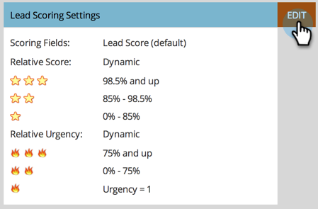

# Marketo管理員的銷售分析頁面{#sales-insight-page-for-marketo-admins}

Marketo管理員在Sales Insight中擁有特定權限。 瞭解它們的下列功能。

## Soap API配置{#soap-api-configuration}

這些憑證可用來將您的Salesforce帳戶連接至您的Marketo例項，以便在Salesforce中使用MSI。

## Rest API Configuration {#rest-api-configuration}

這些憑證可用來將您的Salesforce帳戶連接至您的Marketo例項，以便在Salesforce中使用MSI Insights Dashboard。

您可以選擇在SFDC中移除Rest API憑證，並只使用Soap API。 這將停用前瞻分析控制面板

## 人員分數設定{#person-score-settings}

* **星**:星號代表與其他潛在客源相比的總潛在客戶分數。
* **火焰**:火焰代表了緊迫性——最近銷售線索的分數變化了多少。

依預設，Marketo Sales Insight會使用「銷售線索分數」欄位來計算明星和火焰。 但是，如果您想要選擇不同的領域，以下是方法：

1. 在Marketo的&#x200B;**Admin**&#x200B;區域中，按一下&#x200B;**Sales Insight**。

   

1. 在「銷售線索計分設定」下，按一下「編輯」。****

   

1. 選擇要用於星形的欄位。

   

1. 選擇要用於火焰的欄位。

   

1. 按一下&#x200B;**保存**。 重新計算銷售見解需要一些時間。 您稍後可以檢查您的CRM，看看明星和火焰。

   

   >[!TIP]
   >
   >如果您尚未擁有自訂分數欄位，請參閱以下說明如何建立[欄位](/help/marketo/product-docs/administration/field-management/create-a-custom-field-in-marketo.md)。

   >[!MORELIKETHIS]
   >
   >[星火](/help/marketo/product-docs/marketo-sales-insight/msi-for-salesforce/features/stars-and-flames/customize-stars-and-flames.md)

## 設定{#settings}

**取消訂閱設定：**

您可以選擇下列取消訂閱設定：無範本、標準電子郵件和營運電子郵件

* 遵守取消訂閱設定
* 超過1位收件者時，請遵守取消訂閱設定
* 超過5個收件者時，請遵守取消訂閱設定
* 忽略取消訂閱設定

**啟用鎖定範本的功能：**

啟用後，MSI使用者將無法編輯範本，同時從Salesforce傳送電子郵件

**啟用RSS饋送：**

啟用後，MSI使用者可以在RSS饋送中檢視其銷售機會饋送（除了Salesforce中的銷售機會饋送）。
